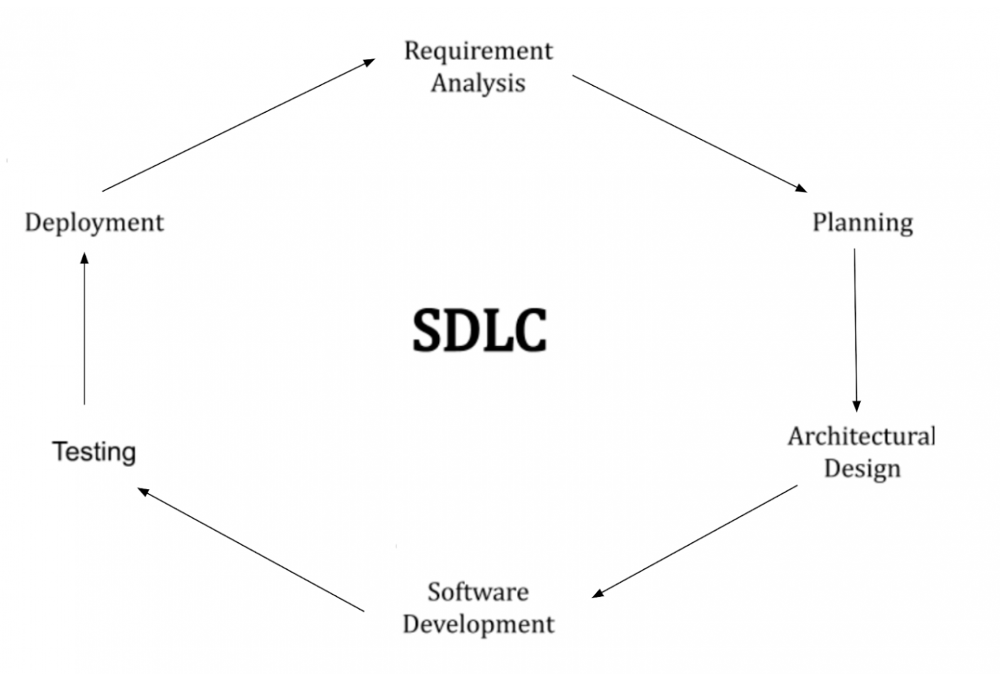
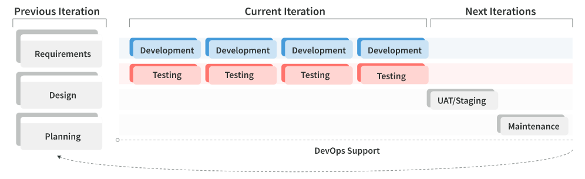

## **Basic SDLC**

A typical SDLC is comprised of six phases:

- **Requirements**  
    The objective of the first phase is to gather the customer’s initial requirements and expectations for the solution that the team will be creating. The Requirements phase also includes defining the resources required to build the software.
- **Planning**
- **Design  
      
    **Once your team has a clear understanding of your customer’s technical and functional requirements, the Design phase includes more detailed work on the project, including a feasibility assessment. A team designs exactly how the system will look and function: its elements, components, security level, modules, architecture, various interfaces, and data types.
- **Software Development  
      
    **The Software Development phase results in producing a system or a prototype that other team members can test. This phase covers the actual coding process, which takes a lot of the team’s efforts. If the system includes hardware, its configuration and tuning for specific requirements and functions also happen in this phase.
- **Testing  
      
    **The Testing phase ensures that the developed system or prototype meets the requirements gathered at the beginning of the project. During this phase, a team records, tracks, corrects, and retests any defects until the product meets quality standards and all functions work as expected. Testing activities can be manual or automated, and they may be performed in a specific simulation environment.
- **User Acceptance Testing (UAT)/Staging  
      
    **During the UAT, or Staging, phase, selected business users test the solution and deployment procedures in an environment that resembles the production environment as much as possible. When UAT is complete and key stakeholders have signed off on the functionality, the software is released to production.
- **Maintenance  
      
    **After the solution is released to end users, there still could be bugs the software development team did not identify during the previous phases. If bugs occur, the team must fix the issues and repeat the Testing and UAT/Staging phases. The Maintenance phase also encompasses planning additional features for future releases. These tasks can lead to starting a new SDLC.

## **Building an Agile SDLC**

An Agile approach throughout a project enables your clients to react quickly to end users’ requests and provide a high-quality product that satisfies customer needs and expectations.

**Key Principles of Agile-Driven Software Development**

- **Prioritize code quality first  
      
    **Following best code design principles ensures the team will have fewer issues to address at a later stage. As a result, a client can enjoy a high-quality solution faster and cheaper.
- **Shift Feedback Left  
      
    **Shift all feedback you receive—from your customer, team members, and automated verification processes (e.g., unit tests, static code analysis)—to the left: the earliest point possible in the SDLC. Seeking feedback earlier will make it cheaper for your team to fix any issues and resulting negative outcomes and enable your team to produce higher-quality code.
- **Automate All Repeatable Tasks  
      
    **Automation saves time that developers can use for other tasks, which increases their productivity. Engineers can automate many repeatable tasks in the SDLC to receive reliable and fast feedback on the existing functionality. For example, your team can automate code quality checks, test execution, report generation, metrics collection, and more.
- **Follow Lean and PDCA Practices**  
    Your team should continuously strive to assess your current software development processes and identify ways to improve them further. Lean and PDCA are two practices that directly support development speed and agility. The term “lean” was coined by a research team headed by Jim Womack in the late 1980s to describe Toyota’s business practices.   
    **Lean** stands for a set of practices and principles that can help your team maximize the value you bring to your customer while minimizing waste (non-optimal processes that add no value to the customer’s product or service). Examples of waste are useless meetings, tasks, and documentation, and ineffective working methods, such as multitasking. Lean encourages Agile engineers to work in iterations and get feedback on their work faster, enabling them to test business ideas with the help of MVPs. Lean applies to all SDLC phases. The “Plan-Do-Check-Act” (PDCA) approach starts with planning a new practice that your team considers necessary at a certain point or checking a hypothesis you have. Then you implement your plan, study how it works in a real environment, and analyze whether the implemented feature brings the expected results. Finally, you act based on the lessons learned in the previous step. If something went wrong, your team should start another PDCA cycle with a better plan. But if the initial plan was successful, you can incorporate your findings into the system and plan new improvements. To make PDCA effective, everyone on your team should contribute to it. Retrospective meetings are the right time to conduct this practice regularly.

## **Implementing the Key Principles with CI/CD**

Continuous integration (CI) goes hand in hand with continuous delivery (CD). Together, they represent an approach software development teams use to support an Agile SDLC.

- **CI** - M. Fowler defines **continuous integration** as a “software development practice where members of a team integrate their work frequently.” While working on different parts of the solution, it is essential for your team to frequently validate that those parts work well together and make timely adjustments if needed.
- **CD** - In **continuous delivery**, teams produce software in short cycles that they can reliably release at any time. This approach aims at building, testing, and releasing software with greater speed and frequency. It helps reduce the cost, time, and risk of delivering changes by allowing for more incremental updates to applications in production. A straightforward and repeatable deployment process (that may or may not take the form of an automatic continuous deployment to production) is important for continuous delivery.

CI/CD embodies a practical implementation of key Agile SDLC principles. For example:

- CI helps your team implement the principle of code quality—during CI, engineers merge all code pieces and check the code quality on each integration regularly and often.
- Both CI and CD run tests as early as possible, which means shifting engineering feedback left. CI provides early and regular feedback from development tools, and during CD, a team receives feedback from QA tools.
- CI/CD encourages automation and helps a team automate all necessary and repeatable tasks.

In short, employing CI/CD practices helps your project become more Agile.

**The Development Phase**

- **Pre-Coding activities  
      
    **Before your team starts coding, you must check all existing tasks against the **Definition of Ready (DoR)** criteria to ensure that the requirements are clear and your team will be able to measure each task’s completion. This preparatory work helps ensure that the team is on the right track and will be developing the requested functionality instead of wasting time and effort to produce an increment with unexpected behavior. As a result of this step, a team is ready to start the implementation of tasks.
- **Coding  
      
    **Usually, software developers divide larger coding tasks into smaller ones that they can complete in one or two days. To ensure production-ready code, developers should:
    - **Follow the same coding standards and coding principles.** This helps prevent common technical defects and improves code readability and maintainability. As a result, product quality improves, and tasks take less time to implement.
    - **Support all development activities with automated static code analysis tools.** These tools provide immediate feedback if a developer creates a technical defect or breaks coding standards.
    - **Check every code change with comprehensive automated testing.** Automated testing is mandatory for every development task. It shortens verification time and reduces the number of possible code defects. As a result, developers can safely change the code. One type of automated testing—unit testing—is prioritized since it provides the fastest feedback.
- **Code Review**  
    Code review is mandatory to perform before integrating a code change to a common source code. By reviewing code for possible defects and coding standards violations that the automated verification does not cover, developers ensure high code quality.  
    
- **Other Development activities  
      
    **Throughout the Development phase, team members should actively participate in knowledge sharing activities and managing their technical debt.
    - **Knowledge sharing:** While coding, a team pays a lot of attention to sharing project-related knowledge among the team members to make sure everyone is on the same page. Usually, this occurs during dedicated knowledge sharing sessions. Code review is also an example of a knowledge sharing activity, as it involves several developers providing feedback to each other’s code.
    - **Technical debt management:** Sometimes, developers might need to make a shortcut and implement code in a non-optimal way. This creates technical debt, which works only as a temporary solution. A team must track these shortcuts and pay off the debt by fixing them later.

To consider a coding task done, a team follows the **definition of done (DoD)**  
 for development activities, which stands for a set of rules, checks, and quality gates that a task should pass. After a task passes the DoD, the development phase is over, and testers can start verifying the piece of code.  

**The Testing Phase**

- **Pre-Testing Activities  
      
    **Pre-testing activities start at the same time developers begin the implementation of their tasks. Using special test case management tools, software testing engineers create test cases for new functionality covering all possible business scenarios. Their goal is to help identify as many defects as possible and speed up feedback when testing.  
    Once the test cases are ready, the testing engineers start to implement “to-be-automated” test cases. Software developers can support them in these activities.  
    
- **Automated and Manual Test Execution  
      
    **Once code is ready for testing, testers deploy it to a Quality Assurance (QA) environment. Immediately after that, they execute automated tests to ensure the functionality is not broken and is suitable for further manual QA checks. If the results of the automated tests are positive, manual QA engineers perform two types of functional testing: using previously written test cases and **exploratory testing**. After that, QA engineers conduct non-functional testing that verifies specific aspects of the system, including performance, security, and usability.
- **Defect Management  
      
    **QA engineers can identify defects by analyzing the results of both automated and manual testing. They submit the defects into the defect management system so that the developers can fix them, ideally during the same iteration. It is also important that QA engineers cover those defects with automated tests to prevent their re-appearance.  
    Once developers fix the defects, QA engineers verify the results.  
    

When product increments successfully pass QA engineers’ verification, the code is ready for the next phase—UAT/Staging—where business users check it in a staging environment and/or in production.

Agile projects combine business and development teams that work together to enable a successful product delivery.

**Example of a Project Ecosystem**

