Redis keys are binary safe; this means that you can use any binary sequence as a key, from a string like "foo" to the content of a JPEG file. **The empty string is also a valid key**. A few other rules about keys: Very long keys are not a good idea.

1. Redis is the Key-Value in-memory data store
2. Redis provides sub-milliseconds latency when performing read / write operations.
3. Redis serves all data from RAM, but supports persistence for **backup / restore purposes**.
4. Keys in Redis are of string data type.
5. Values in Redis can have different types, each type has it own list of supported operations
6. Redis is "fast", because:

- Serve data from RAM
- Use non-blocking IO for networking
- Has single thread for reading and manipulating data, which allow to avoid penalties due to thread synchronization

1. Each Redis command is atomic.
2. Redis commands from multiple clients are executed sequentially, one by one.
3. As all requests from all clients are handled by single thread, you should not send commands, which will execute for long time and will block  
    other clients. Perform read a list of 1 millions elements with single command is not a good idea. It's important to consider time complexity of commands.  
    
4. All commands in Redis transaction are executed one by one, without interruption by other commands.
5. Redis transactions don't support rollback.
6. Redis transaction execution is not started if other clients modified the key, watched with the WATCH command.
7. To perform multi-key commands, affected keys:Should be mapped to the same hash slots.
8. It's possible to enforce the storage of some set of keys on the single master node in Redis Cluster by using hashtags. In this case, some common part of all keys, which is used as hash function input, is introduced.
9. There's many-to-one relation between the key and hash slot.
10. There's many-to-one relation between the hash slot and master node in Redis Cluster.

  

Redis is an open source (BSD licensed), in-memory **data structure store** used as a database, cache, message broker, and streaming engine. Redis provides [**data structures**](https://redis.io/docs/data-types/) such as [**strings**](https://redis.io/docs/data-types/strings/), [**hashes**](https://redis.io/docs/data-types/hashes/), [**lists**](https://redis.io/docs/data-types/lists/), [**sets**](https://redis.io/docs/data-types/sets/), [**sorted sets**](https://redis.io/docs/data-types/sorted-sets/) with range queries, [**bitmaps**](https://redis.io/docs/data-types/bitmaps/), [**hyperloglogs**](https://redis.io/docs/data-types/hyperloglogs/), [**geospatial indexes**](https://redis.io/docs/data-types/geospatial/), and [**streams**](https://redis.io/docs/data-types/streams/). Redis has built-in [**replication**](https://redis.io/topics/replication), [**Lua scripting**](https://redis.io/commands/eval), [**LRU eviction**](https://redis.io/docs/reference/eviction/), [**transactions**](https://redis.io/topics/transactions), and different levels of [**on-disk persistence**](https://redis.io/topics/persistence), and provides high availability via [**Redis Sentinel**](https://redis.io/topics/sentinel) and automatic partitioning with [**Redis Cluster**](https://redis.io/topics/cluster-tutorial). It is scheme-less

  

You can run **atomic operations** on these types, like [**appending to a string**](https://redis.io/commands/append); [**incrementing the value in a hash**](https://redis.io/commands/hincrby); [**pushing an element to a list**](https://redis.io/commands/lpush); [**computing set intersection**](https://redis.io/commands/sinter), [**union**](https://redis.io/commands/sunion) and [**difference**](https://redis.io/commands/sdiff); or [**getting the member with highest ranking in a sorted set**](https://redis.io/commands/zrange).

  

To achieve top performance, Redis works with an **in-memory dataset**. Depending on your use case, Redis can persist your data either by periodically [**dumping the dataset to disk**](https://redis.io/topics/persistence#snapshotting) or by [**appending each command to a disk-based log**](https://redis.io/topics/persistence#append-only-file). You can also disable persistence if you just need a feature-rich, networked, in-memory cache.

Redis supports [**asynchronous replication**](https://redis.io/topics/replication), with fast non-blocking synchronization and auto-reconnection with partial resynchronization on net split.

## Transactions

  

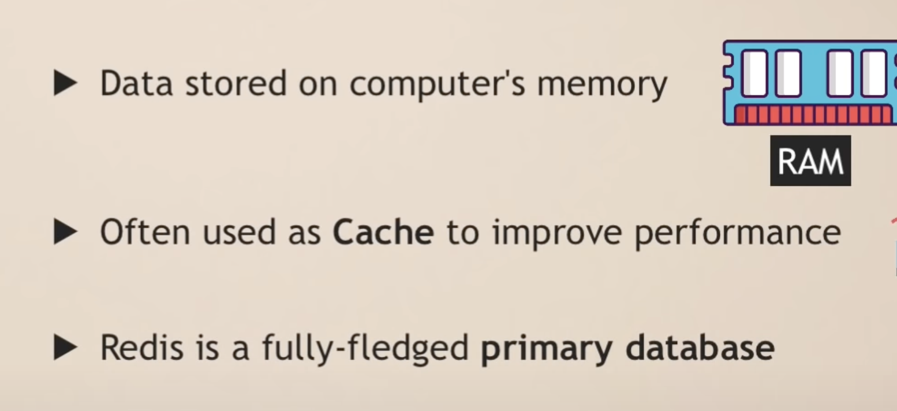

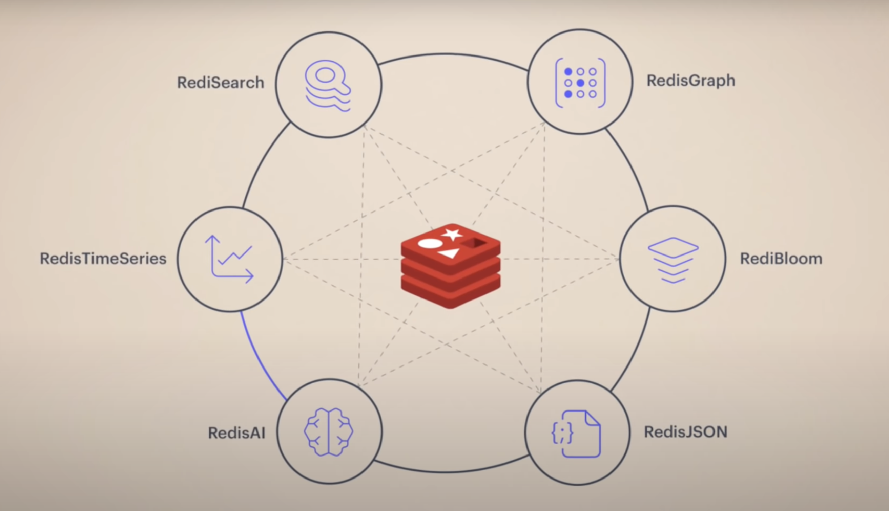

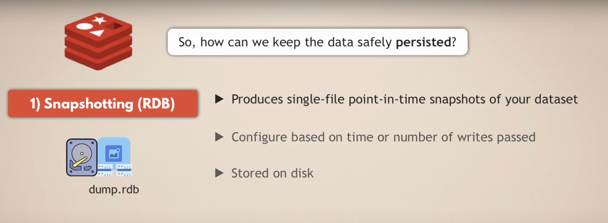

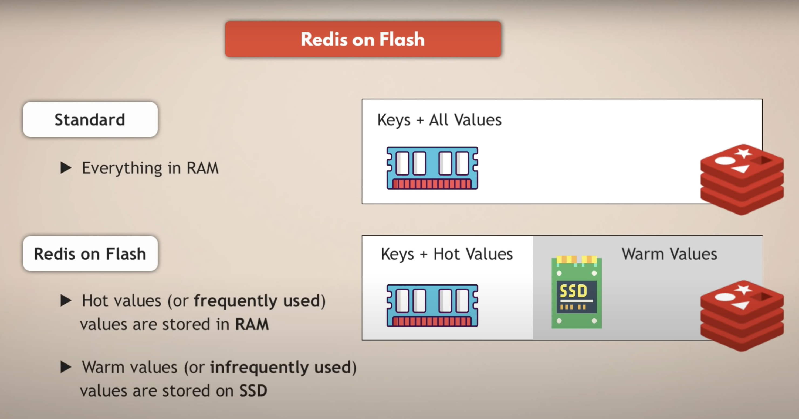

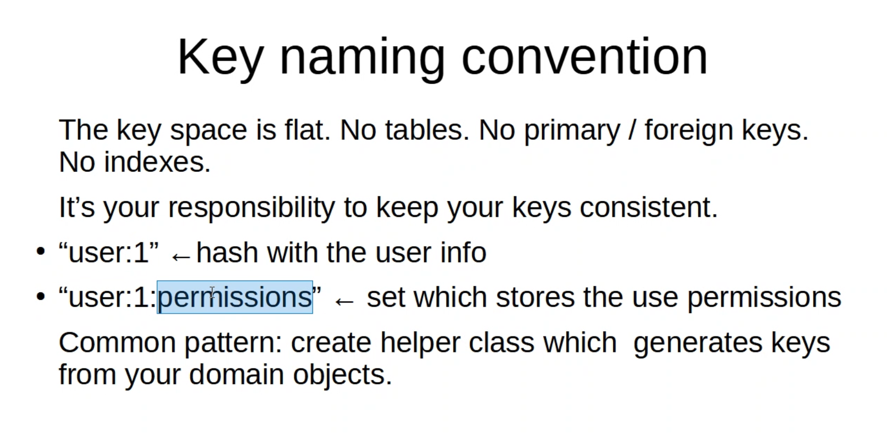

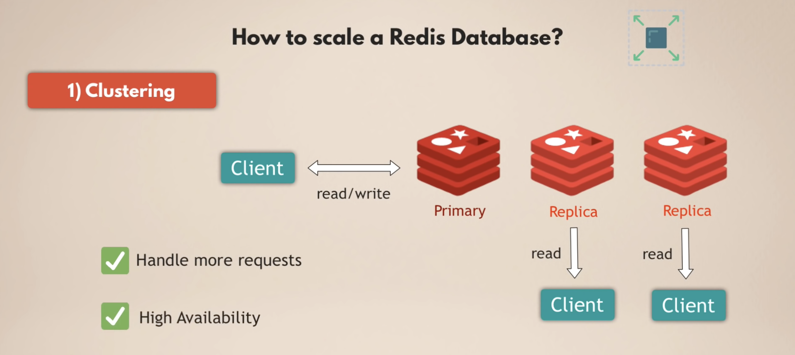

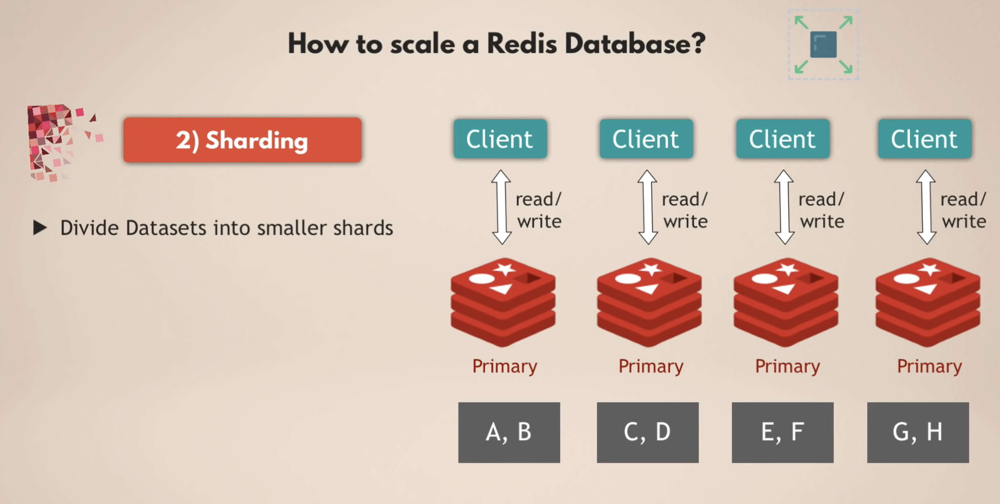

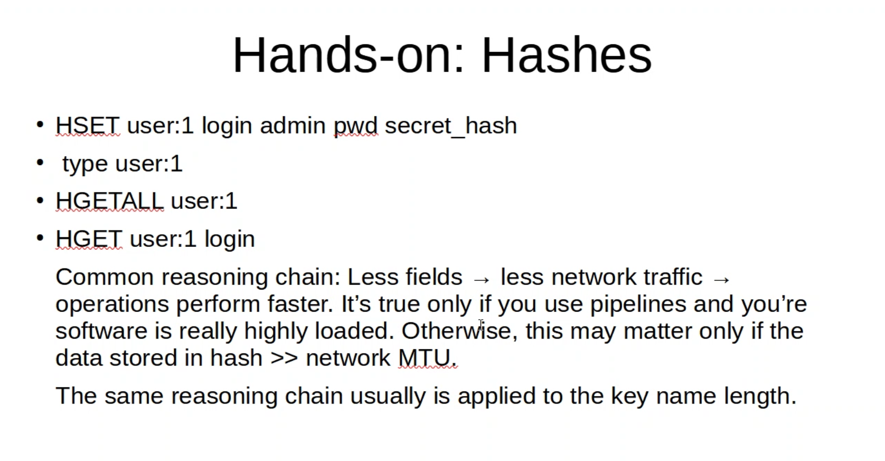

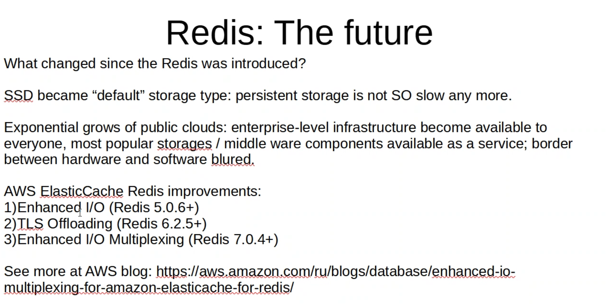

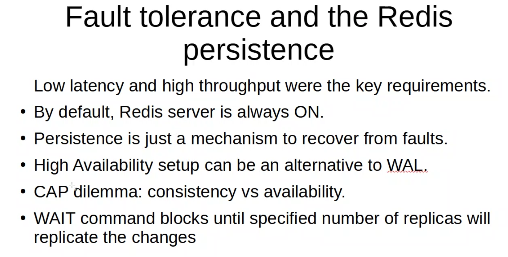

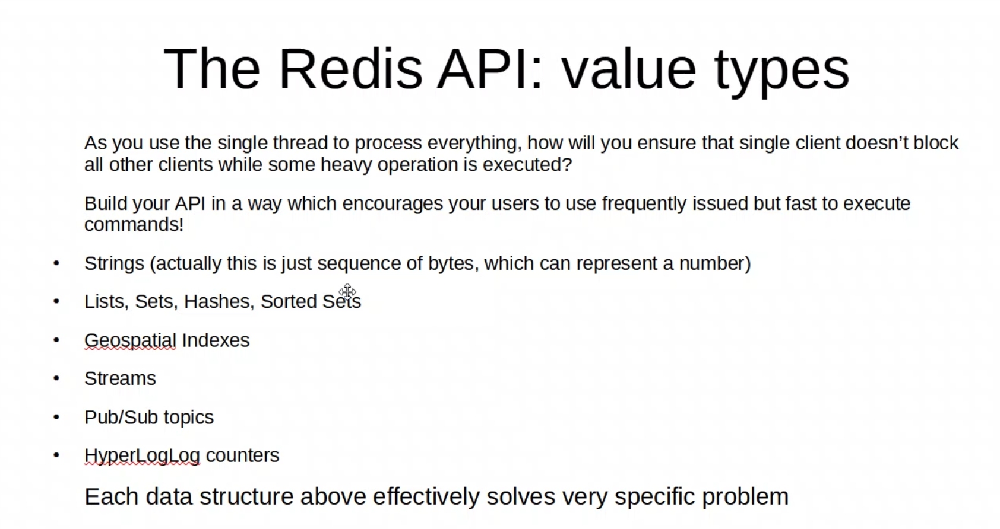

## Data types

- Strings
- Sets - acts like [Java HashSets](https://docs.oracle.com/javase/7/docs/api/java/util/HashSet.html)
- Sorted sets - collections of unique strings that maintain order by each string's associated score.
- Hashes - acts like [Java HashMaps](https://docs.oracle.com/javase/8/docs/api/java/util/HashMap.html)
- Streams - data structure that acts like an append-only log. Streams help record events in the order they occur and then syndicate them for processing.
- Geospatial indexes - useful for finding locations within a given geographic radius or bounding box.
- Bitmaps - let you perform bitwise operations on strings.
- Bitfields - efficiently encode multiple counters in a string value. Bitfields provide atomic get, set, and increment operations and support different overflow policies.
- Extensions
    - custom [**server-side functions in Lua**](https://redis.io/docs/manual/programmability/).
    - custom Redis module using the [**modules API**](https://redis.io/docs/reference/modules/)
    - [**JSON**](https://redis.io/docs/stack/json/), [**querying**](https://redis.io/docs/stack/search/), [**time series**](https://redis.io/docs/stack/timeseries/), and other capabilities provided by [**Redis Stack**](https://redis.io/docs/stack/).

## Commands

### SET

Set `**key**` to hold the string `**value**`. If `**key**` already holds a value, it is overwritten, regardless of its type. Any previous time to live associated with the key is discarded on successful `**SET**` operation.

- `**EX**` _seconds_ -- Set the specified expire time, in seconds.
- `**PX**` _milliseconds_ -- Set the specified expire time, in milliseconds.
- `**EXAT**` _timestamp-seconds_ -- Set the specified Unix time at which the key will expire, in seconds.
- `**PXAT**` _timestamp-milliseconds_ -- Set the specified Unix time at which the key will expire, in milliseconds.
- `**NX**` -- Only set the key if it does not already exist.
- `**XX**` -- Only set the key if it already exists.
- `**KEEPTTL**` -- Retain the time to live associated with the key.

The command `**SET resource-name anystring NX EX max-lock-time**` is a simple way to implement a locking system with Redis.

A client can acquire the lock if the above command returns `**OK**` (or retry after some time if the command returns Nil), and remove the lock just using [`**DEL**`](https://redis.io/commands/del).

The lock will be auto-released after the expire time is reached.

It is possible to make this system more robust modifying the unlock schema as follows:

- Instead of setting a fixed string, set a non-guessable large random string, called token.
- Instead of releasing the lock with [`**DEL**`](https://redis.io/commands/del), send a script that only removes the key if the value matches.

This avoids that a client will try to release the lock after the expire time deleting the key created by another client that acquired the lock later.

### **EXPIRE**

Set a timeout on `**key**`. After the timeout has expired, the key will automatically be deleted. A key with an associated timeout is often said to be _volatile_ in Redis terminology.

### **EXPIREAT**

`**EXPIREAT**` has the same effect and semantic as [`**EXPIRE**`](https://redis.io/commands/expire), but instead of specifying the number of seconds representing the TTL (time to live), it takes an absolute [**Unix timestamp**](http://en.wikipedia.org/wiki/Unix_time) (seconds since January 1, 1970). A timestamp in the past will delete the key immediately.