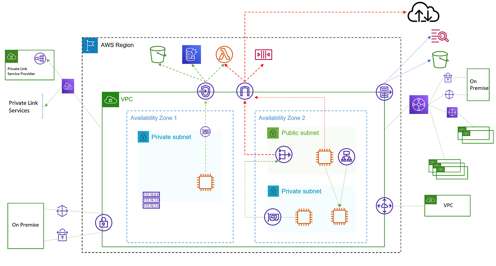
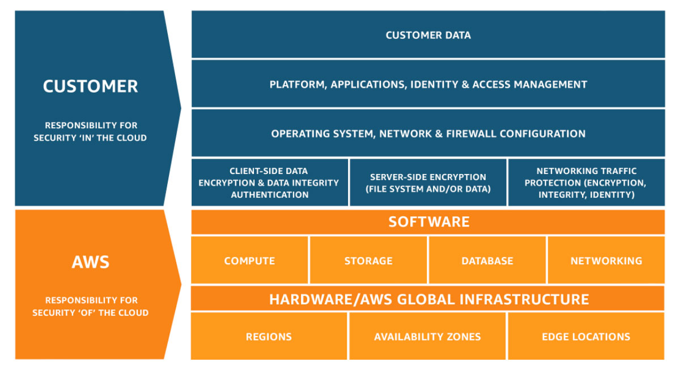
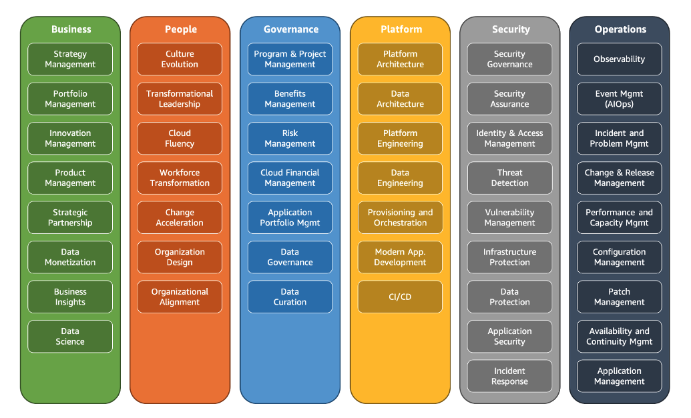

Storage

S3

Amazon S3 Transfer Acceleration

AWS Glacier

Amazon Elastic Block Store (EBS)

Amazon EBS volumes types

AWS Compute Optimizer

Amazone Elastic File Storage (EFS)

Instance Store

AWS AD Connector

AWS Simple AD

AWS Data Sync

AWS Storage Gateway,

Volume Gateway

AWS Snow family

Databases

Amazon DynamoDB

Amazon RDS

AWS Database Migration Service

Elasticache

Amazon Neptune

Network

VPC

Availability zones

Virtual Private Gateway

AWS Transit Gateway

VPC peering connection

Amazon Elastic Load Balancer (ELB)

Amazon Load Balancers

AWS Client VPN

AWS Site-to-Site VPN

AWS Network Access Control List (ACL)

AWS Security Groups

AWS Internet Gateway

AWS Scalability

AWS Direct Connect

AWS Local Zones

Amazon CloudFront

Amazon Global Accelerator

Message Queues

Amazon Simple Notification Service (SNS)

Amazon Simple Queue Service (SQS)

Amazon Message Queue (AMQ)

Amazon Managed Streaming for Apache Kafka (MSK)

Infrastructure Management Services

AWS Trusted Advisor

AWS Compute Optimizer

AWS Systems Manager

AWS Migration Hub

AWS Server Migration Service (SMS)

AWS Control Tower

CloudEndure Disaster Recovery

Machine Learning

Amazon SageMaker

Amazon Kinesis

Amazon Polly

Amazon Comprehend

Amazon Kendra

Computing

Amazon EC2

Amazon EC2 Image Builder

AWS Lambda

AWS Auto Scaling Group

AWS CloudFormation

AWS Elastic Beanstalk

Amazon Lightsail

AWS Application Migration Service

Amazon Machine Image (AMI)

AWS Step Functions

Amazon Simple Workflow Service (SWF)

AWS Application Discovery Service

Security

AWS Inspector

Amazon GuardDuty

Amazon Detective

Data encryption

AWS WAF

AWS Shield

Amazon Macie

AWS Acceptable Use Policy

Amazon Security Token Service (STS)

AWS CloudHSM

Containers

AWS Fargate

Amazon Elastic Container Service for Kubernetes (EKS)

Amazon Elastic Container Service (ECS)

Amazon Elastic Container Registry (ECR)

Support

AWS Support plans

AWS Partner Network (APN)

AWS Quick Starts references

AWS Forums

AWS Whitepapers

Cloud Foundations

Auth

Amazon IAM

Programmatic access

Amazon Cognito

AWS Single Sign-On (SSO)

AWS Organizations

Logs

AWS CloudTrail

Amazon CloudWatch

AWS X-Ray

CI/CD

AWS Device Farm

AWS IoT Core

AWS Config

AWS CodePipeline

Amazon CodeDeploy

AWS OpsWorks

Amazon AppStream 2.0

Amazon WorkSpaces 

Pricing

AWS Pricing Calculator

AWS Cost Explorer

AWS Budgets

Cost Allocation Tags

AWS Cost and Usage Reports

AWS pricing policies

AWS Cost Anomaly Detection

AWS Total Cost of Ownership (TCO) Calculator

Amazon DevPay

AWS Marketplace

Data Processing

Amazon Elastic Transcoder

AWS Glue

Amazon Elasticsearch Service

Amazon Athena

Amazon QuickSight

Amazon CodeStar

Amazon Cloud9

Amazon Route 53

Information

AWS Artifact

AWS Service Catalog

AWS Managed Services

AWS Personal Health Dashboard

AWS Service Health Dashboard

Principles

AWS Well-Architected Framework Pillars

Six advantages of cloud computing

Five benefits of cloud coomputing

AWS Shared Responsibility Model

AWS Cloud Adoption Framework (CAF)

Six perspectives of the AWS Cloud Adoption Framework

AWS CAF tasks that a company should perform when planning to migrate to the AWS Cloud

Geographical Services

Free Services

Serverless Services

## Storage

### S3

- **CRR** (Cross-region replication): enables automatic, asynchronous copying of objects across buckets in different AWS Regions.
- You cannot reserve capacity.
- Bucket names rules:
    - **Names** must be **unique across all of AWS.**
    - Names must be 3 to 63 characters in length.
    - Names can only contain lowercase letters, numbers and hyphens.
    - Names cannot be formatted as an IP address.
- IAM policies can be written to grant access to Amazon S3 buckets.
- Amazon S3 storage tier:
    - **S3 Standard** - for data that is accessed less frequently, but requires rapid access when needed.
    - **S3 Express One Zone** - High performance storage for your most frequently accessed data. Single AZ, **One digit millisecond** to return data
    - **S3 Standard-IA** - offers the high durability, high throughput, and low latency of S3 Standard.
    - **S3 One Zone-IA** - _the most cost-effective_ Amazon S3 storage tier for data that is not often accessed but requires high durability and rapid access when needed. It stores data in a **single** AZ. **Milliseconds** to return data
    - **S3 Intelligent-Tiering** is an appropriate Amazon S3 storage class for “data with unknown/changing access pattern”. It works by storing objects in two access tiers: one tier that is optimized for frequent access and another lower-cost tier that is optimized for infrequent access. S3 Intelligent-Tiering would turn out to be costlier than S3 Standard-IA for the cases when rapid access needed. **Milliseconds** to return data
    - **S3 Glacier**
        - **Glacier Instant Retriever** - **Milliseconds** to return data
        - **Glacier Flexible Retriever** - **Minutes or hours** to return data
        - **Glacier Deep Archive** - **Hours** to return data
- **Multipart upload** can be used to speed up uploads to S3.
- **S3 Copy** -> up to 5GB in size in a single atomic operation.
- **Data consistency** models available are:
    - Read after write consistency for PUTS of new objects.
    - Eventual consistency for overwrite PUTS and DELETES (it takes time to propagate).
- “**MFA delete**” adds a layer of additional security to prevent accidental deletion.
- Amazon S3 **objects** consist of:
    - Key
    - Value
    - Version ID
    - Metadata
- **Object lifecycle management** can be used with objects so that they are stored cost effectively throughout their lifecycle. Objects can be transitioned to another storage class or expired. It enables you to **set rules** to **automatically transfer** objects between different storage classes at defined time intervals.
- **Standard-IA** and **One Zone-IA** both have a minimum storage duration charge of **30** days
- All Amazon S3 buckets have **encryption** configured **by default**, and objects are automatically encrypted by using server-side encryption with Amazon S3 managed keys (SSE-S3). This encryption setting applies to all objects in your Amazon S3 buckets.

### Amazon S3 Transfer Acceleration

- It enables fast, easy, and secure **transfers** of files **over long distances** between your client and your Amazon S3 bucket.

### AWS Glacier

- Data access option **retrieves** data:
    - **Standard**: takes 3-5 hours
    - **Expedited**: within 1-5 minutes
- That is accessed though S3.
- You _pay_ for storage on a per GB/month basis, retrival requests and quantity (based on expedited, standard or bulk).
- For **interacting** with AWS **Glacier** require that you use the **AWS CLI** or write code (using **REST API**).
- Only Amazon Glacier has **a minimum storage** duration charge of **90** days.

### Amazon Elastic Block Store (EBS)

- The **easiest** way to store a backup of an EBS volume on Amazon S3: Create a **snapshot** of the volume.
- Amazon EBS snapshots are stored on _S3_.
- **Infrequent Access storage class** is cost-optimized for files accessed less frequently. Data costs less than Standard and **you will pay a fee each time you read** from or write to a file.
- **Amazon EBS Snapshots** are a point in time copy of your block data. They **are stored incrementally**, which means you are billed only for the changed blocks stored.
- EBS volumes must be **in the same AZ** as the instances they are attached to.
- You can use _Amazon Data Lifecycle Manager_ (**Amazon DLM**) to automate the creation, retention, and deletion of snapshots taken to back up your Amazon EBS volumes.
- The Fundamental _charges_ for EBS volumes are:
    - the amount of data **provisioned** (**not** _consumed_) _per_ month
    - amount you provision in **IOPS**
- The **root** EBS volumes are **deleted** on termination by default
- Extra **non-root** volumes are **not deleted** on termination by default

### Amazon EBS volumes types

- **General purpose (gp2)**(SSD)
    - it provides a good balance of price to performance, is suitable for most workloads and can be used as a system boot volume.
- **Provisioned IOPS (io1)**(SSD)
    - it is a high-performance volume type that is more expensive and should be used for apps that require the higher performance.
- **Cold HDD (sc1)**
    - it cannot be used as a boot volume and is good for throughput oriented storage for infrequently accessed data.
- **Throughput Optimized (st1)**
    - it is ideal for streaming workloads with fast throughput such as big data and data warehouses.

### **AWS Compute Optimizer**

It helps avoid overprovisioning and underprovisioning, based on your utilization data, four types of AWS resources:

- Amazon Elastic Compute Cloud (EC2) instance types.
- EC2 Auto Scaling Groups
- Amazon Elastic Block Store (EBS) volumes.
- Amazon Elastic Container Service (ECS) services on AWS Fargate.
- AWS Lambda functions.

### Amazone Elastic File Storage (EFS)

Amazon EFS is a regional service **storing data within and across multiple Availability Zones (AZs) for high availability and durability**. Amazon EC2 instances can access your file system across AZs, regions, and VPCs, while on-premises servers can access using AWS Direct Connect or AWS VPN.

### **Instance Store**

An instance store provides temporary block-level storage for your EC2 instance. This storage is located on disks that are physically attached to the host computer. Instance store is ideal for the temporary storage of information that changes frequently, such as buffers, caches, scratch data, and other temporary content, or for data that is replicated across a fleet of instances, such as a load-balanced pool of web servers. Instance storage is temporary, data is lost if instance experiences failure or is terminated. Amazon EC2 instance store cannot be used for file sharing between instances.

### AWS AD Connector

- A directory gateway is used for **redirecting** directory requests to your on-premise Active Directory.
- Connects your **existing** _on-premise AD_ to AWS.

### AWS Simple AD

- An inexpensive **Active Directory** compatible service with common directory features.
- It is a **standalone**.
- It does **not** connect your on-premise AD to AWS

### AWS Data Sync

- It is a simple and fast way to **move huge amounts** of data (hundreds of terabytes) between **on-premise** storage to **S3**, **EFS**, **FSx**.

### AWS Storage Gateway,

AWS Storage Gateway is a hybrid cloud storage service that gives you on-premises access to virtually unlimited cloud storage. All data transferred between the gateway and AWS storage is encrypted using SSL (for all three types of gateways - File, Volume and Tape Gateways). Storage Gateway cannot be used for data archival.

### Volume Gateway

- The volume gateway represents the family of gateways that _support_ **block-based volumes**, previously referred to as gateway-cached and gateway-stored modes. it allows you to use block-based volumes on-premise that are then **asynchronously** backed up to Amazon **S3**.
    - **Stored Volumes mode**: the _entire dataset is stored on-site_ and is **asynchronously** backed up to S3 (EBS point-in-time snapshots). Snapshots are incremental and compressed
    - **Cached Volume mode**: the _entire dataset is stored on S3_ and a cache of the _most frequently accessed_ data is cached on-site.
- “**File Gateway**” and “**Gateway Virtual Tape Library**” are types of AWS storage gateway.

### AWS Snow family

- AWS **Snowcone** is a **small**, rugged, and secure **edge computing** and data transfer **device**. It features 2 CPUs, 4 GB of memory, and up to 14 TB of usable storage.
- AWS Snowball is a **petabyte-scale** data transport solution that uses devices designed to be secure to transfer large amounts of data **into and out of** the AWS Cloud.
    - Snowball Edge **Storage Optimized** devices are well suited for large-scale data migrations and recurring transfer workflows.
    - Snowball Edge **Compute Optimized** provides powerful computing resources for use cases such as machine learning, full motion video analysis, analytics, and local computing stacks.
- AWS Snowmobile is an **exabyte-scale** data transfer service used to move large amounts of data to AWS, up to 100 petabytes of data, a **45-foot long ruggedized shipping container**, pulled by a semi trailer truck.

## Databases

### Amazon DynamoDB

- It’s a fully managed **NoSQL** database service. (schema-less)
- You can **scale** the DB at **any time** **without incurring downtime**.
- DynamoDB pricing models:
    - **On-demand capacity mode**: charges you for the data reads and writes your application
    - **Provisioned capacity mode**: you specify the number of reads and writes per second that you expect
- Availability model:
    - **Data is synchronously** replicated across **3** facilities in a region
- You can use **DynamoDB** and **SWF** for create “stateless” applications.
- Best practices for storing **large items** and attributes in DynamoDB:
    - Compress large attribute values
    - Store large attributes as objects in Amazon S3
- Amazon DynamoDB Accelerator (DAX) is a fully managed, highly available caching service built for [Amazon DynamoDB](https://aws.amazon.com/dynamodb/). DAX delivers up to a 10 times performance improvement—from milliseconds to microseconds—even at millions of requests per second.

### Amazon RDS

- AWS provides Amazon RDS as a service. AWS manages patches for the Amazon RDS engine. The customer can choose a time window to install patches.
- You can **restore** a DB instance to a specific **point in time** with a granularity of **5 minutes**
- **Replication**
    - **Multi-Region:**
        - For disaster recovery and local performance
        - Only read replicas
        - asynchronously
    - **Multi-AZ**:
        - For high availability
        - Read and master replicas
        - Non Aurora: synchronously
        - Aurora: asynchronously
    - Single-AZ
        - For scalability
        - Read and master replicas
    - **Amazon Aurora Multi-Master** can scale out **write** performance for their Amazon Aurora database across _multiple_ availability zones. You can't enable cross-Region replicas from multi-master clusters.
- RDS supports the following **engines**:
    - SQL Server
    - Oracle
    - MySQL Server
    - PostgreSQL
    - Aurora
    - MariaDB
- **Read replicas** are available for:
    - MySQL
    - PostgreSQL
    - MariaDB
    - Aurora
- RDS **automated** _backups_ allow point in time recovery to any point within the retention period down to a second.
- RDS supports **automated backups** as a **default** configuration
- With RDS you are **charged for**:
    - the type and size of DB
    - document type (e.g multi AZ)
    - data transfer outbound
    - requests
    - the uptime
    - any additional storage of backup

AWS provides Amazon RDS as a service. AWS manages patches for the Amazon RDS engine. The customer can choose a time window to install patches.

### AWS Database Migration Service

AWS DMS can be used to migrate data from an on-premises database to a database in AWS. However, AWS DMS does not migrate the actual server to an EC2 instance.

### Elasticache

Only the **Memcached** and **Redis** database engines can be used with **ElastiCache**.

### Amazon Neptune

- Amazon Neptune is a fast, reliable, fully-managed **graph database** service that makes it easy to build and run applications that work with highly connected datasets.
- Has operational overhead

## Network

- You **cannot detach** a primary network interface (**eth0**) from an instance. You can create and attach **additional** network interfaces.[elastic network interface(**ENI**)].
- Amazon Resource Names (ARNs) are used to **uniquely identify AWS resources**.

### VPC

- The following are the key concepts for VPCs:
    - Subnet — A range of IP addresses in your VPC.
    - Route table — A set of rules, called routes, that are used to determine where network traffic is directed.
    - Internet Gateway — A gateway that you attach to your VPC to enable communication between resources in your VPC and the internet.
    - VPC endpoint — Enables you to privately connect your VPC to supported AWS services and VPC endpoint services powered by PrivateLink
- The options available in the **VPC Wizard** are:
    - VPC with a Single Public Subnet.
    - VPC with Public and Private Subnets.
    - VPC with Public and Private Subnets and Hardware VPN Access.
    - VPC with a Private Subnet Only and Hardware VPN Access.
- **NAT Instances** are managed by **you** and they must be **scaled manually** and used as **bastion** hosts and can be _assigned to security groups_.
- **NAT Gateway** is managed for you by **AWS**. They can **scale automatically** and they are **not** _associated with any security groups_. They are highly available in **each AZ**.
- **Security Groups** are stateful andcan have only allow rules
- **Placement groups** are a logical grouping of instances in one of the following configurations:
    - A **Cluster**: It’s a logical grouping on intances **within a single AZ**. Cluster placement groups are recommended for **applications** that benefit from **low network latency**, **high network throughput**, or both, and if the majority of the network traffic is between the instances in the group.
    - A **spread**: that are each placed on **distinct** underlying hardware. Spread placement groups are recommended for **applications** that have **a small number of critical instances** that should be kept separate from each other.
- **VPC Endpoint** - A VPC endpoint enables you to privately connect your VPC to supported AWS services. You cannot connect two VPCs using a VPC endpoint.
    - An interface endpoint is an elastic network interface with a private IP address from the IP address range of your subnet that serves as an entry point for traffic destined to a supported service. Interface endpoints are powered by AWS PrivateLink, a technology that enables you to privately access services by using private IP addresses.
    - A gateway endpoint is a gateway that you specify as a target for a route in your route table for traffic destined to a supported AWS service.

### Availability zones

All Availability Zones (AZ) in an AWS Region are interconnected with high-bandwidth, low-latency networking, over fully redundant, dedicated metro fiber providing high-throughput, low-latency networking between AZs. **All traffic between Availability Zones (AZ) is encrypted.**

### Virtual Private Gateway

- It’s the VPN concentrator on the **Amazon side** of the VPN connection
- You create a virtual private gateway and _attach_ it to the **VPC** from which you want to create the VPN connection.
- NAT devices and firewalls are **not** required for an _AWS managed VPN_.
- A **customer gateway** is a physical device or software application on **your side** of the VPN connection.

### **AWS Transit Gateway**

AWS Transit Gateway connects Amazon Virtual Private Clouds (Amazon VPC) and on-premises networks through a central hub. This simplifies your network and puts an end to complex peering relationships. It acts as a cloud router – each new connection is only made once. As you expand globally, inter-Region peering connects AWS Transit Gateways using the AWS global network. Your data is automatically encrypted and never travels over the public internet.

### VPC peering connection

- If you have **more than one AWS account**, you can **peer** the VPCs across those accounts to create a file sharing network
- You **cannot** peer _subnets_.
- It is a way of allowing routing between VPCs in _different AWS accounts_.
- It enables you to route traffic via **private IP addresses** between _two_ peered VPCs.
- VPC peering connection is **not transitive**, a separate VPC peering connection has to be made between two VPCs that need to talk to each other. With growing VPCs, this gets difficult to manage.

### Amazon Elastic Load Balancer (ELB)

- It distributes incoming application traffic across multiple targets, such as Amazon EC2 instances, **in multiple Availability Zones.**
- It offers multiple types of load balancers that all feature the high availability, automatic scaling and robust security, necessary to make your applications fault-tolerant.
- ELB Health Check gets first insights about potential issues.
- While **ELB** only routes traffic based on **routing number**, **ALB** facilitates **context-driven routing** based on multiple references, including query string perimeter, source IP, port number, hostname, and path.
- A **listener** is a process that checks for connection requests, using the protocol and port that you configure.
- Each listener has a default **rule**.
- Each rule **action** has a type.
- There are two types of **rule condition**:
    - Host
    - Path
- The primary **benefits** of using AWS ELB:
    - High availability
    - Elasticity

### Amazon Load Balancers

- Application Load Balancers (ALB)
    - process traffic at the HTTP, HTTPS level (layer 7)
    - routes traffic to targets within Amazon VPC
- Network Load Balancers (NLB)
    - process traffic at the TCP, UDP, TLS level (layer 4)
    - capable of handling millions of requests per second while maintaining ultra-low latencies
- Gateway Load Balancers (GLB)
    - handle millions of requests per second, volatile traffic patterns, and introduces extremely low latency
- Classic Load Balancers (CLB)
    - process traffic at the TCP, SSL, HTTP and HTTPS levels (layer 4 & 7).
- _Load balancing with session affinity_ can be used for **horizontal scaling** of **stateful** components.

### AWS Client VPN

Client VPN is a managed client-based VPN service that gives you the ability to securely access your AWS resources and the resources in your on-premises network. With Client VPN, you can access your resources from any location through an OpenVPN-based VPN client. You would use Client VPN to connect individual laptops to AWS, not an entire data center.

### AWS Site-to-Site VPN

Site-to-Site VPN creates an encrypted network path between your on-premises network and your AWS Cloud network. This connection uses the internet, so you cannot expect consistency. Even though the traffic is encrypted, the connection is not private because the internet is a shared resource.

- “**Direct Connect**” and “**VPN CloudHub**” are two ways of connecting to an _Amazon VPC_ from an _on-premise_ data center.
- If you have **multiple VPN connections**, you can provide secure communication **between sites** using the **AWS VPN CloudHub**.
- “**Virtual Gateway**” on the VPC side and a **Customer Gateway** on the on-premise network side need to connect VPC with a VPN connection (those are parts of Amazon Managed VPN connection).
- _AWS Managed VPN_ uses **internet connection**.

### AWS Network Access Control List (ACL)

- Network ACLs operate at the **subnet** level NOT AZ level. It provides a firewall / security layer at the subnet level.
- Network ACLs are **stateless** so you must create rules in both directions to allow traffic through.
- By default: all in - all out
- Not used in S3

### AWS Security Groups

- Stateful firewalls
- By default: none in - all out
- Only `allow` rules, it is not possible to have `deny` rules
- It allows access through specific port
- It is possible to have **inbound** and **outbound** rules in a security group
- It operates on EC2 instance level
- Not used in S3

### AWS Internet Gateway

- Do not have `allow` or `deny` rules
- It allows public traffic to access VPC resources
- It operates on VPC level

### AWS Scalability

AWS Scaling **vertically**: - increasing the instance size, CPU, RAM, DISK

AWS Scaling **horizontally**: - adding more EC2 instances, AWS Lambda - adding concurrently executing functions - adding read replicas to an Amazon RDS database

### AWS Direct Connect

- Benefits:
    - Reduce cost when using large volumes of traffic
    - Increase reliability (predictable performance)
    - Increase bandwidth (predictable bandwidth)
    - Decrease latency
- It uses private network connections(It’s **NOT** based on internet connection)
- It is available in **1Gbps** and **10Gbps** speeds.
- When connecting to AWS over Direct Connect:
    - You can connect to all AZs **within the VPC** of the **local region**.
    - You can connect to public services in **remote regions**.
- You can use **AWS Direct Connect Gateway** for connecting a company from their on-premises network to VPCs in **multiple regions** using **private connections**

### **AWS Local Zones**

AWS Local Zones allow you to use AWS services, like compute and storage services, **closer to more end-users**, **providing them very low latency access to the applications** running locally. AWS Local Zones are also connected to the parent region via Amazon’s redundant and very high bandwidth private network, giving applications running in AWS Local Zones fast, secure, and seamless access to the rest of AWS services.

You should use AWS Local Zones to deploy workloads closer to your end-users for low-latency requirements. AWS Local Zones have their connection to the internet and support AWS Direct Connect, so resources created in the Local Zone can serve local end-users with very low-latency communications.

### Amazon CloudFront

- It has a **global scope**.
- It is a content delivery network (**CDN**) that allows you to store (cache) your content at “**edge locations**” located around the world.
- This allows customers to access content **more quickly** and provides security against **DDoS attacks**.
- It can be used for **data**, **videos**, **applications**, and **APIs**.
- An **AWS Edge location** is a site that CloudFront uses to cache copies of the content for faster delivery to users at any location.
- Routing policies:
    - Simple.
    - Weighted.
    - Latency-based.
    - Failover.
    - Geolocation.
    - Geoproximity.
    - Multi-value.
    - Traffic flow.
- It supports below **origins**:
    - S3 Bucket.
    - EC2 instance.
    - Elastic Load Balancer.
    - Route 53.

### Amazon Global Accelerator

- Service that improves the availability and performance for application with local and global users. Provides static IP that acts as afixed entry point
- You are asked to **improve the performance** of the application . As part of this initiative, you must **monitor** the **application endpoint health** and **route traffic** to the most appropriate endpoint. For aiming this we should use amazon global accelerator.

## Message Queues

### Amazon Simple Notification Service (SNS)

- **Topics**: how you label and group different endpoints that you send messages to
- **Subscriptions**: the endpoints that a topic sends messages to
- **Publisher**: the person/alarm/event that gives SNS the message that needs to be sent
- It is a web service that makes it easy to **set up**, **operate**, and **send notifications** .
    
    from the cloud
    
- SNS supports notifications over multiple transports including _HTTP/HTTPS_, _Email/Email-JSON_, _SQS_ and _SMS_.
- It is used for building and _integrating_ **loosely-coupled**, _distributed applications_.

### Amazon Simple Queue Service (SQS)

- It is a fully managed message queuing service that enables you to _decouple_ and _scale microservices_, _distributed systems_, and _serverless applications_.
- **Use case**: _Decoupling application_ components to ensure that there is no dependency on the availability of a single component.
- It can be used to ensure the **persistence** of **in-flight** _transactions independently_ of any single application component.
- It is a message queue used for **decoupling** application components

### Amazon Message Queue (AMQ)

xManaged message broker service for ActiveMq and RabbitMq that makes it easy to set up and operate message brokers onAWS

### **Amazon Managed Streaming for Apache Kafka (MSK)**

Amazon MSK makes it easy to ingest and process streaming data in real time with fully managed Apache Kafka.

## Infrastructure Management Services

### AWS Trusted Advisor

- An **online resource** that helps to _reduce cost_, _increase performance_ and _improve security_ by **optimizing** your AWS environment.
- Trusted Advisor checks security groups for rules that allow unrestricted access to a resource. Unrestricted access increases opportunities for malicious activity, such as hacking, denial-of-service attacks, or loss of data.
- Five _categories_ of Trusted Advisor:
    - Cost optimization
    - Security
    - Performance
    - Service limits
    - Fault tolerance
- It can be used to **display current usage and limits**.
- It offers a Service Limits check (in the _Performance_ category) that displays your usage and limits for some aspects of some services
- It can be used to provide **real time guidance** on provisioning resources following _AWS best practices_.
- It can be used to **check service limits** for resources launched within AWS Infrastructure.

### AWS Compute Optimizer

AWS Compute Optimizer **helps you identify** the **optimal** AWS resource **configurations**, such as Amazon EC2 instance types, Amazon EBS volume configurations, and AWS Lambda function memory sizes, using machine learning to analyze historical utilization metrics. AWS Compute Optimizer delivers recommendations for selected types of **EC2** instances, **EC2 Auto Scaling groups**, **EBS** volumes, and **Lambda** functions.

Compute Optimizer calculates an individual performance risk score for each resource dimension of the recommended instance, including CPU, memory, EBS throughput, EBS IOPS, disk throughput, disk throughput, network throughput, and network packets per second (PPS).

AWS Compute Optimizer provides EC2 instance type and size recommendations for EC2 Auto Scaling groups with a fixed group size, meaning desired, minimum, and maximum are all set to the same value and have no scaling policy attached.

AWS Compute Optimizer supports IOPS and throughput recommendations for General Purpose (SSD) (gp3) volumes and IOPS recommendations for Provisioned IOPS (io1 and io2) volumes.

Compute Optimizer helps you optimize two categories of Lambda functions. The first category includes Lambda functions that may be over-provisioned in memory sizes. The second category includes compute-intensive Lambda functions that may benefit from additional CPU power.

### **AWS Systems Manager**

AWS Systems Manager allows you to **centralise** operational **data from multiple AWS services** and automate tasks across your AWS resources. You can create logical groups of resources such as applications, different layers of an application stack, or production versus development environments.

With Systems Manager, you can select a resource group and view its recent API activity, resource configuration changes, related notifications, operational alerts, software inventory, and patch compliance status. You can also take action on each resource group depending on your operational needs. Systems Manager provides a central place to view and manage your AWS resources, so you can have complete visibility and control over your operations.

### **AWS Migration Hub**

**AWS Migration Hub** provides a **single location** to track the progress of application migrations across multiple AWS and partner solutions.

### AWS Server Migration Service (SMS)

- It’s an **agentless** service which makes it easier and faster for you migrate on-premises workloads to AWS.
- You can migrarte Virtual Machines from **VMware vSphere** and **Windows Hyper-V** to AWS with this sevice.

### AWS Control Tower

AWS Control Tower is an AWS native service providing a pre-defined set of blueprints and guardrails to help customers implement a landing zone for new AWS accounts.

AWS Control Tower is designed to provide an easy, self-service setup experience and an interactive user interface for ongoing governance with guardrails. While Control Tower automates creation of a new landing zone with pre-configured blueprints (e.g., AWS IAM Identity Center for directory and access), the AWS Landing Zone solution provides a configurable setup of a landing zone with rich customization options through custom add-ons (e.g., Active Directory, Okta Directory) and ongoing modifications through a code deployment and configuration pipeline.

### **CloudEndure Disaster Recovery**

CloudEndure Disaster Recovery, available from the AWS Marketplace, continuously replicates server-hosted applications and server-hosted databases from any source into AWS using block-level replication of the underlying server. CloudEndure Disaster Recovery enables you to use AWS Cloud as a disaster recovery Region for an on-premises workload and its environment. It can also be used for disaster recovery of AWS hosted workloads if they consist only of applications and databases hosted on EC2 (i.e. not RDS).

## Machine Learning

### Amazon SageMaker

- Fully managed service that provides every developer and data scientist with the ability to build, train, and deploy machine learning (ML) models quickly. SageMaker removes the heavy lifting from each step of the machine learning process to make it easier to develop high-quality models.

### Amazon Kinesis

- There are four **types** of Kinesis services:
    - Kinesis Video Streams
    - Kinesis Data Streams
    - Kinesis Data Firehose
    - Kinesis Data Analytics
- It enables you to build custom applications that process or analyze **streaming data** for specialized needs.
- **Producers** continually push data to Kinesis data Streams and **Consumers** process the data in _real time_.
- Consumers can using an AWS service such as:
    
    store their results
    
    - Amazon DynamoDB
    - Amazon Redshift
    - Amazon S3

### Amazon Polly

Amazon Polly is a machine learning service that converts text to speech. This service provides the ability to read text out loud.

### Amazon Comprehend

Amazon Comprehend is a natural language processing (**NLP**) service that uses **machine learning** to find insights and relationships in **text**.

### **Amazon Kendra**

Amazon Kendra is an intelligent search service powered by machine learning. Kendra reimagines enterprise search for your websites and applications so your employees and customers can easily find the content they are looking for, even when it’s scattered across multiple locations and content repositories within your organization.

Using Amazon Kendra, you can stop searching through troves of unstructured data and discover the right answers to your questions, when you need them. Amazon Kendra is a fully managed service, so there are no servers to provision, and no machine learning models to build, train, or deploy. Amazon Kendra supports unstructured and semi-structured data in .html, MS Office (.doc, .ppt), PDF, and text formats

## Computing

- Cloud computing is the **on-demand** delivery of compute power.
- With cloud computing you get to benefit from massive economies of scale
- With cloud computing you can increase your speed and agility
- AWS **Lambda** and Amazon **API Gateway** are both **app-facing** components of the AWS

### Amazon EC2

- Types:
    - **General Purpose**: instances provide a balance of compute, memory and networking resources, and can be used for diverse workloads; these are ideal for applications that use resources in equal proportions such as web servers and code repositories.
    - **Compute Optimized**: instances are ideal for compute bound applications that benefit from high performance processors; these are well suited for batch processing workloads, media transcoding, high performance web servers, high performance computing (HPC), scientific modeling, dedicated gaming servers and ad server engines, machine learning inference and other compute intensive applications.
    - **Memory Optimized**: instances are designed to deliver fast performance for workloads that process large data sets in memory.
    - **Accelerated Computing**: instances use hardware accelerators, or co-processors, to perform functions, such as floating point number calculations, graphics processing, or data pattern matching, more efficiently than is possible in software running on CPUs.
    - **Storage Optimized**: instances are designed for workloads that require high, sequential read and write access to very large data sets on local storage; these are optimized to deliver tens of thousands of low-latency, random I/O operations per second (IOPS) to applications.
    - **High Performance Computing**: instances are built to offer the best price performance for running HPC workloads at scale on AWS; these are ideal for applications that benefit from high-performance processors such as large, complex simulations and deep learning workloads.
- EC2 pricing model:
    - **On-Demand**: It is the **most economical** option that will ensure **no interruptions**.
    - **Spot**: They are good for **short term requirements** as they can be very economical. However, you may find that the instance is terminated if the spot market price moves. Up to **90%** cheaper then On-Demand
    - **Dedicated Host**: They are EC2 instances that run on hardware dedicated to a single customer. Up to **70%** cheaper then On-Demand
    - **Reserved Instance**: They are good for **long-term**, static requirements as you must lock-in for **1 or 3 years** in return for a decent discount. Up to 75**%** cheaper then On-Demand
- It offers SLAs of **95%** for _each region_.
- EC2 **benefits** over using non-cloud servers:
    - Elastic Web-Scale computing
    - Inexpensive
- Types of Reserved Instance(RI):
    - **Standard RIs**: These provide the **most significant discount** (up to 75% off On-Demand) and are best suited for **steady-state** usage.
    - **Convertible RIs**: These provide a discount (up to 54% off On-Demand) and the capability to change the attributes of the RI as long as the exchange results in the creation of Reserved Instances of equal or greater value. Like Standard RIs, Convertible RIs are best suited for steady-state usage.
    - **Scheduled RIs**: These are available to launch within the time windows you reserve. This option allows you to match your capacity reservation to a predictable recurring schedule that only requires a **fraction of a day, a week, or a month**.
    - Payment options for reserverd instances include All Upfront, Partial Upfront, and NoUpfront.
- With EC2 you are billed either by the **second**, for some Linux instances or by **hour**.
    - Minimum 60 seconds
- With “**Inter-Region VPC Peering**” a company can connect their EC2 instances in _one region_ with EC2 instances in _another region_ using **private IP** addresses
- **Connection**
    - **AWS Systems Manager Session Manager** is a fully-managed service that provides you with an interactive browser-based shell and CLI experience. It helps provide secure and auditable instance management without the need to open inbound ports, maintain bastion hosts, and manage SSH keys. Session Manager helps to enable compliance with corporate policies that require controlled access to instances, increase security and auditability of access to the instances while providing simplicity and cross-platform instance access to end-users.
    - **Amazon EC2 Instance Connect** provides a simple and secure way to connect to your Linux instances using Secure Shell (SSH). With EC2 Instance Connect, you use AWS Identity and Access Management (IAM) policies and principals to control SSH access to your instances, removing the need to share and manage SSH keys. Instance Connect will need port 22 to be open for traffic

### **Amazon EC2 Image Builder**

Amazon EC2 Image Builder simplifies the building, testing, and deployment of Virtual Machine and container images for use on AWS or on-premises. Amazon EC2 Image Builder significantly reduces the effort of keeping images up-to-date and secure by providing a simple graphical interface, built-in automation, and AWS-provided security settings. With Image Builder, there are no manual steps for updating an image nor do you have to build your own automation pipeline.

### AWS Lambda

- Lambda functions can be invoked in response to **events**.
    - Invoke a function in response to resource lifecycle events, such as with Amazon **S3**. (_Lambda & S3_)
    - Respond to incoming **HTTP requests**. (_Lambda & API Gateway_)
    - Consume events _from_ a **queue**. (_Lambda & SQS_)
    - Run a function on a **schedule**. (_Lambda & CloudWatch_)

### AWS Auto Scaling Group

- **Scaling Policy** determine when, if, and how the ASG scales and shrinks:
    - **on-demand** (dynamic scaling).
    - **cyclic** (scheduled scaling).
- **Scaling Plan** define the triggers and when instances should be provisioned / deprovisioned.
- With “**EC2**, **Auto Scaling** and **E**lastic **L**oad **B**alancing” combination of AWS services could be used to deploy a **stateless** web application that can automatically and elastically scale.
- The **scaling policies** include:
    - simple
    - scheduled
    - dynamic
    - step scaling
- vertical scaling -> scaling-up
- horizontal scaling -> scaling-out

### AWS CloudFormation

- **Infrastructure as code**
- It provides a **common language** for you to describe annd provision all the infrastructure resources in your cloud environment.
- It’s free of charge.
- **Change sets** allow you to preview how proposed changes to a stack might impact your running resources.
- **Bootstrapping** and **Infrastructure as code** are two echniques for using automated, repeatable processes that are fast and avoid human error.

### AWS Elastic Beanstalk

- The **fastest** and **simplest** way to get web applications up and running on AWS.
- It is more of a **PaaS** service and is focused on web applications not infrastructure.

### Amazon Lightsail

- It provides developers compute, storage, and networking capacity and capabilities to deploy and manage websites, web applications, and databases in the cloud. Also it provides **preconfigured VPS** that inclouds **everything required to deploy** or create a **DB**.
- The **product set** includes:
    - **VPS** (Virtual Private Servers)
    - Managed **MySQL** databases
    - **HA** storage
    - **Load balancing**

### AWS Application Migration Service

AWS MGN is an automated lift-and-shift solution. This solution can migrate physical servers and any databases or applications that run on them to EC2 instances in AWS.

### Amazon Machine Image (AMI)

- It contains three catagories:
    - Community AMIs
    - AWS Marketplace AMIs
    - My AMIs
- You must use an AMI from the same region as that of the EC2 instance.
- It stores the **information** that defines an **EC2 instance** such as the template for the _root volume_, _launch permissions_ and _block device mappings_.
- A Golden AMI can create an exact copy of a resource in another region.
- **Golden Image Instances**: a golden image is a snapshot of a particular state for that resource (e.g. EC2 instances, RDS instances, EBS volumes).

### AWS Step Functions

- It lets you **coordinate** _multiple AWS services_ into **serverless** workflows so you can build and update apps quickly.
- It lets you build **visual** _workflows_.

### Amazon Simple Workflow Service (SWF)

- helps developers build, run, and scale background jobs that have parallel or sequential steps.
- SWF is **not** a _visual_ workflow tool.
- It can assist with **coordinating tasks** across _distributed application_ components.

### AWS Application Discovery Service

Application Discovery Service collects information about the usage and configuration of on-premises servers to help plan a migration to AWS. Application Discovery Service does not actually perform migration operations

## Security

- Health Insurance Portability and Accountability Act of 1996 (**HIPAA**) is used for **secure AWS environment** to process, maintain and store protected health information.
- These are valid use cases for using AWS services to implement **real-time auditing**:
    - Use Amazon Inspector to monitor for compliance.
    - Use AWS Lambda to scan log files.

### AWS Inspector

- Inspector is an _automated security assessment_ service that helps improve the security and compliance of applications deployed on AWS.
- Organization can assess applications for vulnerabilities and **deviations** _from best practices_.
    - It uses an **agent** installed in EC2 instances and assesses applications for _vulnerabilities_ and _deviations_ from best practices.

### Amazon GuardDuty

- Amazon GuardDuty is a **threat detection** service that **continuously monitors** your **AWS accounts** and **workloads** for malicious activity and delivers detailed security findings for visibility and remediation.
- For implementing a threat detection service that continuously monitors malicious activities and **unauthorized behaviors** protect AWS account, workloads and data stored in Amazon S3 we use this service.

### Amazon Detective

- It uses **machine learning** and **graph theory** capability collected log data to help you conduct faster and efficient security invedtigations.
- It uses **AWS CloudTrail logs, Amazon VPC Flow Logs,** and **Amazon GuardDuty** findings

### Data encryption

Enabled by default

- **S3** is automatically server-side encrypted using 256-bit Advanced Encryption Standard (AES-256) with keys maintained by AWS.
- **AWS Storage Gateway** All data transferred between the gateway and AWS storage is encrypted using SSL
- Log files delivered by **AWS CloudTrail** to your bucket are encrypted by Amazon server-side encryption with Amazon S3-managed encryption keys (SSE-S3).

### AWS WAF

- AWS Web Application Firewall creates custom rules that block **at Level 7,** to protect against **common exploits** that could compromise application availability and security or consume excessive resources, such as:
    - common attack patterns
    - SQL injection.
    - Cross-site scripting.
    - Rules that are designed for your specific application
    - Can be used to prevent DDoS attack
- Could be deployed on
    - **Amazon CloudFront,**
    - **Application Load Balancer,**
    - **Amazon API Gateway,**
    - **AWS AppSync**

### AWS Shield

- AWS Shield is a managed DDoS protection service, working with AWS WAF
    - AWS Shield Standard: no costs, defense from common and frequent DDoS attacks
    - AWS Shield Advanced: paid service. Offers protection against higher fees that could result from a DDoS attack. Diagnostics and ability to detect and mitigate DDoS attacks

### Amazon Macie

- Macie is an automated security assessment service that helps improve the security and compliance of applications deployed on AWS, such as S3.

### AWS Acceptable Use Policy

Describes Prohibited uses of the AWS.

### Amazon Security Token Service (STS)

- It’s used for requesting **temporary** credentials.

### AWS CloudHSM

- Is a **cloud-based hardware security module** (HSM) that allows you to easily add secure key storage and high performance crypto operations to your AWS applications.
- CloudHSM has **no upfront costs** and provides the ability to _start_ and _stop_ HSMs **on-demand**, allowing you to provision cpacity when and where it is needed quickly and cost-effectively.
- CloudHSM is a managed service that **automates** time-consuming administrative tasks, such as hardware provisioning, **software patching**, **high availability**, and **backups**.
- It uses a highly secure _hardware storage device_ to **store encryption keys**

## Containers

### AWS Fargate

- Fargate removes the need to provision and manage servers
- Amazon ECS is a container orchestration service used to provision and manage container clusters.
- It’s **Serverless** offering (**no** EC2 instances)

### Amazon Elastic Container Service for Kubernetes (EKS)

- It’s a managed Kubernetes service that makes it easy for you to run Kubernetes on AWS without needing to install, operate, and maintain your own Kubernetes **control plane**.

### Amazon Elastic Container Service (ECS)

- It is used for running Docker containers on EC2 instances.

### Amazon Elastic Container Registry (ECR)

- It is Docker container registry offering high-performance hosting, so you can reliably deploy application images and artifacts anywhere

## Support

### AWS Support plans

- All support plans provide “**24/7**”:
    - access to customer service
    - documentation
    - whitepapers
    - support forums
    - only core checks from the AWS Trusted Advisor Best Practice Checks
- **Basic**:
    - Does not provide any _technical support_
- **Developer**:
    - Provides **business hours** access via **email**.
    - provides **email support** by **cloud support associates** team
    - With the **Developer** plan you can open **unlimited** cases.
- **Business**:
    - Provides < 1-hour response times for a production system failure
    - provide _support via_ **email**, **chat** and **phone**.
    - provide **email support** by the **cloud support engineers** team.
- **Enterprise**:
    - Provides customers with concierge-like service where the main focus is on helping the customer achieve their outcomes and find success in the cloud.
    - “**AWS Concierge**” is available to support customers on an **Enterprise** support plan.
    - Provides < 1-hour response times for a but is a **more expensive** production system failure
    - provides a **response time of < 15 minutes** for the failure of a _business-critical system_.
    - provide _support via_ **email**, **chat** and **phone**.
    - comes with a _Technical Account manager_ (**TAM**)
    - provide **email support** by the **cloud support engineers** team.
    - Access to online training with **self-paced labs**

### AWS Partner Network (APN)

- It is a global community of partners that leverages programs, expertise, and resources to build, market, and sell customer offerings.
- The **Consulting Partners** are focused on helping partners build successful AWS-based businesses to drive superb customer experiences.
- The **Technology Partners** provide software solutions that are either hosted on or integrated with the AWS platform.

### **AWS Quick Starts references**

Quick Starts are built by AWS solutions architects and partners to help you deploy popular technologies on AWS, based on AWS best practices for security and high availability. These accelerators reduce hundreds of manual procedures into just a few steps, so you can build your production environment quickly and start using it immediately.

Each Quick Start includes AWS CloudFormation templates that automate the deployment and a guide that discusses the architecture and provides step-by-step deployment instructions.

### **AWS Forums**

AWS Forums is an AWS community platform where people can help each other.

### **AWS Whitepapers**

AWS Whitepapers are technical content authored by AWS and the AWS community to expand your knowledge of the cloud. They include technical whitepapers, technical guides, reference material, and reference architectures diagrams. You can find useful content for your deployment, but it is not a service that will deploy technologies.

### **Cloud Foundations**

Cloud Foundations provides a guided path to help customers deploy, configure, and secure their new workloads while ensuring they are ready for on-going operations in the cloud. Cloud Foundations helps customers navigate through the decisions they need to make through curated AWS Services, AWS Solutions, Partner Solutions, and Guidanc

## Auth

### Amazon IAM

- You **cannot** use IAM to create **local user accounts** on any system.
- You are also not charged for what you use, IAM is free to use
- Identity federation.
- PCI DSS compliance.
- AWS recommended **best practices**:
    - Create individual IAM users
    - Least privilege principle: granting only the permissions that are needed to perform specific tasks
- IAM **supported authentication** methods include:
    - Console passwords
    - Access keys
    - Server certificates
- Best practice to ensure the security of AWS account
    - **Don’t generate** an access key for the **root account** user
    - Use **Temporary Security Credentials** (IAM Roles) Instead of Long-Term Access Keys
    - Manage IAM User Access Keys Properly
- You can enable single sign-on (**SSO**) to your AWS accounts by using **federation** and AWS Identity and Access Management (IAM).
- IAM Policy Simulator evaluates the policies that you choose and determines the effective permissions for each of the actions that you specify.
- JSON should consist of
    - Effect
    - Action
- To provide programmatic access
    - Access Key Id
    - Secret Access Key
- All you can do with an **access key** once it has been generated is to:
    - Make active
    - Make inactive
    - Delete

### Programmatic access

Programmatic access requires an access key ID and a secret access key that can be assigned to an AWS user.

- The customer is responsible for **rotating** keys.

### Amazon Cognito

- Amazon Cognito helps you implement customer identity and access management (CIAM) into your web and mobile applications. You can quickly add user authentication and access control to your applications in minutes.
- Amazon Cognito Identity Pool provides temporary AWS credentials for users who are guests (unauthenticated) and for users who have been authenticated and received a token. An identity pool is a store of user identity data specific to your account.
- Amazon Cognito User Pool is a user directory in Amazon Cognito. It doesn’t enable access to unauthenticated identities. You have to use an Identity Pool instead.

### **AWS Single Sign-On (SSO)**

Enables you to makes it easy to centrally manage access to multiple AWS accounts and business applications and provide users with single sign-on access to all their assigned accounts and applications from one place.

### AWS Organizations

- **One bill provided** per AWS organization
- Best practices:
    - Always enable **multi-factor** authentication (MFA) on the root account
    - Always use a **strong and complex password** on the root account
    - The **Paying account** should be used for **billing purposes only**. Do not deploy resources into the Paying account
    - Create **accounts per department**
    - **Service Control Policies (SCPs)** are a type of organization policy that you can use **to manage permissions in your organization**
    - **Restrict** account **privileges** using Service Control Policies (SCP)
- With below options organizations can **reduce their cost**:
    - Create an AWS Organization configuration linking the accounts
    - Setup consolidated billing between the accounts
    - Volume discounts for Amazon EC2 and Amazon S3 aggregated across the member AWS accounts
    - Share the reserved EC2 instances amongst the member AWS accounts
- Volume pricing discounts applied **across multiple accounts**.
- **Create separate AWS accounts for** development and production environments to receive **separate invoices**

## Logs

### AWS CloudTrail

- It is a web service that **records activity** made on your account and delivers log files to an **Amazon S3 bucket**.
- There are three types of events that can be logged in CloudTrail:
    - management events - logged by default
    - data events
    - AWS CloudTrail Insights events.
- Logging and saves a history of API calls for your AWS account.
- It is for **auditing**.
- **AWS CloudTrail Insights** helps AWS users identify and respond to unusual activity associated with write API calls by continuously analyzing CloudTrail management events.  
    Insights events are logged when AWS CloudTrail detects unusual write management API activity in your account.  
    
- It records account activity and service events from most AWS services and logs the following records:
    - The identity of the API caller.
    - The time of the API call.
    - The source IP address of the API caller.
    - The request parameters.
    - The response elements returned by the AWS service.

### Amazon CloudWatch

- It is a service that enables you to monitor and manage various metrics and configure alarm actions based on data from those metrics. If metrics are above or under a threshold, a CloudWatch Alert can be triggered
- A repository for metrics and logs.
- You can use Amazon CloudWatch Logs to monitor, store, and access your log files from Amazon Elastic Compute Cloud (Amazon EC2) instances, AWS CloudTrail, Route 53, and other sources such as **on-premises servers.**
- CloudWatch Dashboard is a single location that allows to access all resources metrics
- Amazon **CloudWatch**:
    - **Basic** monitoring: collects metrics **every 5 minutes**.
    - **Detailed** monitoring: collects metrics **every 1 minute**.

### AWS X-Ray

- It is a service that helps developers **analyze** and **debug** distributed applications.
- It understand how your application and its underlying services are performing to identify and troubleshoot the root cause of performance issues and errors.

## CI/CD

### AWS Device Farm

- It is an **app testing service** that lets you **test** and **interact** with your **Android**, **iOS**, and **web apps** on many devices at once, or reproduce issues on a device in real time

### AWS IoT Core

- It lets **connected devices** _easily_ and _securely_ interact with cloud applications and other devices.

### AWS Config

- It allows you to **automate the evaluation of recorded** configurations against desired configuration.
- It enables you to **assess**, **audit**, and **evaluate** the **configurations of your AWS resources**
- It continuously **monitors** and **records** your AWS resource configurations and allows you to automate the evaluation of recorded configurations against desired configurations.
- It can be used to **keep track** of configuration changes on AWS resources, _keeping multiple date-stamped_ versions in a reviewable history.
- It can be used to **retrieve configuration** changes made to AWS resources causing _operational issues_.

### AWS CodePipeline

- AWS CodePipeline is a **continuous delivery service** you can use to **model**, **visualize**, and **automate the steps** required to release your software. You can quickly model and configure the different stages of a software release process. CodePipeline automates the steps required to release your software changes continuously.
- To orchestrate and **automate** the **various phases** involved in the release of application updates in-line with a predefined release model.

### Amazon CodeDeploy

- It is a deployment service that **automates application deployments** to Amazon EC2 instances, on-premises instances, or serverless Lambda functions.

### AWS OpsWorks

- It is a service that allows you to host your own Puppet Enterprise infrastructure.

### **Amazon AppStream 2.0**

Amazon AppStream 2.0 is a fully managed non-persistent application and desktop streaming service. You centrally manage your desktop applications on AppStream 2.0 and securely deliver them to any computer. You can easily scale to any number of users across the globe without acquiring, provisioning, and operating hardware or infrastructure.

### **Amazon WorkSpaces** 

Amazon WorkSpaces is a managed, secure Desktop-as-a-Service (DaaS) solution. You can use Amazon WorkSpaces to provision either Windows or Linux desktops in just a few minutes and quickly scale to provide thousands of desktops to workers across the globe.

## Pricing

- **Resource groups** make it easy to group resources using the tags that are assigned to them. You can group resources that share one or more tags.
- AWS offers **two types of Savings Plans**:
    1. **Compute Savings Plans** provide the most flexibility and help to reduce your costs by up to 66%. These plans automatically apply to EC2 instance usage regardless of instance family, size, AZ, region, OS or tenancy, and also apply to Fargate and Lambda usage. For example, with Compute Savings Plans, you can change from C4 to M5 instances, shift a workload from EU (Ireland) to EU (London), or move a workload from EC2 to Fargate or Lambda at any time and automatically continue to pay the Savings Plans price.
    2. **EC2 Instance Savings Plans** provide the lowest prices, offering savings up to 72% in exchange for a commitment to the usage of individual instance families in a region (e.g. M5 usage in N. Virginia). This automatically reduces your cost on the selected instance family in that region regardless of AZ, size, OS or tenancy. EC2 Instance Savings Plans give you the flexibility to change your usage between instances within a family in that region. For example, you can move from c5.xlarge running Windows to c5.2xlarge running Linux and automatically benefit from the Savings Plans prices.

### **AWS Pricing Calculator**

AWS Pricing Calculator lets you explore AWS services and **create an estimate for the cost of your use cases** on AWS. You can **model** your solutions **before building** them, explore the price points and calculations behind your estimate, and find the available instance types and contract terms that meet your needs. This enables you to make informed decisions about using AWS. You can plan your AWS costs and usage or price out setting up a new set of instances and services.

### AWS Cost Explorer

It is a free tool that allows you to **view charts** of your costs. You can view cost data for the **past 13 months** and **forecast** how much you are likely to spend over the **next 3 months**. Cost Explorer can be used to **discover patterns** in how much you spend on AWS resources over time and to **identify cost problem** area.

### **AWS Budgets**

AWS Budgets gives the ability to set **custom budgets that alert** you when your costs or usage exceed (or are forecasted to exceed) your budgeted amount. You can also use AWS Budgets to set reservation utilization or coverage targets and r**eceive alerts when your utilization drops** below the threshold you define. Budgets can be created at the monthly, quarterly, or yearly level, and you can customize the start and end dates. You can further refine your budget to track costs associated with multiple dimensions, such as AWS service, linked account, tag, and others. AWS Budgets cannot be used to compare the cost of running the IT infrastructure on-premises vs AWS Cloud.

**Types**

- **Cost budget** - Helps you plan how much you want to spend on a service.
- **Usage budget** - Helps you plan how much you want to use one or more services.
- **Reservation budget** - This helps you track the usage of your Reserved Instances (RI). Two ways of doing it - Reserved Instance (RI) utilization budgets (This lets you see if your Reserved Instances (RI) are unused or under-utilized), Reserved Instance (RI) coverage budgets (This lets you see how much of your instance usage is covered by a reservation).

### Cost Allocation Tags

A Cost Allocation Tag is a label that you or AWS assigns to an AWS resource. Each tag consists of a key and a value. For each resource, each tag key must be unique, and each tag key can have only one value. You can use tags to organize your resources, and cost allocation tags to track your AWS costs on a detailed level.

AWS provides two types of cost allocation tags, an AWS generated tags and user-defined tags. AWS defines, creates, and applies the AWS generated tags for you, and you define, create, and apply user-defined tags. You must activate both types of tags separately before they can appear in Cost Explorer or on a cost allocation report.

### **AWS Cost and Usage Reports**

The AWS Cost and Usage Reports (AWS CUR) contains the most comprehensive set of cost and usage data available. You can use Cost and Usage Reports to **publish your AWS billing reports to an Amazon S3** bucket that you own. You can receive reports that **break down** your costs by the hour or month, by product or product resource, or by tags that you define yourself. Cost and Usage Reports cannot be used to identify under-utilized EC2 instances.

### AWS pricing policies

- The **public cloud** is offered under a purely **pay as you go** model, and allows companies to completely **avoid** _CAPEX costs_.
- Save when you reserve
- Pay less by using more

### AWS Cost Anomaly Detection

- Reduce cost surprises and enhance control without slowing innovation.
- Send alerts when anomalous spending is detected.

### AWS Total Cost of Ownership (TCO) Calculator

- It can be used to **compare** the _cost of running_ your applications in an _on-premises_ or colocation environment to _AWS_.
- “**Compute Hardware**” and “**Data Center Security**” should be included in a TCO analysis comparing on-premise to AWS Cloud.
- Which compute hosting model should be accounted for in the Total Cost of Ownership (TCO) when undertaking a cost analysis that allows physical isolation of a customer workload? **Dedicated Hosts**.

### Amazon DevPay

- That makes it easy for budinesses to **sell applications** that are built in, or run on top of, _Amazon Web Services_.

### AWS Marketplace

Digital catalog with thousands of software listings from independent software vendors that make it easy to find, test, buy, and deploy software that runs on AWS. The AWS Marketplace enables qualified partners to market and sell their software to AWS Customers.

AWS Marketplace offers two ways for sellers to deliver software to customers: Amazon Machine Image (AMI) and Software as a Service (SaaS).

## Data Processing

### Amazon Elastic Transcoder

- It **converts video and audio files** from their source format into versions that will **playback** on devices like smartphones, tablets and PC.

### AWS Glue

- Is a fully managed **extract**, **transform**, and **load** (**ETL**) service that makes it easy for customers to prepare and load their data for analytics.

### Amazon Elasticsearch Service

- For **operational analytics** such as:
    - application monitoring
    - log analytics
    - clickstream analytics
- It allows you to search, explore, filter, aggregate and visualize your data in near real-time.

### Amazon Athena

- For interactive analysis.
- Analyze data directly in **S3** and **Glacier** using standard SQL queries

### Amazon QuickSight

- For dashboards and visualizations.

### Amazon CodeStar

- It enables you to **quickly develop**, **build**, and **deploy** applications on AWS. AWS CodeStar provides a **unified user interface**, enabling you to easily manage your software development activities in one place

### Amazon Cloud9

- It’s a cloud-based integrated development environment (**IDE**) that lets you write, run, and debug your code with just a **browser**.

### Amazon Route 53

- It has a **global scope**.
- Both **CNAME** records and **Alias** records can be used to map a domain name to a target domain name However, only a **CNAME** record can be used to map to a target domain **external** to AWS.
- You can transfer domains to Route 53 only if the Top Level Domain (**TLD**) is supported.
- Amazon **Route 53 health checks** monitors the health and performance of your web applications, web servers, and other resources.
- It offers the following _functions_:
    - Domain Name registry.
    - DNS resolution.
    - Health checking of resources.
- **Routing policies** include:
    - **Failover routing policy** – Use when you want to configure active-passive failover. You can use failover routing to create records in a private hosted zone.
    - **Geolocation routing policy** – Use when you want to route traffic based on the location of your users. You can use geolocation routing to create records in a private hosted zone.
    - **Geoproximity routing policy** – Use when you want to route traffic based on the location of your resources and, optionally, shift traffic from resources in one location to resources in another location.
    - **Latency routing policy** – Use when you have resources in multiple AWS Regions and you want to route traffic to the Region that provides the best latency. You can use latency routing to create records in a private hosted zone.
    - **IP-based routing policy** – Use when you want to route traffic based on the location of your users, and have the IP addresses that the traffic originates from.
    - **Multivalue answer routing policy** – Use when you want Route 53 to respond to DNS queries with up to eight healthy records selected at random. You can use multivalue answer routing to create records in a private hosted zone.
    - **Weighted routing policy** – Use to route traffic to multiple resources in proportions that you specify. You can use weighted routing to create records in a private hosted zone.
- Can be used to prevent DDoS attack

## Information

### AWS Artifact

- It is a self-service audit artifact retrieval **portal** that provides our customers with on-demand access to AWS’ compliance **documentation** and AWS **agreements**.
- You can use **AWS Artifact Reports** to download AWS security and compliance documents, such as

AWS ISO certifications

Payment Card Industry (PCI)

System and Organization Control (SOC) reports

- It is **online**, self-service portal that AWS provides to enable customers to _view reports_ and, such as _PCI reports_, and _accept agreements_.
- It is your **go-to**, central resource for compliance-related information that matters to you.

### AWS Service Catalog

- It can be used to that are approved for use on AWS.
    
    create and manage a selection of AWS services
    
- These IT services **can include everything** from virtual machine images, servers, software, and databases to complete multi-tier application architectures.

### AWS Managed Services

- It manages the **daily operations** of your AWS infrastructure in alignment with **ITIL** processes and provides a **baseline integration** with IT Service Management (**ITSM**) tools such as the ServiceNow platform.

### AWS Personal Health Dashboard

It provides **alerts** and **remediation** _guidance_ when AWS is experiencing events that may _impact_ you.

### **AWS Service Health Dashboard**

AWS Service Health Dashboard publishes most up-to-the-minute information on the status and availability of all AWS services in tabular form for all Regions that AWS is present in. You can check on this page ([https://status.aws.amazon.com/](https://status.aws.amazon.com/)) any time to get current status information or subscribe to an RSS feed to be notified of interruptions to each service.

## Principles

### AWS Well-Architected Framework Pillars

- Operation excellence
- Security
    - Implement a strong identity foundation
    - Enable traceability
    - Apply security at all layers
    - Automate security best practices
    - Protect data in transit and at rest
    - Prepare for security events
- Reliability - includes the ability of a workload to perform its intended function correctly and consistently when it is expected to do so. The deployment of Amazon RDS in multiple Availability Zones supports the goal of reliability because it reduces single points of failure.(Trusted advisor,service quotas)
    - Test recovery procedures
    - Automatically recover from failure
    - Scale horizontally to increase aggregate system availability
    - Stop guessing capacity
    - Manage change in automation
- Performance efficiency - includes the ability to use computing resources efficiently to meet system requirements, and to maintain that efficiency as demand changes and technologies evolve. The use of multiple Availability Zones does not increase performance efficiency.
    - Democratize advanced technologies
    - Go global in minutes
    - Use serverless architectures
    - Experiment more often
    - Mechanical sympathy
- Cost optimization - includes the ability to run systems to deliver business value at the lowest price point.
    - Adopt a consumption model
    - Measure overall efficiency
    - Stop spending money on data center operations
    - Analyze and attribute expenditure
    - Use managed services to reduce cost of ownership
- Sustainability

### **Six advantages of cloud computing**

- Stop guessing capacity
- Trade capital(fixed) expense for variable expense
- Benefit from massive economies of scale
- Increase speed and agility
- Stop spending money running and maintaining data centers
- Go global in minutes

### Five benefits of cloud coomputing

1. Agility
2. Elasticity
3. Cost savings
4. Deploy globally in minutes

### AWS Shared Responsibility Model

- AWS is responsible for:
    - Software: Compute, storage, database, networking **infrastructures**.
    - Hardware: Regions, Availability Zones, Edge Locations.
    - Infrastructure patches and configuration (shared responsibility)
        - S3
- Customers are responsible for:
    - _Networking traffic protection_.
    - _Network and firewall configuration_.
    - Data
    - Platform, Applications, Identity and Access Management (IAM)
    - Operating systems
    - Client-side data encryption, server-side data encryption
    - OS / Applications / Database patches and configuration (shared responsibility)
    - RDS db encryption
- Shared responsibilities:
    - Patch Management.
    - Configuration Management.

### AWS Cloud Adoption Framework (CAF)

### Six perspectives of the AWS Cloud Adoption Framework

1. Business
2. People
3. Governance
4. Platform
5. Security
6. Operations

### AWS CAF tasks that a company should perform when planning to migrate to the AWS Cloud

- Leverage agile methods to rapidly iterate and evolve
- Organize your teams around products and value streams

Steps

1. **Align** - identify capability gaps
2. **Envision -** demonstrate how cloud will help to accelerate your business outcomes
3. **Launch -** deliver pilot initiatives in production and on demonstrating incremental business value
4. **Scale** - expand production pilots and business value to desired scale

### Geographical Services

- Global scope
    - Route 53
    - CloudFront
    - Direct Connect Gateway
    - Global Accelerator
    - IAM
    - Web application Firewall(WAF)
    - SNS
- Regional scope
    - VPC
    - Security Groups
    - Resource Identifiers
    - EFS
    - ECS
    - ECR
    - Lambda
    - GuardDuty
    - Detective
    - Inspector
    - Macie
    - Rekognition
    - Security Hub
    - Migration Hub
    - Config
    - S3
- Availability Zone scope
    - Subnet
    - Elastic Load Balancer
    - EC2 Instances
    - EBS Volumes
    - Cluster Placement Groups

### Free Services

- VPC
- CloudFormation
- IAM
- Cost Explorer

### Serverless Services

- Lambda
- Fargate
- EventBridge
- StepFunctions
- SQS/SNS
- API Gateway
- AppSync
- S3
- EFS
- DynamoDB
- RDS Proxy
- Aurora Serverless
- Redshift Serverless
- Neptune Serverless
- OpenSearch Serverless
- ElastiCache Serverless