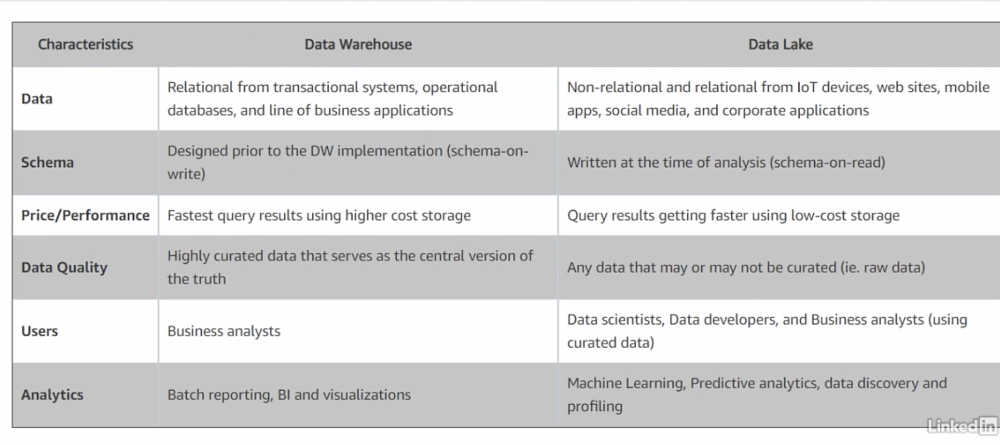
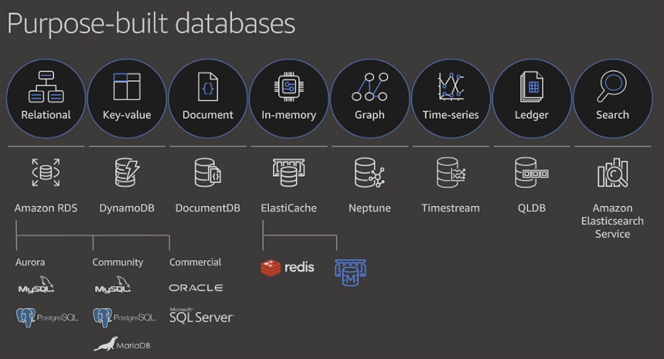
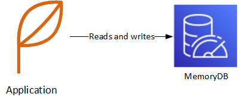

AWS fully managed database services provide continuous monitoring, self-healing storage, and automated scaling to help you focus on application development.

## Pricing considerations and free tier details:

|   |   |   |   |   |
|---|---|---|---|---|
|Database type|Use cases|AWS service|Free Tier Offer Details|Product Pricing|
|Relational|Traditional applications, enterprise resource planning (ERP), customer relationship management (CRM), ecommerce|Amazon Aurora|No|[Amazon Aurora Pricing](https://aws.amazon.com/rds/aurora/pricing/)|
|Relational|Traditional applications, enterprise resource planning (ERP), customer relationship management (CRM), ecommerce|Amazon RDS|12 MONTHS FREE 750 hours per month of db.t2.micro database usage (applicable database engines); 20 GB of general purpose (SSD) database storage; 20 GB of storage for database backups and database snapshots|[Amazon RDS Pricing](https://aws.amazon.com/rds/pricing/?p=ft&c=db)|
|Relational|Traditional applications, enterprise resource planning (ERP), customer relationship management (CRM), ecommerce|Amazon Redshift|2-MONTH FREE TRIAL 750 DC2.Large node hours per month|[Amazon Redshift Pricing](https://aws.amazon.com/redshift/pricing/?p=ft&c=db)|
|Key-value|High-traffic web applications, ecommerce systems, gaming applications|Amazon DynamoDB|ALWAYS FREE 25 GB of storage; 25 units of write capacity; 25 units of read capacity (enough to handle up to 200 million requests per month)|[Amazon DynamoDB Pricing](https://aws.amazon.com/dynamodb/pricing/?p=ft&c=db)|
|In-memory|Caching, session management, gaming leaderboards, geospatial applications|Amazon ElastiCache|12 MONTHS FREE 750 hours of cache.t2micro node usage|[Amazon ElastiCache Pricing](https://aws.amazon.com/elasticache/pricing/?p=ft&c=db)|
|In-memory|Caching, session management, gaming leaderboards, geospatial applications|Amazon MemoryDB for Redis|2-MONTH FREE TRIAL 750 t4g.small instance hours per month; 20 GB of data per month|[Amazon MemoryDB Pricing](https://aws.amazon.com/memorydb/pricing/?p=ft&c=db)|
|Document|Content management, catalogs, user profiles|Amazon DocumentDB (with MongoDB compatibility)|No|[Amazon DocumentDB Pricing](https://aws.amazon.com/documentdb/pricing/)|
|Wide column|High-scale industrial apps for equipment maintenance, fleet management, and route optimization|Amazon Keyspaces|3 MONTHS FREE 30 million on-demand write request units; 30 million on-demand read request units; 1 GB of storage (limit of one free tier per payer account)|[Amazon Keyspaces Pricing](https://aws.amazon.com/keyspaces/pricing/)|
|Graph|Fraud detection, social networking, recommendation engines|Amazon Neptune|No|[Amazon Neptune Pricing](https://aws.amazon.com/neptune/pricing/)|
|Time series|Internet of Things (IoT) applications, DevOps, industrial telemetry|Amazon Timestream|No|[Amazon Timestream Pricing](https://aws.amazon.com/timestream/pricing/)|
|Ledger|Systems of record, supply chain, registrations, banking transactions|Amazon Ledger Database Services (QLDB)|No|[Amazon Ledger Database Services (QLDB)Pricing](https://aws.amazon.com/qldb/pricing/)|

### RDS

[Amazon Relational Database Service (Amazon RDS)](https://docs.aws.amazon.com/AmazonRDS/latest/UserGuide/Welcome.html) is a service that makes it easier to set up, operate, and scale a relational databases (SQL) in the AWS Cloud. It provides cost-efficient, resizable capacity for an industry-standard relational database and manages common database administration tasks.

Amazon RDS takes over many of the difficult and tedious management tasks of a relational database:

- When you buy a server, you get CPU, memory, storage, and IOPS, all bundled together. With Amazon RDS, these are split apart so that you can scale them independently. If you need more CPU, less IOPS, or more storage, you can easily allocate them.
- Amazon RDS manages backups, software patching, automatic failure detection, and recovery.
- To deliver a managed service experience, Amazon RDS doesn't provide shell access to DB instances. It also restricts access to certain system procedures and tables that require advanced privileges.
- You can have automated backups performed when you need them, or manually create your own backup snapshot. You can use these backups to restore a database. The Amazon RDS restore process works reliably and efficiently.
- You can use the database products you are already familiar with: MySQL, MariaDB, PostgreSQL, Oracle, Microsoft SQL Server.
- You can get high availability with a primary instance and a synchronous secondary instance that you can fail over to when problems occur. You can also use MariaDB, Microsoft SQL Server, MySQL, Oracle, and PostgreSQL read replicas to increase read scaling.
- In addition to the security in your database package, you can help control who can access your RDS databases by using AWS Identity and Access Management (IAM) to define users and permissions. You can also help protect your databases by putting them in a virtual private cloud.

### RedShift

It is a [data warehouse](https://en.wikipedia.org/wiki/Data_warehouse) product which forms part of the larger [cloud-computing](https://en.wikipedia.org/wiki/Cloud-computing) platform [Amazon Web Services](https://en.wikipedia.org/wiki/Amazon_Web_Services).[1](1)(https://en.wikipedia.org/wiki/Amazon_Redshift\#cite_note-1) It is built on top of technology from the [massive parallel processing](https://en.wikipedia.org/wiki/Massive_parallel_processing) (MPP) data warehouse company [ParAccel](https://en.wikipedia.org/wiki/ParAccel) (later acquired by [Actian](https://en.wikipedia.org/wiki/Actian)),[2](2)(https://en.wikipedia.org/wiki/Amazon_Redshift#cite_note-2) to handle large scale [data sets](https://en.wikipedia.org/wiki/Data_set) and [database migrations](https://en.wikipedia.org/wiki/Database#Migration).[3](3)(https://en.wikipedia.org/wiki/Amazon_Redshift#cite_note-3) Redshift differs from Amazon's other hosted database offering, [Amazon RDS](https://en.wikipedia.org/wiki/Amazon_RDS), in its ability to handle analytic workloads on [big data](https://en.wikipedia.org/wiki/Big_data) data sets stored by a [column-oriented DBMS](https://en.wikipedia.org/wiki/Column-oriented_DBMS) principle. Redshift allows up to 16 [petabytes](https://en.wikipedia.org/wiki/Petabyte) of data on a cluster[4](4)(https://en.wikipedia.org/wiki/Amazon_Redshift#cite_note-4) compared to Amazon RDS [Aurora's](https://en.wikipedia.org/wiki/Amazon_Aurora) maximum size of 128 terabytes.[5](5)(https://en.wikipedia.org/wiki/Amazon_Redshift#cite_note-5)

### **ElastiCache**

In memory Database. Supports Redis or Memcached as engine. Amazon ElastiCache for Redis is a manged version of Redis – in-memory data store used mainly for caching. It can be placed in front of a database, like DynamoDB or RDS, to speed reads operations. Two common caching strategies are [lazy loading and write-through](https://docs.aws.amazon.com/whitepapers/latest/database-caching-strategies-using-redis/caching-patterns.html).

**Weakly consistent**

with an unbounded inconsistency window.

Redis allows writes and strongly consistent reads on the primary node of each shard and eventually consistent reads from read replicas. These consistency properties are not guaranteed if a primary node fails, as writes can become lost during a failover and thus violate the consistency model. Automatic detection of and recovery from cache node failures. In scenarios where the primary node fails ElastCache for Redis will automatically promote an existing read replica to the primary role. Redis replication system is asynchronous: all updates to primary nodes are replicated after being committed. In the event of a failure of a primary, acknowledged updates can be lost.

**Use cases / Considerations**

**Building low-latency data stores.** Amazon ElastiCache stores non-durable datasets in the memory and further supports real-time applications with microsecond latency and thus, helps in building low-latency data stores which help many clients.

**Eases backend database load.** Amazon ElastiCache provides caching of users' data which further reduces the pressure on the user's backend database and further enables the higher application scalability. This helps in reducing the operational burden and thus eases the backend database load.

**Accelerated performance of the application.** Amazon ElastiCache accesses the data with a microsecond latency and with high throughput which further results in lightning-fast application performance. Thus it provides the accelerated performance of the application.

**Caching.** Amazon ElastiCache provides caching which accelerates the application and the database performance or further as a primary data store for use cases that don't require durability like the session stores, streaming gaming leaderboards and analytics.

**In-memory data store.** Amazon Elasticahe provides an in-memory key-value store(or Datastore) which further provides ultrafast and inexpensive access to the copies of data. Further, most data stores have areas of data that are frequently accessed but are seldom updated. So, querying a database is always slower and more expensive than locating a key in the key-value pair cache.

  

### MemoryDb for Redis

MemoryDB for Redis aims to replace both cache and database in one component – provides microsecond read latency and data durability.

**Strong consistency** on the primary node, eventual consistency reads on replica nodes.

The consistency model of MemoryDB is similar to ElastiCache for Redis. However, in MemoryDB, data is not lost across failovers, allowing clients to read their writes from primaries regardless of node failures. Only data that is successfully persisted in the multi-AZ transaction log is visible. Replica nodes are still eventually consistent.

MemoryDB supports lossless failover.

When a failure occurs on a primary node, MemoryDB will automatically failover and promote one of the replicas to serve as the new primary and direct write traffic to it. Additionally, MemoryDB utilizes a distributed transactional log to ensure the data on replicas is kept up-to-date, even in the event of a primary node failure. Failover typically happens in under 10 seconds for unplanned outages and typically under 200 milliseconds for planned outages. MemoryDB stores your entire data set in memory and uses a distributed multi-AZ transactional log to provide data durability.

### DynamoDb

[Amazon DynamoDB](https://aws.amazon.com/dynamodb/) is a fully managed **NoSQL** database service that provides fast and predictable performance with seamless scalability.

In DynamoDB, tables, items, and attributes are the core components that you work with. A table is a collection of items, and each item is a collection of attributes.

DynamoDB supports eventually consistent and strongly consistent reads. For more information on that, see [Read Consistency](https://docs.aws.amazon.com/amazondynamodb/latest/developerguide/HowItWorks.ReadConsistency.html).

DynamoDB comes in two [Read/Write capacity modes](https://docs.aws.amazon.com/amazondynamodb/latest/developerguide/HowItWorks.ReadWriteCapacityMode.html), which should be chosen depending on application load and your budget.

For working with data, you can access Amazon DynamoDB using the AWS Management Console, the AWS Command Line Interface (AWS CLI), or the DynamoDB API.

If your application requires really fast reads (real-time bidding, social gaming, and trading applications) DynamoDB Accelerator (DAX) is a good choice, as it will cache query data from DynamoDB and your application will get the needed data much faster.

As DynamoDB has two Read/Write capacity modes, it’s important to understand, whether to use On-Demand or Provisioned mode.

### DocumentDb

Amazon DocumentDB implements the Apache 2.0 open source MongoDB 3.6, 4.0, and 5.0 API by emulating the responses that a MongoDB client expects from a MongoDB server, allowing you to use your existing MongoDB drivers and tools with Amazon DocumentDB. Updating your application is as easy as changing the database endpoint to a new Amazon DocumentDB cluster.

### **Neptune**

Amazon Neptune is a fast, scalable graph database service. Neptune efficiently stores and navigates highly connected data.

### **Keyspaces**

Amazon Keyspaces (for Apache Cassandra) is a scalable, highly available, and managed Apache Cassandra–compatible database service. With Amazon Keyspaces (for Apache Cassandra), you can run your Cassandra workloads on AWS using the same Cassandra application code and developer tools that you use today.

### QLDB

Amazon QLDB is a fully managed ledger database that provides a transparent, immutable and cryptographically verifiable transaction log owned by a central trusted authority. Amazon QLDB tracks each and every application data change and maintains a complete and verifiable history of changes over time.

  

  

## Self-check

1. What's the difference between Relational, NoSQL and In-Memory databases?
2. If you need to store simple data(string/integer) in cache, will you use Redis or Memcached?
3. When you want to make sure you get the latest data from DynamoDB, which type of read will you use?
4. Can you make your DynamoDB highly available? If yes, how?
5. How can you backup Database services?
6. What is RDS? What engines does it support?
7. What is RDS pricing?
8. Can you make your RDS instance highly available? If yes, how?
9. What is read replica in RDS and how it works?
10. What RDS operational (maintenance, monitoring) practices do you know?
11. What RDS capacity planning best practices do you know?
12. What RDS testing and profiling best practices do you know?
13. What are the advantages of RDS over manually managed databases?
14. What is the difference between multi-AZ deployment and read replicas in RDS?
15. What security features does RDS provide?
16. What is AWS Aurora?
17. You need to make a snapshot in RDS at a specific time, is that possible? If yes, how?