**Amazon Elastic Compute Cloud (Amazon EC2)** provides scalable computing capacity in the Amazon Web Services (AWS) Cloud. Using Amazon EC2 eliminates your need to invest in hardware up front, so you can develop and deploy applications faster. You can use Amazon EC2 to launch as many or as few **virtual servers** as you need, configure security and networking, and manage storage. Amazon EC2 enables you to scale up or down to handle changes in requirements or spikes in popularity, reducing your need to forecast traffic.

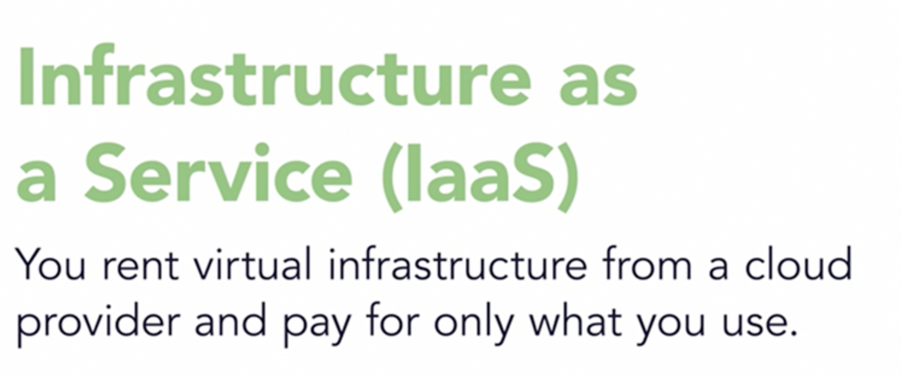

AMI - preconfigured server image with OS and other applications

To calculate prices

calculator.aws

## Key Information about EC2 Service:

Amazon EC2 provides the following features:

- Virtual computing environments, known as instances
- Preconfigured templates for your instances, known as Amazon Machine Images (AMIs), that package the fits you need for your server (including the operating system and additional software)
- Various configurations of CPU, memory, storage, and networking capacity for your instances, known as instance types
- Secure login information for your instances using key pairs(AWS stores the public key, and you store the private key in a secure place)
- Storage volumes for temporary data that's deleted when you stop, hibernate, or terminate your instance, known as instance store volumes
- Persistent storage volumes for your data using Amazon Elastic Block Store (Amazon EBS), known as Amazon EBS volumes
- Multiple physical locations for your resources, such as instances and Amazon EBS volumes, known as Regions and Availability Zones
- A firewall that enables you to specify the protocols, ports, and source IP ranges that can reach your instances using security groups
- Static IPv4 addresses for dynamic cloud computing, known as **Elastic IP addresses**
- Metadata (including tags), that you can create and assign to your Amazon EC2 resources
- Virtual networks you can create that are logically isolated from the rest of the AWS Cloud, and that you can optionally connect to your own network, known as virtual private clouds(VPCs)

  

## Regions and Availability Zones:

AWS has the concept of a **Regions**, which are a separate geographic areas of the world where we cluster data centers. Each group of physical data centers is called an **Availability Zone**. Each AWS Region consists of multiple, isolated, and physically separate AZs. Unlike other cloud providers, who often define a region as a single data center, the multiple AZ design of every AWS Region offers advantages for customers. Each AZ has independent power, cooling, and physical security and is connected via redundant, ultra-low-latency networks. AWS customers focused on high availability can design their applications to run in multiple AZs to achieve even greater fault-tolerance. AWS infrastructure Regions meet the highest levels of security, compliance, and data protection.

## AMIs

> An Amazon Machine Image (AMI) provides the information required to launch an instance. You must specify an AMI when you launch an instance. You can launch multiple instances from a single AMI when you need multiple instances with the same configuration. You can use different AMIs to launch instances when you need instances with different configurations.

An AMI includes: one or more Amazon EBS snapshots, launch permissions that control which AWS accounts can use the AMI to launch instances and a block device mapping that specifies the volumes to attach to the instance when it's launched.

After you launch an instance from an AMI, you can connect to it. When you are connected to an instance, you can use it just like you use any other server. For information about launching, connecting, and using your instance

[AMI Lifecycle](https://docs.aws.amazon.com/AWSEC2/latest/UserGuide/ami-lifecycle.html)

The following diagram summarizes the AMI lifecycle. After you create and register an AMI, you can use it to launch new instances. (You can also launch instances from an AMI if the AMI owner grants you launch permissions.) When you no longer require an AMI, you can deregister it.

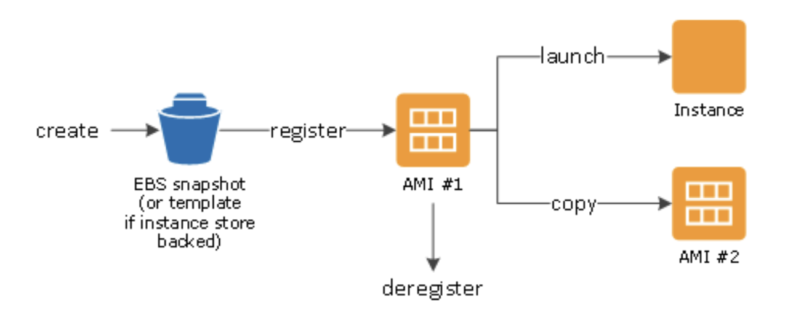

## EC2 instance types:

Amazon EC2 provides a wide selection of instance types optimized for different use cases. To determine which instance types meet your requirements, such as supported Regions, compute resources, or storage resources, see [Find an Amazon EC2 instance type.](https://docs.aws.amazon.com/AWSEC2/latest/UserGuide/instance-discovery.html)

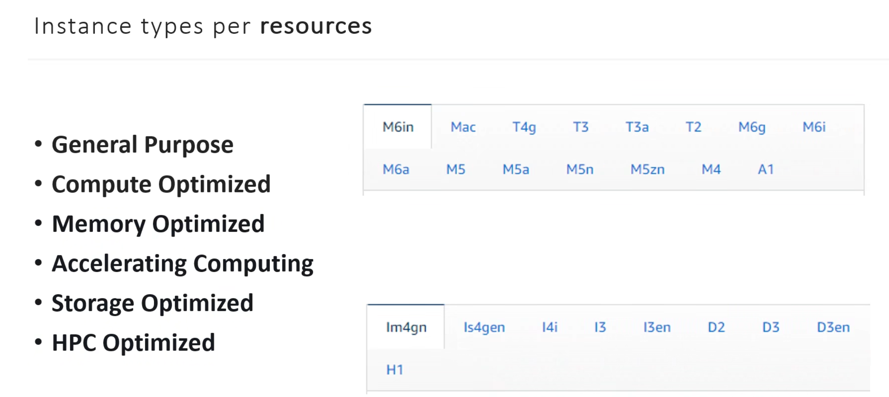

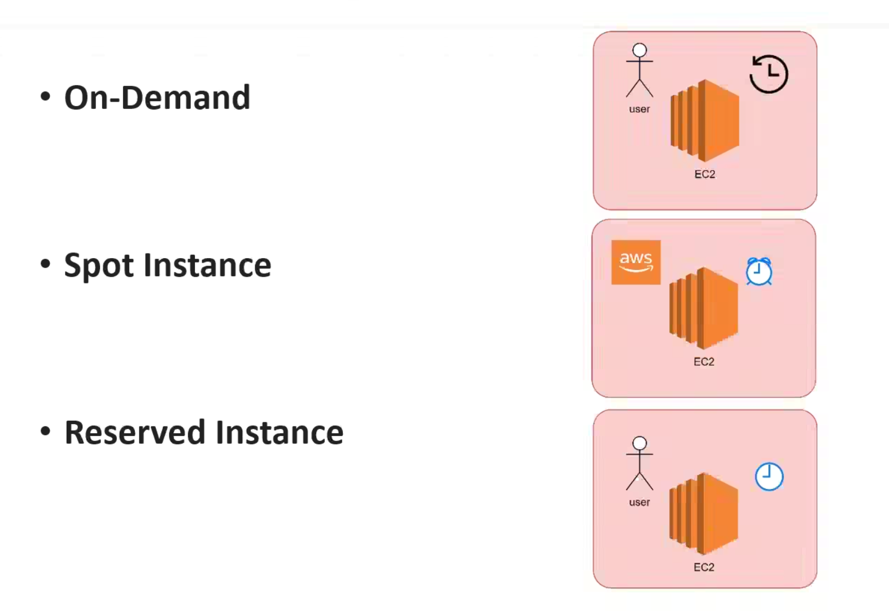

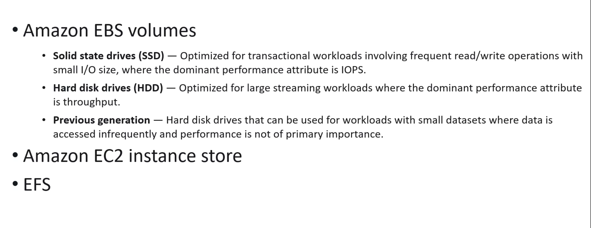

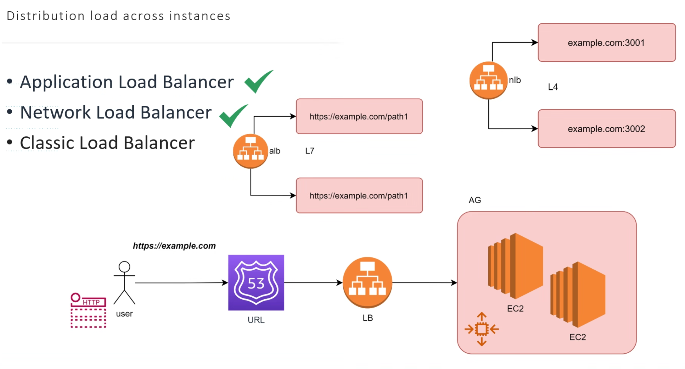

  

There are several types of instances:

- [General purpose instances](https://docs.aws.amazon.com/AWSEC2/latest/UserGuide/general-purpose-instances.html) provide a balance of compute, memory, and networking resources, and can be used for a wide range of workloads. There are a number of general purpose instance types:See explanation bellow
    
    These types support bursting CPU usage at any time and as long as you need. Each generation has some unique features. Instances are a low-cost. T-type instances is available on the AWS Free tier(availible generation depends on region). T4g instances are powered by Arm-based AWS Graviton2 processors. These instances are ideal for:
    
    - Websites and web applications
    - Code repositories
    - Development, build, test, and staging environments
    - Microservices
    
    [M-type](https://aws.amazon.com/ec2/instance-types/m5/), [T-type](https://aws.amazon.com/ec2/instance-types/t2/), [Mac1 instance](https://docs.aws.amazon.com/AWSEC2/latest/UserGuide/ec2-mac-instances.html)
    
    Figure: T4 instance type specifications
    
    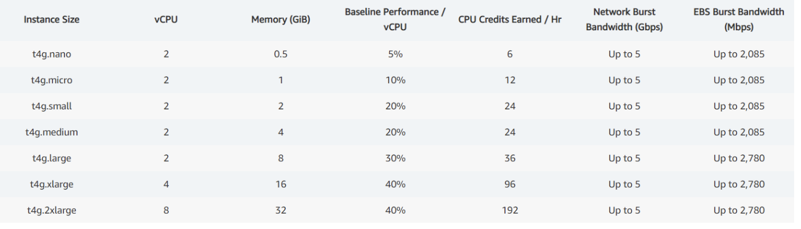
    
- [Compute optimized instances](https://docs.aws.amazon.com/AWSEC2/latest/UserGuide/compute-optimized-instances.html) are ideal for compute-bound applications that benefit from high-performance processors.
- [Memory optimized instances](https://docs.aws.amazon.com/AWSEC2/latest/UserGuide/memory-optimized-instances.html) are designed to deliver fast performance for workloads that process large data sets in memory.
- [Storage optimized instances](https://docs.aws.amazon.com/AWSEC2/latest/UserGuide/storage-optimized-instances.html) are designed for workloads that require high, sequential read and write access to very large data sets on local storage. They are optimized to deliver tens of thousands of low-latency, random I/O operations per second (IOPS) to applications.
- [Accelerated computing instances](https://docs.aws.amazon.com/AWSEC2/latest/UserGuide/accelerated-computing-instances.html) use hardware accelerators, or co-processors, to perform functions, such as floating point number calculations, graphics processing, or data pattern matching, more efficiently than is possible in software running on CPUs.

### Burstable performance instances:

The T instance family provides a baseline CPU performance with the ability to burst above the baseline at any time for as long as required. The T instances offer a balance of compute, memory, and network resources, and provide you with the most cost-effective way to run a broad spectrum of general purpose applications that have a low-to-moderate CPU usage. They can save you up to 15% in costs when compared to M instances, and can lead to even more cost savings with smaller, more economical instance sizes, offering as low as 2 vCPUs and 0.5 GiB of memory.

Differences between the burstable instance types:

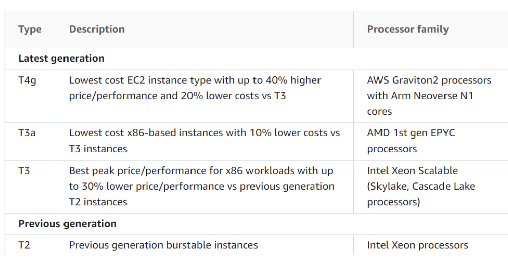

### [User data](https://docs.aws.amazon.com/AWSEC2/latest/UserGuide/instancedata-add-user-data.html)

AWS user data is the set of commands/data you can provide to a instance at launch time.

When you launch an instance in Amazon EC2, you have the option of passing user data to the instance that can be used to perform common automated configuration tasks and even run scripts after the instance starts. You can pass two types of user data to Amazon EC2: [shell scripts](https://docs.aws.amazon.com/AWSEC2/latest/UserGuide/user-data.html#user-data-shell-scripts) and [cloud-init directives](https://docs.aws.amazon.com/AWSEC2/latest/UserGuide/user-data.html#user-data-cloud-init). You can also pass this data into the launch wizard as plain text, as a file (this is useful for launching instances using the command line tools), or as base64-encoded text (for API calls). For more information, see [Run commands on your Linux instance at launch](https://docs.aws.amazon.com/AWSEC2/latest/UserGuide/user-data.html#user-data-requirements)

### [Сloud-init](https://docs.aws.amazon.com/AWSEC2/latest/UserGuide/amazon-linux-ami-basics.html#amazon-linux-cloud-init)

The cloud-init package is an open-source application built by Canonical that is used to bootstrap Linux images in a cloud computing environment, such as Amazon EC2. Amazon Linux contains a customized version of cloud-init. It enables you to specify actions that should happen to your instance at boot time.

### Ways how to troubleshoot user data scripts:

  

1. You can verify using the following steps: a) SSH on launch EC2 instance. b) Check the log of your user data script in: /var/log/cloud-init.log and /var/log/cloud-init-output.log You can see all logs of your user data script, and it will also create the /etc/cloud folder.
2. Right click on your instance, then in the new interface: Monitor and Troubleshoot > Get System Log

### [Instance metadata](https://docs.aws.amazon.com/AWSEC2/latest/UserGuide/ec2-instance-metadata.html)

Instance metadata is data about your instance that you can use to configure or manage the running instance. Instance metadata is divided into categories, for example, host name, events, and security groups.

Because your instance metadata is available from your running instance, you do not need to use the Amazon EC2 console or the AWS CLI. This can be helpful when you're writing scripts to run from your instance. For example, you can access the local IP address of your instance from instance metadata to manage a connection to an external application.

To view all categories of instance metadata from within a running instance, use the following IPv4([http://169.254.169.254/latest/meta-data/](http://169.254.169.254/latest/meta-data/)) or IPv6([http://[fd00:ec2::254]/latest/meta-data/](https://www.notion.sohttp://[fd00:ec2::254%5D/latest/meta-data/)) URIs.

### AWS Cost Management

[AWS Cost Management](https://us-east-1.console.aws.amazon.com/cost-management/home?region=eu-north-1#/dashboard)

### Shared responsibility

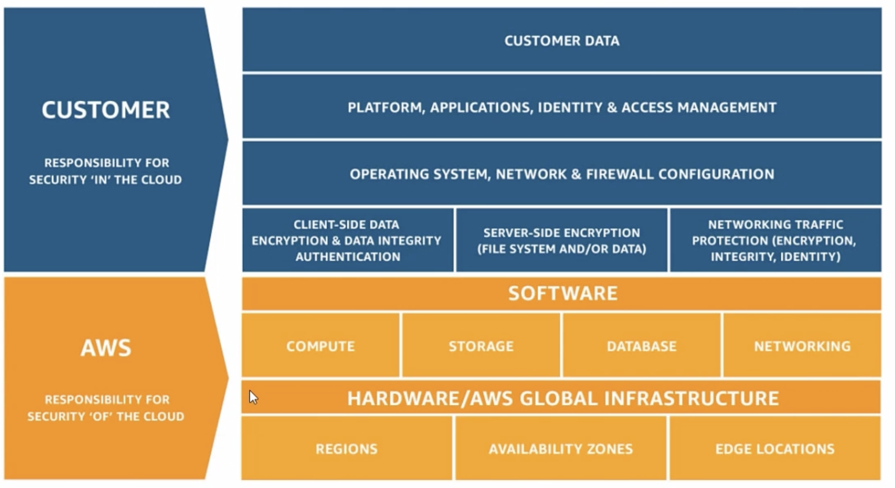

## EC2 purchasing options:

Amazon EC2 provides the following purchasing options to enable you to optimize your costs based on your needs ([Amazon EC2 pricing](https://aws.amazon.com/ec2/pricing/?did=ap_card&trk=ap_card)):

- [On-Demand Instances](https://docs.aws.amazon.com/AWSEC2/latest/UserGuide/ec2-on-demand-instances.html) – Pay, by the second, for the instances that you launch.
- [Reserved Instances](https://docs.aws.amazon.com/AWSEC2/latest/UserGuide/ec2-reserved-instances.html) – Reduce your Amazon EC2 costs by making a commitment to a consistent instance configuration, including instance type and Region, for a term of 1 or 3 years.
- [Spot Instances](https://docs.aws.amazon.com/AWSEC2/latest/UserGuide/using-spot-instances.html) – Request unused EC2 instances, which can reduce your Amazon EC2 costs significantly.
- [Dedicated Hosts](https://docs.aws.amazon.com/AWSEC2/latest/UserGuide/dedicated-hosts-overview.html) – Pay for a physical host that is fully dedicated to running your instances, and bring your existing per-socket, per-core, or per-VM software licenses to reduce costs.
- [Dedicated Instances](https://docs.aws.amazon.com/AWSEC2/latest/UserGuide/dedicated-instance.html) – Pay, by the hour, for instances that run on single-tenant hardware.
- [Capacity Reservations](https://docs.aws.amazon.com/AWSEC2/latest/UserGuide/ec2-capacity-reservations.html) – Reserve capacity for your EC2 instances in a specific Availability Zone for any duration.

In additional you can use [Savings Plans](https://docs.aws.amazon.com/savingsplans/latest/userguide/what-is-savings-plans.html) for reducing your Amazon EC2 costs by making a commitment to a consistent amount of usage, in USD per hour, for a term of 1 or 3 years.

## Cautions

Amazon EC2 provides different resources that you can use. These resources include images, instances, volumes, and snapshots. When you create your AWS account, it configured with default quotas (also referred to as limits) on these resources on a per-Region basis.

One of the most important is the limit on the number of running On-Demand Instances per AWS account per Region. On-Demand Instance limits are managed in terms of the number of virtual central processing units (vCPUs, regardless of the instance type).

Please refer to the documentation: [Request a limit increase](https://docs.aws.amazon.com/AWSEC2/latest/UserGuide/ec2-on-demand-instances.html#vcpu-limits-request-increase)

EC2 usage are billed on one second increments, with a minimum of 60 seconds. Similarly, provisioned storage for EBS volumes will be billed per-second increments, with a 60 second minimum. Per-second billing is available for instances launched in:

- On-Demand, Reserved and Spot forms
- All regions and Availability Zones
- Amazon Linux and Ubuntu

## EC2 Monitoring:

Monitoring is an important part of maintaining the reliability, availability, and performance of your Amazon Elastic Compute Cloud (Amazon EC2) instances and your AWS solutions. You can monitor the status of your instances by viewing **Status Checks** and scheduled events for your instances. There are two types of status checks.

System status checks:

- Monitor the systems on which your instances run
- Reasons for failure:
    - Loss of network connectivity
    - Loss of system power
    - Software issues on the physical host
    - Hardware issues on the physical host that impact network reachability

Instance status checks:

- Monitor the network and software configuration on an instance
- You must intervene to fix
- Reason for failure:
    - Failed systems status checks
    - Incorrect networking or startup configuration
    - Exhausted memory
    - Corrupted file system
    - Incompatible kernel

Also you can monitor your instances using **Amazon CloudWatch**, which collects and processes raw data from Amazon EC2 into readable, near real-time metrics. These statistics are recorded for a period of 15 months, so that you can access historical information and gain a better perspective on how your web application or service is performing.

You could collect following EC2 metrics:

- CPUUtilization
- DiskReadOps
- DiskWriteOps
- DiskReadBytes
- DiskWriteBytes
- NetworkIn
- NetworkOut
- NetworkPacketsIn
- NetworkPacketsOut
- MetadataNoToken

## Spot Fleet

Amazon Web Services (AWS) Spot Fleets are collections of AWS spot instances and optionally On-Demand Instances, virtual servers from Amazon’s pool of spare capacity, offered at discounts of up to 90%. Spot instances need to be carefully managed, because they are terminated by Amazon at short notice when the market price goes about your bidding price. Applications can make requests for Spot Fleets via the Spot Fleet application programming interface (API) or the command line interface (CLI). Because spot instances pricing often changes, EC2 constantly attempts to balance the capacity according to predefined values.

AWS Spot instances are an excellent way to significantly reduce your EC2 on demand instance cost by up to 90%.AWS spot instances represent AWS’s excess capacity.

AWS Spot instances can be used for a much broader set of use cases, without any significant impact on availability or performance. Some examples:

- Stateful applications
- Machine Learning
- CI/CD operations
- Big Data
- Distributed DBs such as Elasticsearch, Cassandra, Mongo

There are two types of Spot Fleet requests:

- Request creates a spot fleet on a one-time basis
- Maintain creates a Spot Fleet and maintains a desired capacity on an ongoing basis, identifying and recovering failed instances

[Spot Fleet instance weighting:](https://docs.aws.amazon.com/AWSEC2/latest/UserGuide/spot-instance-weighting.html)

When you request a fleet of Spot Instances, you can define the capacity units that each instance type would contribute to your application's performance, and adjust your maximum price for each Spot capacity pool accordingly using instance weighting. With spot fleets, you can also apply a custom weighting to each instance type. Weighting tells the spot fleet request what total capacity we care about. As a simple example, say we would like a total capacity of 10GB of RAM, and we select two instance types, one that has 2GB and one that has 4GB of RAM. If we assign a weight to each instance that is equal to the amount of RAM, then we can tell the spot fleet to give us 10 units of capacity. Spot fleet then uses the weighting information to provision 10 units. It can be five 2GB instances or two 4GB and one 2GB instance. It does not matter. We still get a total of 10 units or 10GB of capacity. Spot fleets work conservatively and will round up and slightly over provision if the instance types happen not perfectly to meet 10 units. For example, three 4GB instances result in 12 units.

The following tables provide examples of calculations to determine the price per unit for a Spot Fleet request with a target capacity of 10:

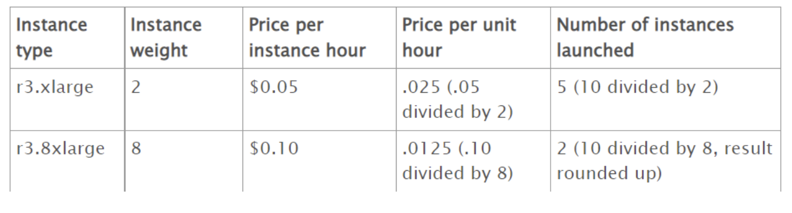

### Use cases / Considerations

- **Hosting environments.** One of the foremost uses of EC2 is for hosting a variety of applications, software and websites on the cloud. Users are even hosting games on the cloud, turning the servers on and off when needed. And the best part of this dynamic and scalable environment is that its compute capacity can grow along with the need of the application. This in turn ensures the best quality service for all end users at all times.
- **Development and test environments.** The scalable nature of EC2 means that organizations now have the ability to create and deploy large scale testing and development environments with unprecedented ease. The Amazon cloud does away with any heavy upfront investments for hardware, all the while providing as scalable solution.
- **Backup and disaster recovery.** Companies are leveraging EC2 as a medium for performing disaster recovery for both active and passive environments. The fact that the Amazon Elastic Compute Cloud can be turned up quickly in case of an emergency, means that businesses have access to a faster failover with minimal downtime for their applications.
- **Banking and financial sector.** These are areas that demand the utmost in security and scalability — both are factors that Amazon EC2 provides in droves. Financial institutions trust the Amazon cloud to provide a range of highly secure services. Retail and commercial banks, credit unions, insurance providers, card service companies, and major payment platforms rely on AWS for their scalable cloud computing needs.
- **Marketing and advertisement.** Low costs and rapid provisioning capabilities that EC2 allows have resulted in the platform increasingly being used to host marketing and advertising environments on the fly.
- **High performance computing.** The need for HPC is exponentially on the rise, and EC2 provides specialized virtualized servers that provide both high performance networking and compute power. These can be used to perform a range of CPU intensive and number crunching tasks, including Big Data analytics and processing.

## **EC2 Auto Scaling**

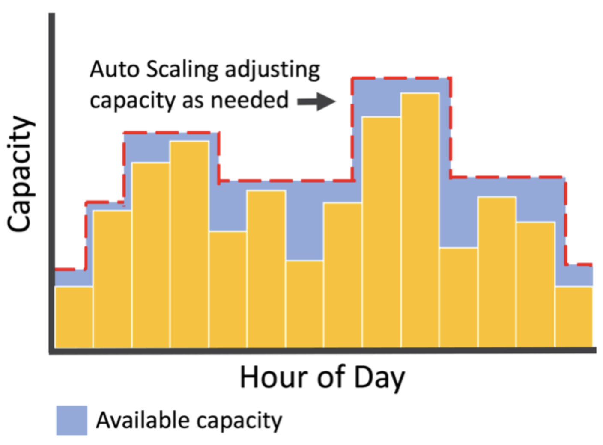

**Amazon EC2 Auto Scaling** helps you ensure that you have the correct number of Amazon EC2 instances available to handle the load for your application. You create collections of EC2 instances, called Auto Scaling groups. You can specify the minimum number of instances in each Auto Scaling group, and Amazon EC2 Auto Scaling ensures that your group never goes below this size. You can specify the maximum number of instances in each Auto Scaling group, and Amazon EC2 Auto Scaling ensures that your group never goes above this size. If you specify the desired capacity, either when you create the group or at any time thereafter, Amazon EC2 Auto Scaling ensures that your group has this many instances. If you specify scaling policies, then Amazon EC2 Auto Scaling can launch or terminate instances as demand on your application increases or decreases.

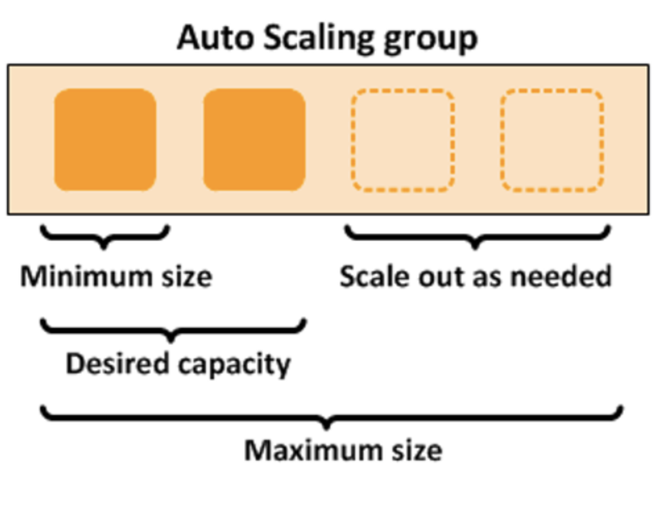

## Use cases:

You should use EC2 Auto Scaling if you only need to scale Amazon EC2 Auto Scaling groups, or if you are only interested in maintaining the health of your EC2 fleet. You should also use EC2 Auto Scaling if you need to create or configure Amazon EC2 Auto Scaling groups, or if you need to set up scheduled or step scaling policies (as AWS Auto Scaling supports only target tracking scaling policies).

Adding Amazon EC2 Auto Scaling to your application architecture is one way to maximize the benefits of the AWS Cloud. When you use Amazon EC2 Auto Scaling, your applications gain the following benefits:

- Better fault tolerance. Amazon EC2 Auto Scaling can detect when an instance is unhealthy, terminate it, and launch an instance to replace it. You can also configure Amazon EC2 Auto Scaling to use multiple Availability Zones. If one Availability Zone becomes unavailable, Amazon EC2 Auto Scaling can launch instances in another one to compensate.
- Better availability. Amazon EC2 Auto Scaling helps ensure that your application always has the right amount of capacity to handle the current traffic demand.
- Better cost management. Amazon EC2 Auto Scaling can dynamically increase and decrease capacity as needed. Because you pay for the EC2 instances you use, you save money by launching instances when they are needed and terminating them when they aren't.

## Limits:

Your AWS account has the default quotas, for Amazon EC2 Auto Scaling Groups, Scaling policy quotas and API-specific limits

To view the current quotas for your account, open the Amazon EC2 console at [https://console.aws.amazon.com/ec2/](https://console.aws.amazon.com/ec2/) and navigate to the Limits page. You can also use the describe-account-limits command. To request an increase, use the Auto Scaling Limits form.

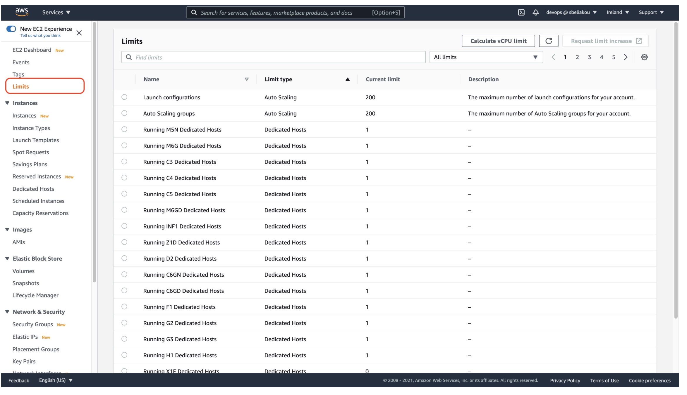

  

**EC2 Load Balancing**

A **load balancer** serves as the single point of contact for clients. The load balancer distributes incoming application traffic across multiple targets, such as EC2 instances, in multiple Availability Zones. This increases the availability and fault tolerance of your application. Elastic Load Balancing detects unhealthy instances and routes traffic only to healthy targets.

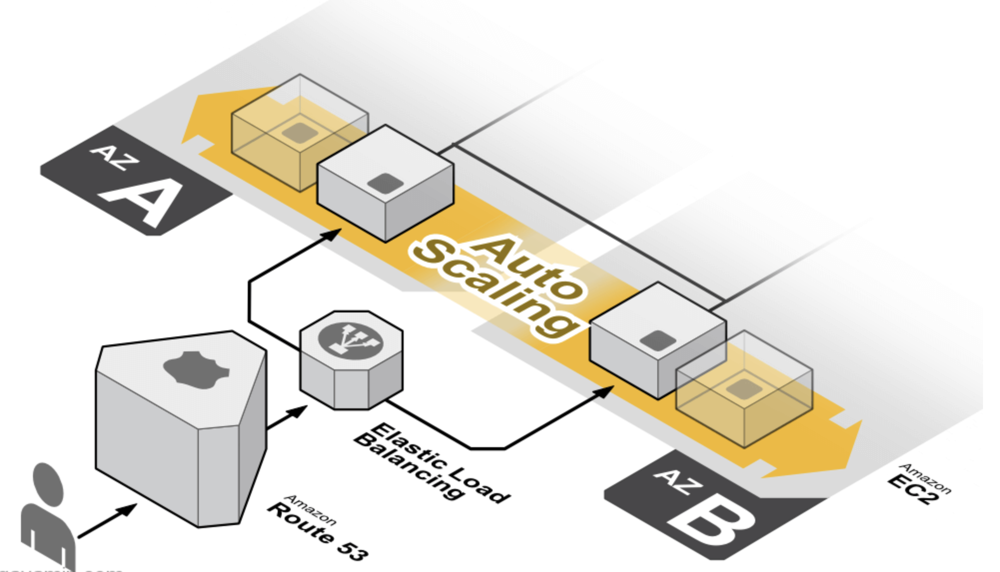

  

## Service Description:

A load balancer serves as the single point of contact for clients. The load balancer distributes incoming application traffic across multiple targets, such as EC2 instances, in multiple Availability Zones. This increases the availability and fault tolerance of your application. Elastic Load Balancing detects unhealthy instances and routes traffic only to healthy targets.

There are 4 types of Load Balancers available to choose:

- An [**Application Load Balancer (ALB)**](https://docs.aws.amazon.com/elasticloadbalancing/latest/application/application-load-balancers.html) functions at the application layer, the seventh layer of the Open Systems Interconnection (OSI) model. After the load balancer receives a request, it evaluates the listener rules in priority order to determine which rule to apply, and then selects a target from the target group for the rule action. You can configure listener rules to route requests to different target groups based on the content of the application traffic. Routing is performed independently for each target group, even when a target is registered with multiple target groups. You can configure the routing algorithm used at the target group level. The default routing algorithm is round robin; alternatively, you can specify the least outstanding requests routing algorithm.
    
    Detailed ALB components:
    
    - **Listener**. A listener is a process that checks for connection requests, using the protocol and port you configure. Traffic received by the listener is then routed to targets per your specification. You can specify multiple rules and multiple certificates per listener for ALB. Listeners support the following protocols and ports: _protocols_ - HTTP, HTTPS; _ports_ - 1-65535. For more information, see [Listeners](https://docs.aws.amazon.com/elasticloadbalancing/latest/application/load-balancer-listeners.html).
    - **Listener rules**. The rules that you define for a listener determine how the load balancer routes requests to its registered targets. Each listener has a default rule, and you can optionally define additional rules. Each rule consists of a priority, one or more actions, and one or more conditions. For more information, see [Listener rules](https://docs.aws.amazon.com/elasticloadbalancing/latest/application/load-balancer-listeners.html#listener-rules).
    - **Target groups**. Each target group is used to route requests to one or more registered targets. When you create each listener rule, you specify a target group and conditions. When a rule condition is met, traffic is forwarded to the corresponding target group. You can create different target groups for different types of requests. For more information, see [Target groups](https://docs.aws.amazon.com/elasticloadbalancing/latest/application/load-balancer-target-groups.html).
- A [**Network Load Balancer (NLB)**](https://docs.aws.amazon.com/elasticloadbalancing/latest/network/network-load-balancers.html) functions at the fourth layer of the Open Systems Interconnection (OSI) model. It can handle millions of requests per second. After the load balancer receives a connection request, it selects a target from the target group for the default rule. It attempts to open a TCP connection to the selected target on the port specified in the listener configuration.
    
    For TCP traffic, the load balancer selects a target using a flow hash algorithm based on the protocol, source IP address, source port, destination IP address, destination port, and TCP sequence number. The TCP connections from a client have different source ports and sequence numbers, and can be routed to different targets. Each individual TCP connection is routed to a single target for the life of the connection.
    
    For UDP traffic, the load balancer selects a target using a flow hash algorithm based on the protocol, source IP address, source port, destination IP address, and destination port. A UDP flow has the same source and destination, so it is consistently routed to a single target throughout its lifetime. Different UDP flows have different source IP addresses and ports, so they can be routed to different targets.
    
    Detailed NLB components:
    
    - **Listener**. A listener checks for connection requests from clients, using the protocol and port that you configure, and forwards requests to a target group. Listeners support the following protocols and ports: _protocols_ - TCP, TLS, UDP, TCP_UDP; _ports_ - 1-65535. For more information, see [Listeners](https://docs.aws.amazon.com/elasticloadbalancing/latest/network/load-balancer-listeners.html).
    - **Listener rules**. The rules that you define for a listener determine how the load balancer routes requests to the targets in one or more target groups. For more information, see [Listener rules](https://docs.aws.amazon.com/elasticloadbalancing/latest/network/load-balancer-listeners.html#listener-rules).
    - **Target groups**. Each target group is used to route requests to one or more registered targets. When you create each listener rule, you specify a target group and conditions. When a rule condition is met, traffic is forwarded to the corresponding target group. You can create different target groups for different types of requests. For more information, see [Target groups](https://docs.aws.amazon.com/elasticloadbalancing/latest/network/load-balancer-target-groups.html).
- A **Classic Load Balancer** is a previous generation of loadbalancers. It’s recommended to consider mentioned above types of loadbalancers instead. CLB operates on Layer 4/7 of the Open Systems Interconnection (OSI) model. The only one type of LB which is compatible with EC2-Classic
- **Gateway Load Balancers** enable you to deploy, scale, and manage virtual appliances, such as firewalls, intrusion detection and prevention systems, and deep packet inspection systems. It combines a transparent network gateway (that is, a single entry and exit point for all traffic) and distributes traffic while scaling your virtual appliances with the demand. A Gateway Load Balancer operates at the third layer of the Open Systems Interconnection (OSI) model, the network layer. It listens for all IP packets across all ports and forwards traffic to the target group that's specified in the listener rule. It maintains stickiness of flows to a specific target appliance using 5-tuple (for TCP/UDP flows) or 3-tuple (for non-TCP/UDP flows).Gateway Load Balancers use Gateway Load Balancer endpoints to securely exchange traffic across VPC boundaries. Traffic to and from a Gateway Load Balancer endpoint is configured using route tables. Traffic flows from the service consumer VPC over the Gateway Load Balancer endpoint to the Gateway Load Balancer in the service provider VPC, and then returns to the service consumer VPC. You must create the Gateway Load Balancer endpoint and the application servers in different subnets. This enables you to configure the Gateway Load Balancer endpoint as the next hop in the route table for the application subnet. AWS Demo: [Getting Started with AWS Gateway Load Balancer](https://youtu.be/f4DduW2M5WI)

  

On a high level:

- Be able to name and briefly explain all AWS Compute services
- Be able to tell how AWS provides security for Compute services (data-at-rest and data-in-transit)
- Be able to explain how AWS charges Compute services
- Know base monitoring for Compute Services (which metrics provided\not provided by default in CloudWatch)
- Capabilities of Enhanced Monitoring for Compute Services
- Differentiate Spot, On-demand and Reserved Instances
- Know the difference between Elastic IP and Public IP
- Get familiar with Public FQDN, Private FQDN naming convention
- Know what Bastion and Jump servers are

In details:

- Be familiar with EC2 instances, their types, AMI, Root Volumes, Snapshots, Burstable Instances, CPU Credits
- Understand Instance Metadata, User Data, cloud-init and how to troubleshoot it
- Explain the purpose of usage, base configuration and benefits of Autoscaling, ASG, Launch Templates
- Be familiar with Load Balancer types, target groups, listeners, listener rules and different types of rule actions and rule conditions
- Be able to choose LB for TLS termination, UDP - traffic, routing, originating source IP. Know on what OSI level each type of LB works
- Explain what all EC2 Launch Wizard options mean

Self-check:

- What is EC2?
- What are the types of EC2 instances?
- What provisioning/billing options are available with EC2?
- How to reduce costs when purchasing EC2 instances?
- What are Regions and Availability zones, and how can it help to build high availability solutions?
- What keys are created for each EC2 instance? What for?
- What happens to EC2 instances when they are stopped and started vs re-started?
- What is the difference between IAM roles and EC2 (VPC) security groups?
- What is AMI? How it differs from Snapshot(or from Launch Template)?
- What is EBS? What types of volumes are offered by EC2?
- Is it possible to decrease the size of an existing EBS volume?
- Is it possible to reuse a EBS volume for multiple instances?
- How can you monitor EC2 instances?
- What is horizontal scalability and Amazon EC2 auto scaling?
- What is Load Balancer? What types of Amazon Load Balancers do you know? What is the key difference between them?
- What is the request routing algorithm for Application and Network Load Balancers?
- What is a Listener and Listener rules? What is rule priority and rule condition?
- What is a Target Group? Can you use Lambda behind the Target Group?
- How is it possible to install/configure software on a EC2 instance?
- How is it possible to get such metadata as current region/AZ from within a running EC2 instance?
- What are the key events in EC2 instance lifecycle?
- How is it possible to grant a EC2 instance permissions to access certain AWS resources like S3?