Amazon Virtual Private Cloud (Amazon VPC) lets you provision a logically isolated section of the Amazon Web Services (AWS) Cloud where you can launch AWS resources in a virtual network that you define. You have complete control over your virtual networking environment, including selection of your own IP address range, creation of subnets, and configuration of route tables and network gateways
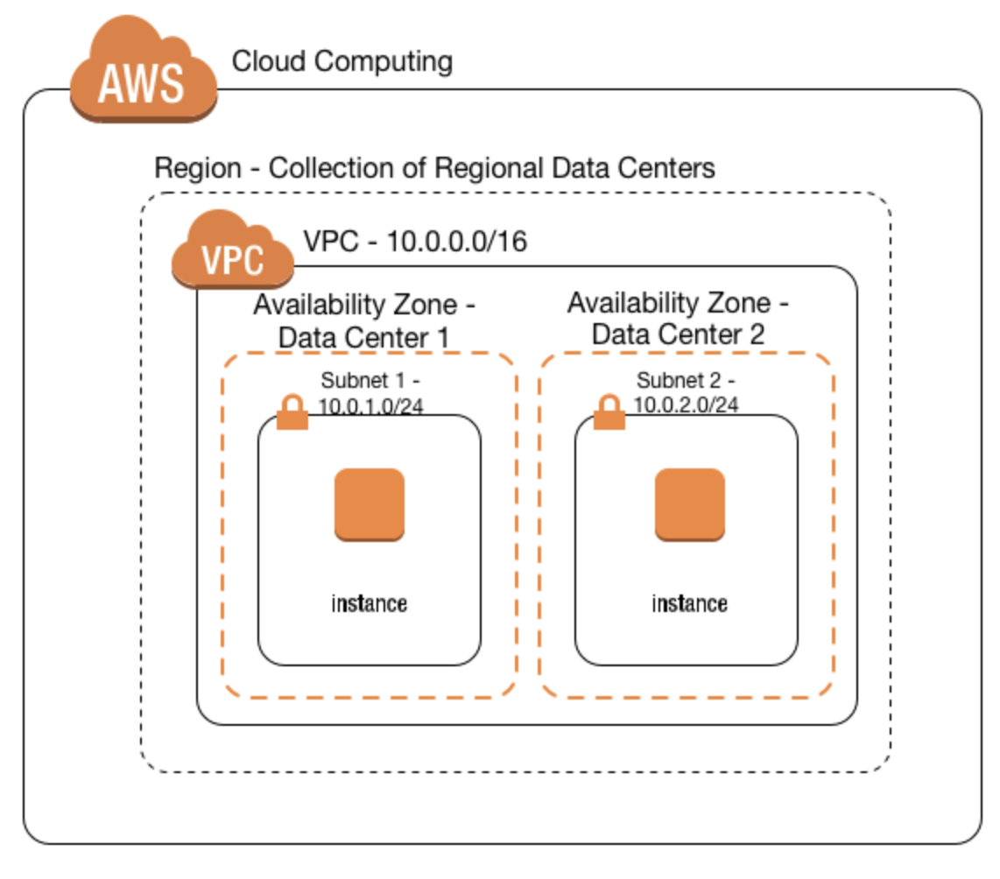

An Elastic Network Interface (ENI) is a virtual network interface that you can attach to an instance in an Amazon VPC. ENIs are only available within an Amazon VPC, and they are associated with a subnet upon creation. They can have one public IP address and multiple private IP addresses. If there are multiple private IP addresses, one of them is primary. Assigning a second network interface to an instance via an ENI allows it to be dual-homed (have network presence in different subnets). An ENI created independently of a particular instance persists regardless of the lifetime of any instance to which it is attached; if an underlying instance fails, the IP address may be preserved by attaching the ENI to a replacement instance.  
ENIs allow you to create a management network, use network and security appliances in your Amazon VPC, create dual-homed instances with workloads/roles on distinct subnets, or create a low-budget, high-availability solution.  

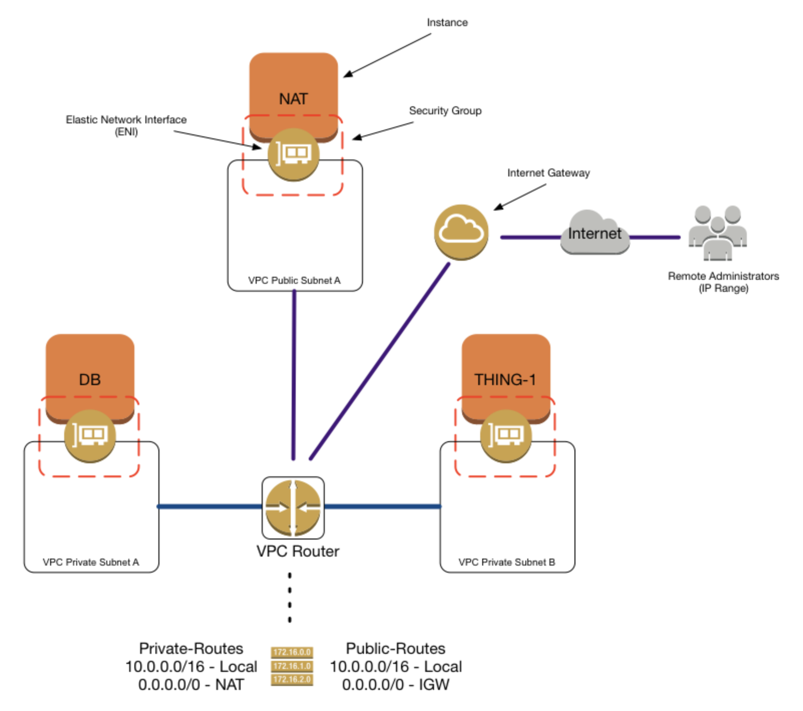

## IPv6

You can optionally associate an IPv6 CIDR block with your VPC and subnets, and assign IPv6 addresses from that block to the resources in your VPC. IPv6 addresses are public and reachable over the internet. Your VPC can operate in dual-stack mode: your resources can communicate over IPv4, or IPv6, or both. IPv4 and IPv6 addresses are independent of each other; you must configure routing and security in your VPC separately for IPv4 and IPv6.

### Use cases / Considerations

- A common use case for ENIs is the creation of management networks. This allows you to have public-facing applications like web servers in a public subnet but lock down SSH access down to a private subnet on a secondary network interface. In this scenario, you would connect using a VPN to the private management subnet, then administrate your servers as usual.
- ENIs are also often used as the primary network interfaces for Docker containers launched on ECS using Fargate. This allows Fargate tasks to handle complex networking, set firewalls in place using security groups, and be launched into private subnets.

**Elastic IP Addresses (EIPs)**

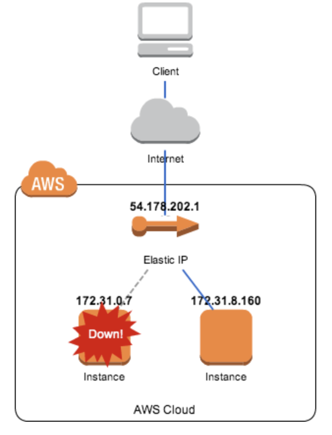

  

AWS maintains a pool of public IP addresses in each region and makes them available for you to associate to resources within your Amazon VPCs. An Elastic IP Addresses (EIP) is a static, public IP address in the pool for the region that you can allocate to your account (pull from the pool) and release (return to the pool). EIPs allow you to maintain a set of IP addresses that remain fixed while the underlying infrastructure may change over time. Here are the important points to understand about EIPs:

- You must first allocate an EIP for use within a VPC and then assign it to an instance.
- EIPs are specific to a region (that is, an EIP in one region cannot be assigned to an instance within an Amazon VPC in a different region).
- There is a one-to-one relationship between network interfaces and EIPs.
- You can move EIPs from one instance to another, either in the same Amazon VPC or a different Amazon VPC within the same region.
- EIPs remain associated with your AWS account until you explicitly release them.
- There are charges for EIPs allocated to your account, even when they are not associated with a resource.

## Network Address Translation (NAT) Instances and NAT Gateways

Used to interact for instances in different VPCs including private subnets

By default, any instance that you launch into a private subnet in an Amazon VPC is not able to communicate with the Internet through the IGW(internet gateway?). This is problematic if the instances within private subnets need direct access to the Internet from the Amazon VPC in order to apply security updates, download patches, or update application software. AWS provides NAT instances and NAT gateways to allow instances deployed in private subnets to gain Internet access. For common use cases, we recommend that you use a NAT gateway instead of a NAT instance. The NAT gateway provides better availability and higher bandwidth, and requires less administrative effort than NAT instances.

## VPC endpoint

A VPC endpoint enables you to privately connect your VPC to supported AWS services and VPC endpoint services powered by PrivateLink without requiring an internet gateway, NAT device, VPN connection, or AWS Direct Connect connection. Instances in your VPC do not require public IP addresses to communicate with resources in the service. Traffic between your VPC and the other service does not leave the Amazon network.

## VPC Peering

An Amazon VPC peering connection is a networking connection between two Amazon VPCs that enables instances in either Amazon VPC to communicate with each other as if they are within the same network. You can create an Amazon VPC peering connection between your own Amazon VPCs or with an Amazon VPC in another AWS account within a single region. A peering connection is neither a gateway nor an Amazon VPN connection and does not introduce a single point of failure for communication.

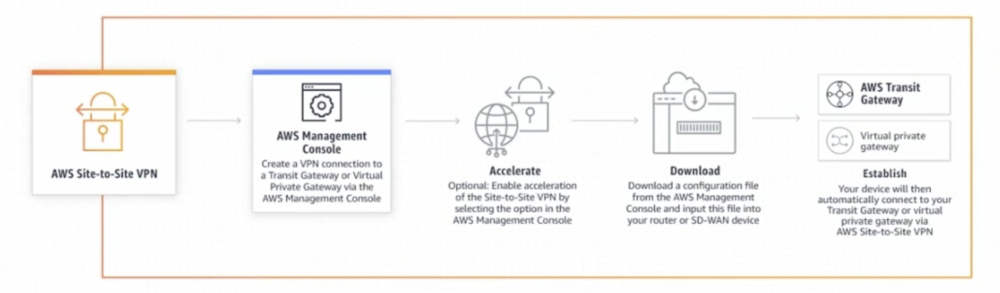

## Transit Gateway (TGW)

With large number of VPCs, Transit Gateway provides simpler VPC-to-VPC communication management over VPC Peering. Note that the transit hub can be used to interconnect not only our VPCs but also on-premises networks

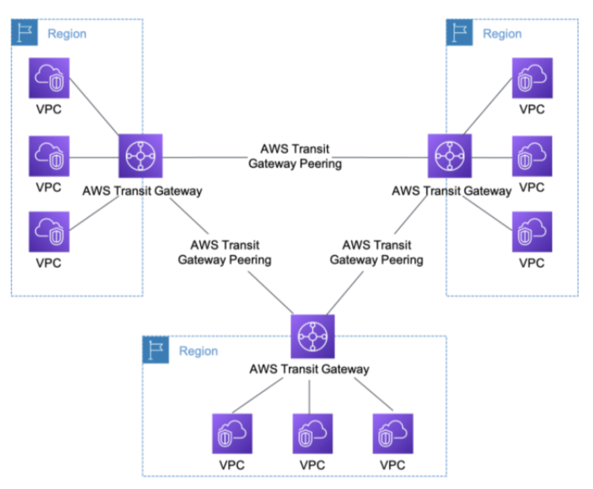

The Transit Gateway provides a hub and spoke design for connecting VPCs and on-premises networks as a fully managed service without VPN overlay.

  

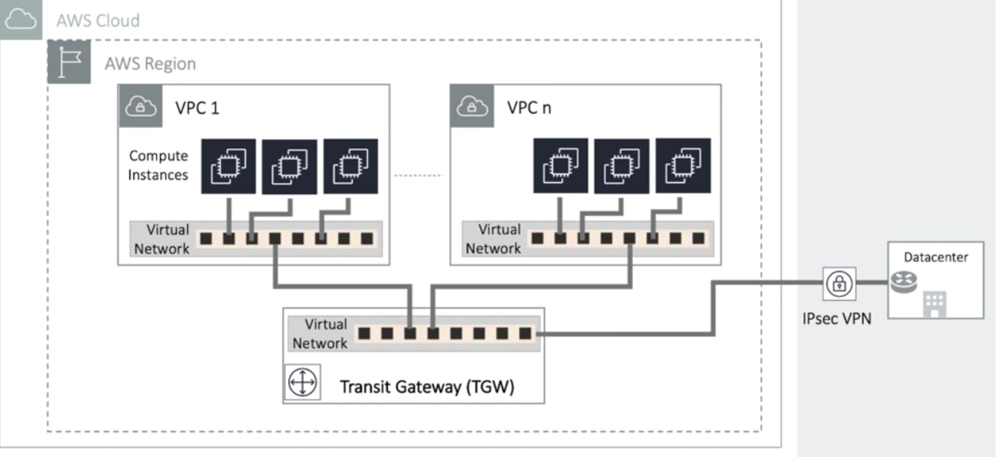

## Use cases / Considerations

- **Deliver applications around the world.** Build, deploy, and manage applications across thousands of Amazon VPCs without having to manage peering connections or update routing tables.
- **Rapidly move to global scale.** Share VPCs, Domain Name System (DNS), Microsoft Active Directory, and IPS/IDS across Regions with inter-Region peering.
- **Smoothly respond to spikes in demand.** Quickly add Amazon VPCs, AWS accounts, virtual private networking (VPN) capacity, or AWS Direct Connect gateways to meet unexpected demand.
- **Host multicast applications on AWS.** Host multicast applications that scale based on demand, without the need to buy and maintain custom hardware.

## VPC Flow Logs

VPC Flow Logs is a feature that enables you to capture information about the IP traffic going to and from network interfaces in your VPC. Flow log data can be published to Amazon CloudWatch Logs or Amazon S3. After you've created a flow log, you can retrieve and view its data in the chosen destination.

## Route 53

Amazon Route 53 is a highly available and scalable cloud Domain Name System (DNS) web service. It is designed to give developers and businesses an extremely reliable and cost effective way to route end users to Internet applications by translating names like [www.example.com](http://www.example.com/) into the numeric IP addresses like 192.0.2.1 that computers use to connect to each other. Amazon Route 53 is fully compliant with IPv6 as well.

Amazon Route 53 effectively connects user requests to infrastructure running in AWS – such as Amazon EC2 instances, Elastic Load Balancing load balancers, or Amazon S3 buckets – and can also be used to route users to infrastructure outside of AWS. You can use Amazon Route 53 to configure DNS health checks, then continuously monitor your applications’ ability to recover from failures and control application recovery with Route 53 Application Recovery Controller.

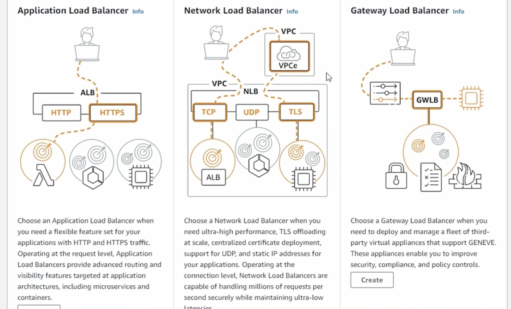

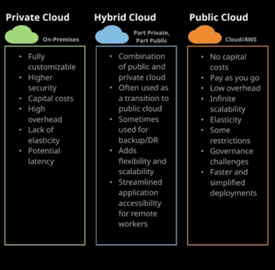

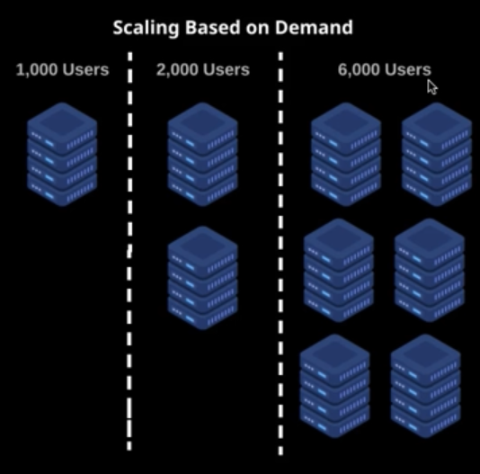

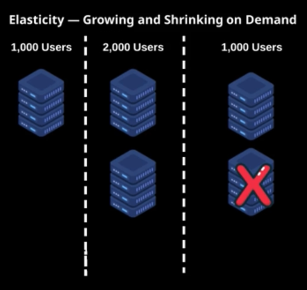

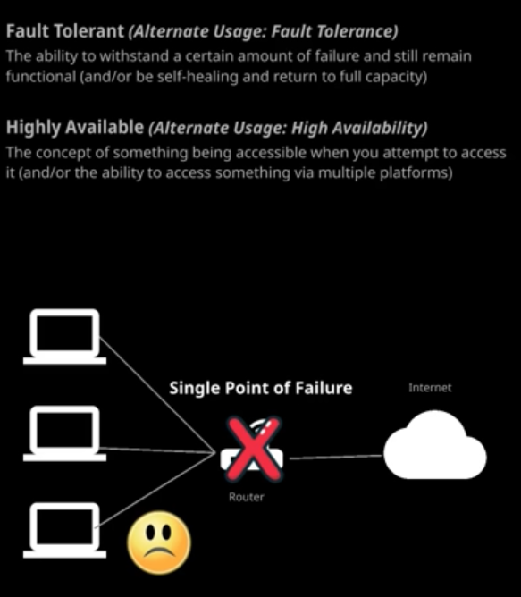

## Use cases / Considerations

- **Traffic Flow.** Amazon Route 53 provides Easy-to-use & cost-effective global traffic management that is route end users to the best endpoint for their application based on the proximity, latency, health, and other considerations. Thus Amazon Route 53 is widely used across the world.
- **Latency based Routing.** Amazon Route 53 provides Latency Based Routing (LBR) which is AWS’s highly reliable cost-effective DNS service. The Latency Based Routing which is one of the Amazon Route 53’s most requested features, helps users to improve their application’s performance for the global audience. Amazon Route 53 Latency Based Routing works by routing user's customers to the AWS endpoint (e.g. EC2 instances, Elastic IPs or ELBs) which provides the fastest experience based on actual performance measurements of the different AWS regions where the user's application is running.
- **Geo DNS.** Amazon Route 53 enables users to purchase a new domain name or transfer the management of their existing domain name to Route 53. When users purchase the new domains via Route 53, the service will automatically configure a Hosted Zone for each domain. Amazon Route 53 offers the privacy protection for user's WHOIS records at no additional charge. In addition, users benefit from AWS's consolidated billing to manage their domain name expenses alongside all of their other AWS resources. Amazon Route 53 offers a selection of more than 150 top-level domains (TLDs), including the major generic TLDs.
- **Private DNS for Amazon VPC.** Amazon Route 53 provides private DNS for Amazon VPC(Virtual Private Cloud) which helps in managing custom domain names for users' internal AWS resources without further exposing the DNS data to the public Internet.

  

  

- To get familiar with AWS Network Architecture components: VPC, Subnets, Private/Public subnets layout, Nat Gateways, Routing Tables, Elastic Network Interfaces(ENI)
- To know how to establish Cross VPC connectivity: VPC Peering, Transit Gateway
- To know how to secure your Networks (NACL and Security Groups, the difference between them)
- To get familiar with AWS DNS Service (AmazonProvidedDNS), DHCPs Option Sets
- Understand Route53: Public/Private Zones, Types of Records (including CNAME and Aliases)
- Learn about AWS CloudFront(Content Delivery Network)

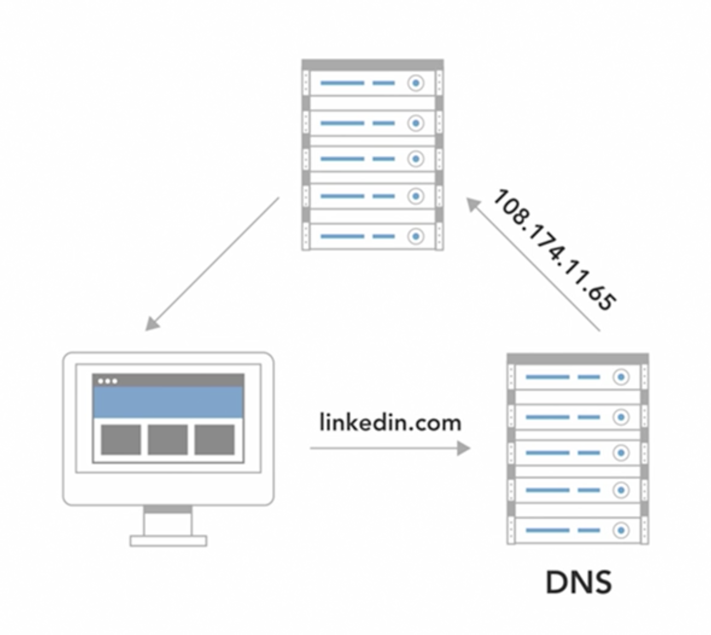

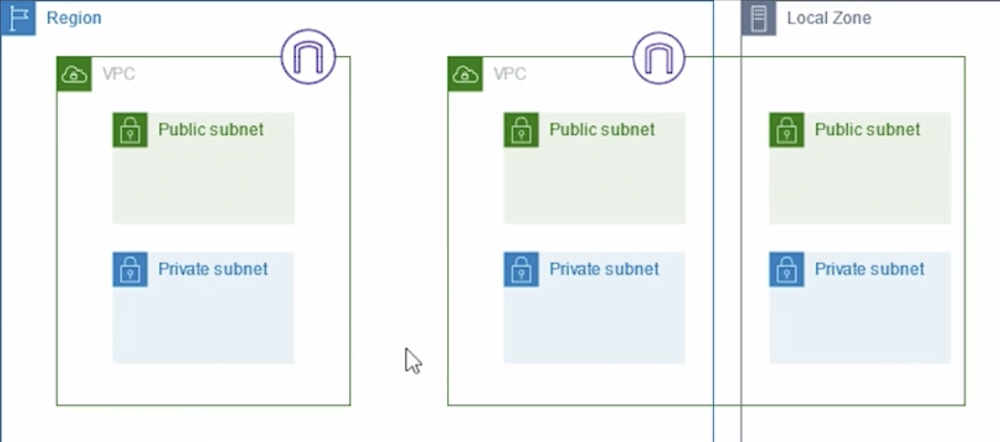

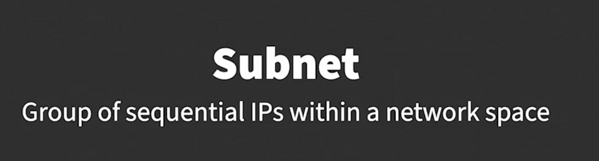

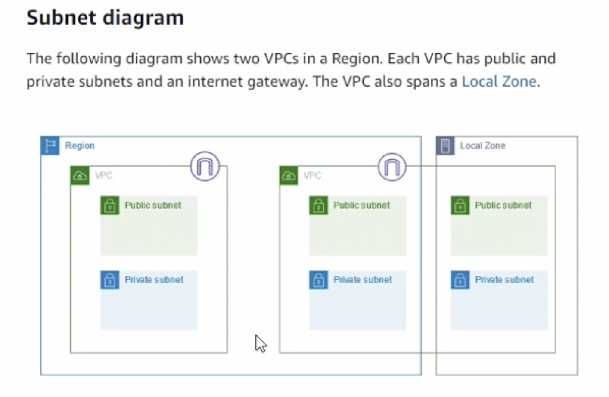

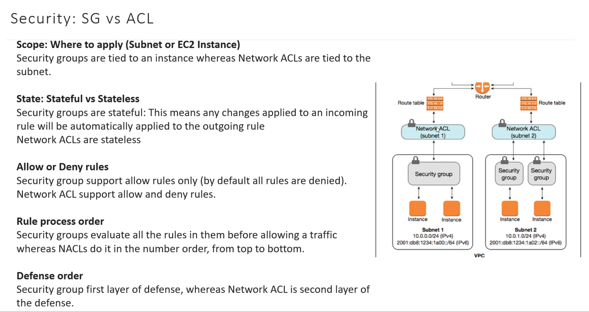

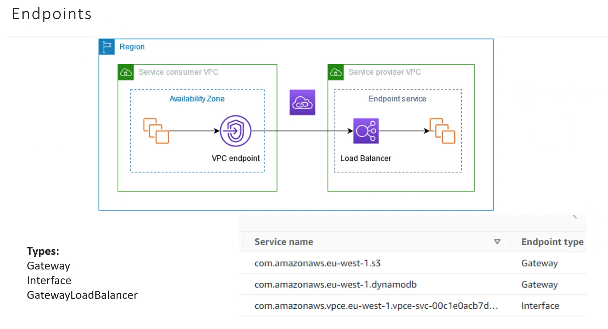

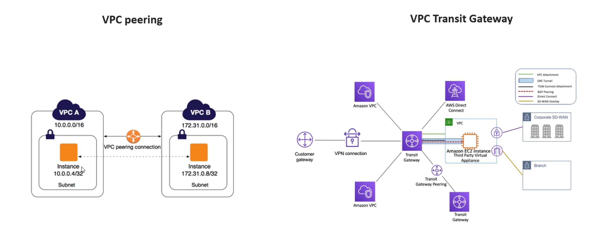

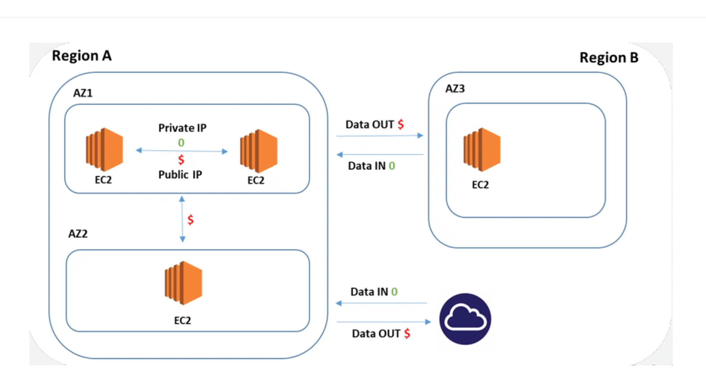

  

  

## Bastion  
  

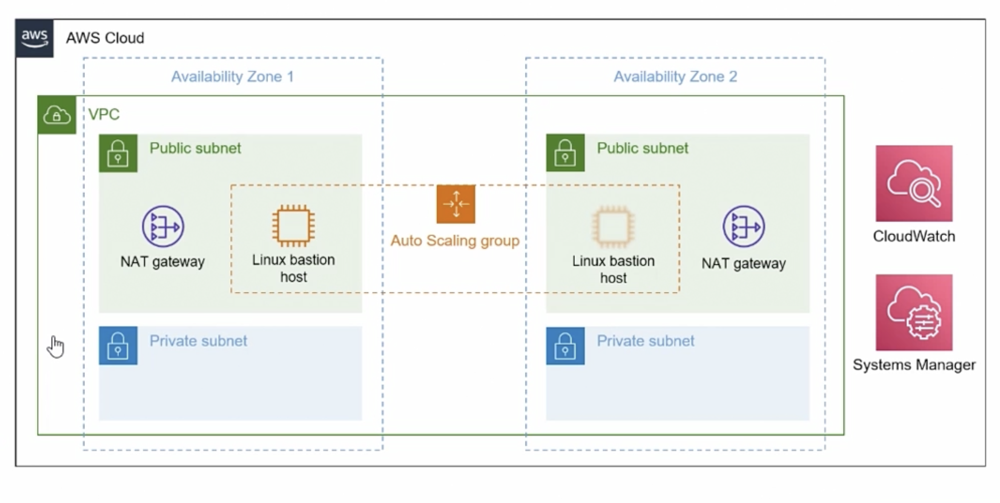

Host that is in public subnet and connection to another private instances made through it

  

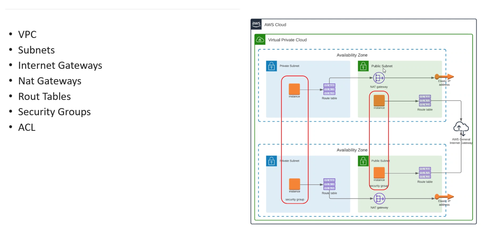

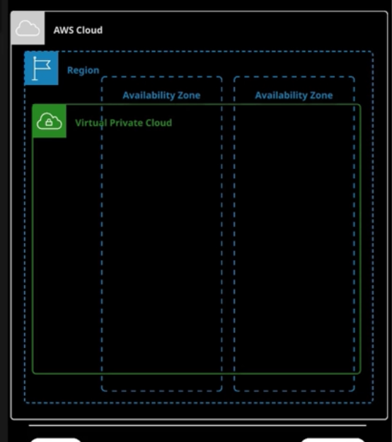

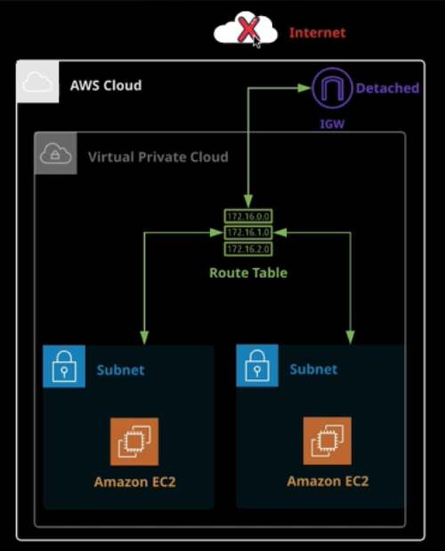

  

## Your Goals:

- To get familiar with AWS Network Architecture components: VPC, Subnets, Private/Public subnets layout, Nat Gateways, Routing Tables, Elastic Network Interfaces(ENI)
- To know how to establish Cross VPC connectivity: VPC Peering, Transit Gateway
- To know how to secure your Networks (NACL and Security Groups, the difference between them)
- To get familiar with AWS DNS Service (AmazonProvidedDNS), DHCPs Option Sets
- Understand Route53: Public/Private Zones, Types of Records (including CNAME and Aliases)
- Learn about AWS CloudFront(Content Delivery Network)

Self-check:

1. What kinds of IP addresses does AWS VPC offer?
2. What happens to different IP address types when an EC2 instance is rebooted, stopped, started?
3. Can you assign multiple IP addresses to an instance?
4. How many elastic IPs is it possible to create per account/region?
5. What's the difference between Public and Private subnet?
6. How do VPC subnets map onto AZs?
7. What's the difference between Default and Custom VPC?
8. What is the difference between NAT gateways and NAT instances?
9. Suppose you’ve assigned a CIDR block to a VPC. Will all the IPs in that block be available for the resources you create in the VPC?
10. When will you use NACL and when will you use SG? Which of them is stateful and which one is stateless?
11. How does VPC determine whether to deny/allow a request when both ACLs and security groups specified?
12. What does "local" target mean in terms of an AWS routing table?
13. How do you connect your VPC to the Internet?
14. What is bastion in terms of networking?
15. How can you monitor the network traffic in VPC?
16. Can you peer VPC with a VPC belonging to another AWS account?
17. Do you pay for VPC when using EC2 instances?