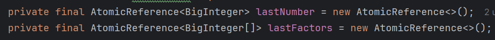

Thread Safety

Race Condition

```JavaScript
@NotThreadSafe
public class UnsafeSequence {
	private int value;
	/** Returns a unique value. */
	public int getNext() {
		return value++;
	}
}
```


```JavaScript
@ThreadSafe
public class Sequence {
	@GuardedBy("this") private int value;
	public synchronized int getNext() {
		return value++;
	}
}
```

Liveness hazard of a thread - something good eventually happens

Performance hazard of a thread - performance may drop due to context switching

Context switching- schedulre suspends current active thread temporary, so the other thread may run

Shared - variable could be accessed by many different threads

Mutable - it’s value may change during it’s lifetime

thread safety is all about protecting data

If multiple threads access the same mutable variable without synchronization, the program is broken, to fixit:

- Don’t share state variable accross threads
- Make state variable immutable
- Use synchronization whenever accessing variable

A class is **thread-safe** if it behaves correctly when accessed from multiple threads, regardless of the scheduling, interleaving and with no additional synchronization or other coordination on the part of calling code.

Thread-safe classes encapsulate any needed synchronization so the clients need not to provide their own

data race - thread writes a variable that might next be read by another thread or reads the variable that might be read by another thread if both threads don’t use synchronization

**Race conditions** occurs when correctness of computation relies on the relative timing or interleaving of multiple threads by the runtime

- check-then-act race condition - you observe something is true(file doesn’t exist); take an action based on observation(create file); But at the moment of action observation might become invalid
- read-modify-write - increment

Example

Race condition in Lazy initialization - you check if object is instantiated, if not - instantiate it

  

**Atomic operations** - operation A and B are atomic with respect to each other if from perspective of thread executing A, when another thread executes A, all operations B are executed or not started

**Compound actions** - actions that consist from several operations, like read-modify-write or check-then-act. These operations must be executed atomically in order to remain thread

When multiple variables participate in an invariant, they are not independent, thus when you update one, you should update other in the same atomic operation




Intrinsic locks in java act like mutex - at most one thread can own the lock

```Java
synchronized(object){
	...
}
```

Reentrancy

When thread requests lock that is already held by another thread, the requesting thread blocks.

But because intrinsic lock is reentrant, if thread tries to acquire lock that already holds, it will succeed. Reentrancy means that lock acquired on per thread, not per invocation basis. If it happens, lock count is increased and associated thread remains the same. Reentrancy facilitates encapsulation of locking - calling super.doSomething inside of this.doSomething (assuming the’re both marked synchronized) won’t lead to deadlock.

Serializing access - threads take turns accessing the object exclusively, rather then doing so concurrently.

  

It’s common mistake to assume that synchronization is needed only when writing to shared variables. For all the access to mutable variable must be performed with the same lock held.

  

Every shared mutable variable should be guarded by exactly one lock.


### [Sharing objects](Sharing%20objects.md)

### Composing Objects

### Building Blocks