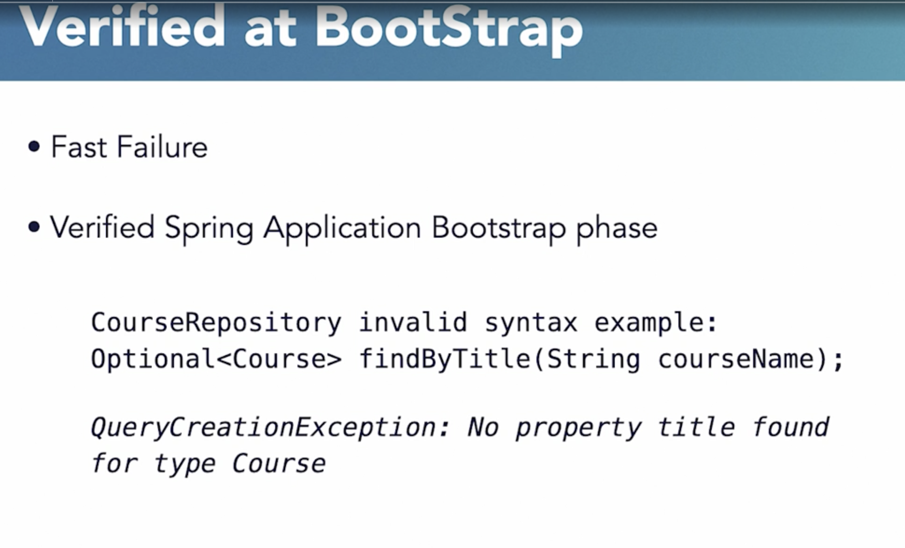
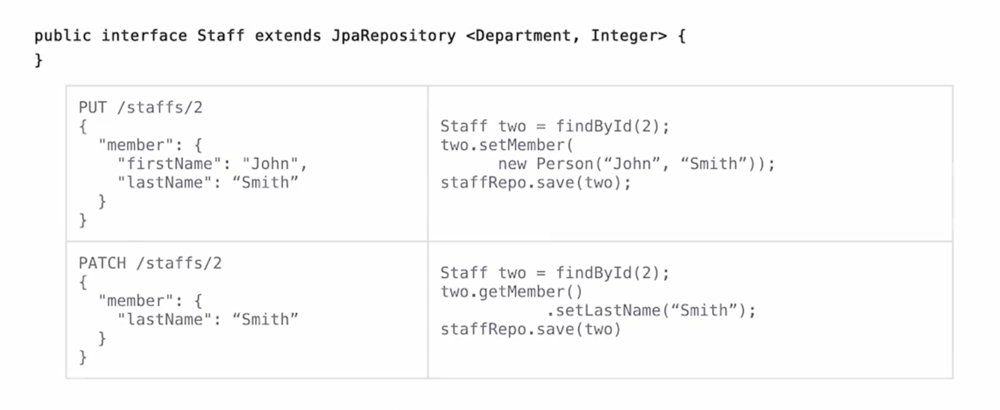

# **Spring Data**

Provides a set of common interfaces for interaction with datasources, aspected behaviour and naming convention.

**Benefits**

- Removes boilerplate code
- Allows swapping datasources(Easier data migration)
- Allows to focus on business value

# **Spring Data JPA**

Spring Data JPA, part of the larger Spring Data family, makes it easy to easily implement JPA based repositories. This module deals with enhanced support for JPA based data access layers. It makes it easier to build Spring-powered applications that use data access technologies.

@EnableJpaRepositoties

## **Features**

- Sophisticated support to build repositories based on Spring and JPA
- Support for [Querydsl](http://www.querydsl.com/) predicates and thus type-safe JPA queries
    
    ```Java
    List<Person> persons = queryFactory.selectFrom(person)
      .where(
        person.firstName.eq("John"),
        person.lastName.eq("Doe"))
      .fetch();
    ```
    
- Transparent auditing of domain class
- Pagination support, dynamic query execution, ability to integrate custom data access code
- Validation of `@Query` annotated queries at bootstrap time
- Support for XML based entity mapping
- JavaConfig based repository configuration by introducing `@EnableJpaRepositories`.

## Entity

Entity класс - POJO, который отображает  информацию из связанной таблицы

```Java
@Table(name="Books") //table relation
@Column //column relation
@Id // автогенерируемый id
@GeneratedValue // описывает стратегию генерации pk
	Auto // выбор стратегии зависит от типа бд
	Identity // автоматическое увеличение значения предыдущей строчки
	Sequence // c помощью. sequence
	Table // с помощью таблицы со значением
//создание собственного генератора Id
@GenericGenerator(name = "prod-generator",
		parameters = @Parameter(name = "prefix", value = "prod"),
		strategy = "com.baeldung.hibernate.pojo.generator.MyGenerator") 

@EmbeddedId //составной пк
Session //  обертка над подключением к бд с помощью JDBC.

// Отношения между таблицами:
Uni-directional // знает об отношениях только одна сторона
@OneToOne  // тип отношения между объектами: один к одному

Bi-directional // знает об отношениях  обе стороны
MappedBy // связь на второй таблице для Bi-directional, указываем название поля, с которым связать в другом классе
@OneToMany  // тип отношения между объектами: один ко многим
@ManyToMany  - тип отношения между объектами: многие ко многим
// Связь через промежуточную таблицу
@JoinColumn  - столбец, по которому осуществляется связь

Cascade-операции // операции, которые выполняются не только на Entity, но и на связанных с ним Entity

CascadeType // какие операции выполнять на оба метода
	All
	Persist
	Merge
	Refresh
```

**N+1 проблема** - два запроса в случае ленивых данных, вместо одного. Можно решить через FetchMode или EntityGraph  
fetch = FetchType - тип загрузки:  
Eager - загружаются все зависимые сразу  
Lazy - загружаются все зависимые при необходимости  

  




[https://docs.spring.io/spring-data/jpa/docs/current/reference/html/#repository-query-keywords](https://docs.spring.io/spring-data/jpa/docs/current/reference/html/#repository-query-keywords)

## Repository

Реализуется через наследование:

- **Repository**
- **CRUDRepository** - only basic create, read, update, delete methods. Returns Iterable for multiple items
- **PagingAndSortingRepository** - Instead of methods with Iterable uses Pageable
- **JpaRepository** - extends CRUD and PagingAndSorting, providing additional methods, returns List for multiple items
- **QueryByExampleRepository**

Spring Data 3

- **ListCrudRepository**
- _**PagingAndSortingRepository no longer extends**_ **CRUDRepository(it extends ListCrudRepository)**

## Transactions

Spring 3.1 introduces **the** _**@EnableTransactionManagement**_ **annotation** that we can use in a _@Configuration_ class to enable transactional support:

[https://docs.spring.io/spring-data/jpa/docs/current/reference/html/#transactions](https://docs.spring.io/spring-data/jpa/docs/current/reference/html/#transactions)

JPA in Spring uses `JpaTransactionManager`, which supports cases when `DataSource` is used directly, so it allows mixing JPA and JDBC code under one transaction.

### **@Transactional**

Благодаря данной аннотации метод оборачивается с помощью прокси и перед ним запускается транзакция и после него совершается коммит. По этой причине методы того же класса не запустят новую транзакцию. Соответственно только публичные методу работают с данной аннотацией. Можно настраивать, на какие исключения вызывать роллбэк транзакции. Ставится транзакция в слой логики, потому что там как раз осуществляется набор запросов в единую операцию.In case of class level, annotation is applied to every public individual method. Private and Protected methods are Ignored by Spring.

Note that by default, rollback happens for runtime, unchecked exceptions only. **The checked exception does not trigger a rollback** of the transaction. We can, of course, configure this behavior with the _rollbackFor_ and _noRollbackFor_ annotation parameters.

The annotation supports **further configuration** as well:

- the _Propagation Type_ of the transaction
- the _Isolation Level_ of the transaction
- a _Timeout_ for the operation wrapped by the transaction
- a _readOnly flag_ – a hint for the persistence provider that the transaction should be read only
- the _Rollback_ rules for the transaction

**Propagation**

- **Required** применяется по умолчанию. При входе в @Transactional метод будет использована уже существующая транзакция или создана новая транзакция, если никакой ещё нет
- **Supports** метод с этим правилом будет использовать текущую транзакцию, если она есть, либо будет исполняться без транзакции, если её нет.
- **Mandatory** всегда используется существующая транзакция и кидается исключение, если текущей транзакции нет.
- Never - правило, которое явно запрещает исполнение в контексте **транзакции**.
- **Not_supported** при входе в метод текущая транзакция, если она есть, будет приостановлена и метод будет выполняться без транзакции.
- **Requires_new** транзакция всегда создаётся
- **Nested** правило, которое явно запрещает исполнение в контексте транзакции. Если при входе в метод будет существовать транзакция, будет выброшено исключение.

### TransactionManager

PlatformTransactionMangaer is an interface that extends TransactionManager. It is the central interface in Spring's transaction infrastructure.

JPA can work with following transaction managers:

- `JpaTransactionManager` – recommended when working with one database and one Entity Manager
    
    
    
- `JtaTransactionManager` – recommended when working with multiple databases and Entity Managers, or when working with multiple databases and other transactional resources, for example one transaction needs to span Database and JMS Topic
    
    
    

### @Query

- [Spring JPA](https://medium.com/javarevisited/5-best-spring-data-jpa-courses-for-java-developers-45e6438be3c9) can automatically generate the ORDER_BY using the Sort parameter. This is mostly used on the occasions that you might want to order the query in ascending order or descending order.
    
    ```Java
    @Query("select s from Student s where s.age = ?15")
    List<Student> findStudentByAgeAndSorted(int age, Sort sort);	
    ```
    
- @Query Example with Named Parameters
    
    ```Java
    @Query(value = "SELECT * FROM Student WHERE age = :age 
                     and name= :name", nativeQuery = true)
    Book findStudentByAgeAndStudentNameNative(@Param("age") int age,
                          @Param("name") String name);
    ```
    
- Native SQL Select @Query with Index Parameters
    
    ```Java
    @Query(value = "SELECT * FROM Student WHERE age = ?15
                    and name = ? Megan Alex ", nativeQuery =true)
    Book findStudentByAgeAndNameNative(String age, String studentName);
    ```
    

### Derived Query Methods

Derived method names have two main parts separated by the first _By_ keyword:

```Java
List<User> findByName(String name)
```

The first part — such as _find_ — is the _introducer_, and the rest — such as _ByName_ — is the _criteria_.

Spring Data JPA supports _find_, _read_, _query_, _count_ and _get_.

```Java
List<User> findTop3ByAge()

List<User> findByActiveFalse();

List<User> findByNameStartingWith(String prefix);

List<User> findByAgeLessThan(Integer age);

List<User> findByNameOrAge(String name, Integer age);
```

## Dynamic Querying

### Criteria API


### JPASpecificationExecutor


### QueryDSL

Generates classes using plugin


All entities will have an implementation starting with Q


QueryDslPredicateExecutor


### QueryByExample

JpaRepository already extends QueryByExampleExecutor


# **Spring Data JDBC**

Spring Data JDBC, part of the larger Spring Data family, makes it easy to implement JDBC based repositories. This module deals with enhanced support for JDBC based data access layers. It makes it easier to build Spring powered applications that use data access technologies

## **Features**

- CRUD operations for simple aggregates with customizable `NamingStrategy`.
- Support for `@Query` annotations.
- Support for MyBatis queries.
- Events.
- JavaConfig based repository configuration by introducing `@EnableJdbcRepositories`.

  

# Spring Data REST

Spring Data REST is part of the umbrella Spring Data project and makes it easy to build hypermedia-driven REST web services on top of Spring Data repositories.

Spring Data REST builds on top of Spring Data repositories, analyzes your application’s domain model and exposes hypermedia-driven HTTP resources for aggregates contained in the model.

## **Features**

- Exposes a discoverable REST API for your domain model using HAL as media type.
- Exposes [collection, item and association resources](https://docs.spring.io/spring-data/rest/docs/current/reference/html/#repository-resources) representing your model.
- Supports pagination via [navigational links](https://docs.spring.io/spring-data/rest/docs/current/reference/html/#paging-and-sorting).
- Allows to dynamically filter collection resources.
- Exposes dedicated [search resources for query methods](https://docs.spring.io/spring-data/rest/docs/current/reference/html/#repository-resources.query-method-resource) defined in your repositories.
- Allows to [hook into the handling of REST requests](https://docs.spring.io/spring-data/rest/docs/current/reference/html/#events) by handling Spring `ApplicationEvents`.
- [Exposes metadata](https://docs.spring.io/spring-data/rest/docs/current/reference/html/#metadata) about the model discovered as ALPS and JSON Schema.
- Allows to define client specific representations through [projections](https://docs.spring.io/spring-data/rest/docs/current/reference/html/#projections-excerpts).
- Ships a customized variant of the [HAL Explorer](https://docs.spring.io/spring-data/rest/docs/current/reference/html/#hal-explorer) to leverage the exposed metadata.
- Currently supports JPA, MongoDB, Neo4j, Solr, Cassandra, Gemfire.
- Allows [advanced customizations](https://docs.spring.io/spring-data/rest/docs/current/reference/html/#customizing-sdr) of the default resources exposed.





# **Spring Data MongoDB**

Spring Data for [MongoDB](https://www.mongodb.org/) is part of the umbrella Spring Data project which aims to provide a familiar and consistent Spring-based programming model for new datastores while retaining store-specific features and capabilities.

## **Features**

- Spring configuration support using Java based @Configuration classes or an XML namespace for a Mongo driver instance and replica sets.
- MongoTemplate helper class that increases productivity performing common Mongo operations. Includes integrated object mapping between documents and POJOs.
- Exception translation into Spring’s portable Data Access Exception hierarchy
- Feature Rich Object Mapping integrated with Spring’s Conversion Service
- Annotation based mapping metadata but extensible to support other metadata formats
- Persistence and mapping lifecycle events
- Low-level mapping using MongoReader/MongoWriter abstractions
- Java based Query, Criteria, and Update DSLs
- Automatic implementation of Repository interfaces including support for custom query methods.
- QueryDSL integration to support type-safe queries. GeoSpatial integration
- Map-Reduce integration
- JMX administration and monitoring
- CDI support for repositories
- GridFS support

# **Spring Data Redis**

Spring Data Redis, part of the larger Spring Data family, provides easy configuration and access to Redis from Spring applications. It offers both low-level and high-level abstractions for interacting with the store, freeing the user from infrastructural concerns.

## **Features**

- Connection package as low-level abstraction across multiple Redis drivers([Lettuce](https://github.com/lettuce-io/lettuce-core) and [Jedis](https://github.com/xetorthio/jedis)).
- [Exception](https://docs.spring.io/spring-data/data-redis/docs/current/reference/html/#redis:connectors) translation to Spring’s portable Data Access exception hierarchy for Redis driver exceptions.
- [RedisTemplate](https://docs.spring.io/spring-data/data-redis/docs/current/reference/html/#redis:template) that provides a high-level abstraction for performing various Redis operations, exception translation and serialization support.
- [Pubsub](https://docs.spring.io/spring-data/data-redis/docs/current/reference/html/#pubsub) support (such as a MessageListenerContainer for message-driven POJOs).
- [Redis Sentinel](https://docs.spring.io/spring-data/data-redis/docs/current/reference/html/#redis:sentinel) and [Redis Cluster](https://docs.spring.io/spring-data/data-redis/docs/current/reference/html/#cluster) support.
- Reactive API using the Lettuce driver.
- JDK, String, JSON and Spring Object/XML mapping [serializers](https://docs.spring.io/spring-data/data-redis/docs/current/reference/html/#redis:serializer).
- JDK [Collection](https://docs.spring.io/spring-data/data-redis/docs/current/reference/html/#redis:support) implementations on top of Redis.
- Atomic [counter](https://docs.spring.io/spring-data/data-redis/docs/current/reference/html/#redis:support) support classes.
- Sorting and Pipelining functionality.
- Dedicated support for SORT, SORT/GET pattern and returned bulk values.
- Redis [implementation](https://docs.spring.io/spring-data/data-redis/docs/current/reference/html/#redis:support:cache-abstraction) for Spring 3.1 cache abstraction.
- Automatic implementation of `Repository` interfaces including support for custom query methods using `@EnableRedisRepositories`.
- CDI support for repositories.