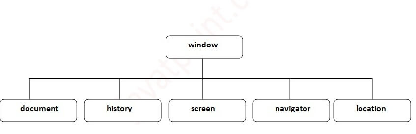

# JavaScript
1. [JSON](JavaScript/JSON.md)
2. [Chrome DevTools](JavaScript/Chrome_DevTools.md)
# Frameworks
1. [Angular](JavaScript/Frameworks/Angular.md)
2. [Next.js](JavaScript/Frameworks/Next.js.md)
3. [NPM](JavaScript/Frameworks/NPM.md)
4. [TypeScript](JavaScript/Frameworks/TypeScript.md)
# Libraries
1. [React](JavaScript/Libraries/React.md)

Javascript is a **single-threaded language**, meaning that just one line of code may be run at once.

**BOM** stands for _Browser Object Model_. It provides interaction with the browser. The default object of a browser is a window. So, you can call all the functions of the window by specifying the window or directly. The window object provides various properties like document, history, screen, navigator, location, innerHeight, innerWidth,



**DOM** stands for _Document Object Model_. A document object represents the HTML document. It can be used to access and change the content of HTML.

# Async

[**Async functions**](https://javascript.info/async-await#async-functions)

The word “async” before a function means one simple thing: a function always returns a promise. Other values are wrapped in a resolved promise automatically.

So, `async` ensures that the function returns a promise, and wraps non-promises in it. Simple enough, right? But not only that. There’s another keyword, `await`, that works only inside `async` functions, and it’s pretty cool.

The keyword `await` makes JavaScript wait until that promise settles and returns its result.

Here’s an example with a promise that resolves in 1 second:

`await` literally suspends the function execution until the promise settles, and then resumes it with the promise result. That doesn’t cost any CPU resources, because the JavaScript engine can do other jobs in the meantime: execute other scripts, handle events, etc.

It’s just a more elegant syntax of getting the promise result than `promise.then`. And, it’s easier to read and write.

  

1. `Promise` (по англ. `promise`, будем называть такой объект «промис») – это специальный объект в JavaScript, который связывает «создающий» и «потребляющий» коды вместе. В терминах нашей аналогии – это «список для подписки». «Создающий» код может выполняться сколько потребуется, чтобы получить результат, а _промис_ делает результат доступным для кода, который подписан на него, когда результат готов.

Функции-потребители могут быть зарегистрированы (подписаны) с помощью методов `.then` и `.catch`.

Первый аргумент метода `.then` – функция, которая выполняется, когда промис переходит в состояние «выполнен успешно», и получает результат.

Второй аргумент `.then` – функция, которая выполняется, когда промис переходит в состояние «выполнен с ошибкой», и получает ошибку.
# Promise
```js
const request = new Promise((resolve, reject) => {
	console.log('Request');
	
	setTimeout(() => {
		console.log('Response')
		resolve()
	}, 2000)
})

request.then(() => {
	// resolve	
	console.log('Resolved')
}, () =>{
	// reject
	console.log('Rejected')
})

```
# Область видимости
Область видимости `var` ограничена функцией, а не блоком
``` js
function fun(){
	if(...){
		var value = 10;
	}
	console.log(value); // No Error
}
console.log(value); // Error
```
 Поиск переменной происходит из внутренней области во внешнюю
 ```js
 let value = 10;
 if(...){
	 let value = 5;
	 console.log(value); // prints 5
 } 
```

```js
function outer(){
	function inner(){
		...
	}
}

inner(); //Error

```

```js
function outer(){
	inner(); //No Error
	
	function inner(){
		...
	}
	
	inner(); //No Error
}
```

``` js
function outer(){
	inner(); //Error
	
	const inner = () => {
		...
	}
	
	inner(); //No Error
}
```

Global variable (no let/const)
``` js
glVar = 5
```

# Замыкания

```js
function outer(){
	let message = 'hello';
	return function () {
		console.log(message)
	}
}

const func = outer();
func(); // prints hello
```

```js
function outer(){
	return function () {
		console.log(message)
	}
}

let message = 'hi';
const func = outer();
func(); // prints hi
```

```js
function outer(){
	let count = 0;
	return function () {
		count++;
		console.log(count)
	}
}

const func = outer();
func(); // prints 1
func(); // prints 2
func(); // prints 3
```

# Контекст
```js
const person = {
	name: 'John',
	greet(){
		console.log(`Hello, I'm ${this.name}`)
	}
}

function greeting() {
	console.log(`I'm ${this.name}`)
}
const user = { name: 'Sam'}

person.greet.call(user) // calls method greet on user -> Hello, I'm Sam
greeting.call(user) // calls method greeting on user -> I'm Sam
greeting.call(person) // calls method greeting on user -> I'm John
```

```js
function sum(a, b){
	return a + this.num + b
}
const obj = { num: 45}
let res = sum.call(obj, 32, 14) // all args using comma
res = sum.apply(obj, [32, 14]) // all args as array

const func = sum.bind(obj) // binds context to the function
res = func(12, 32) // called with context of obj
```