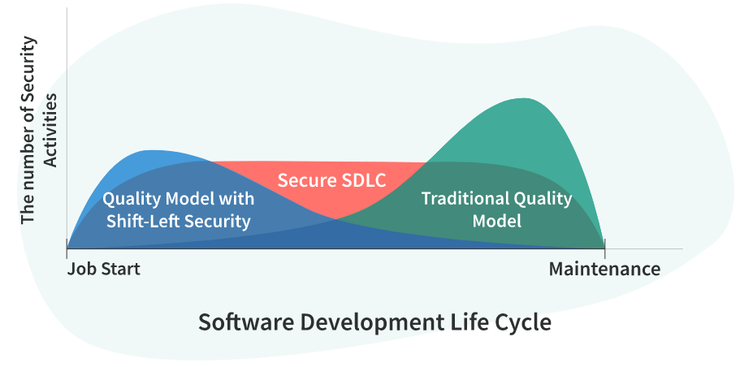
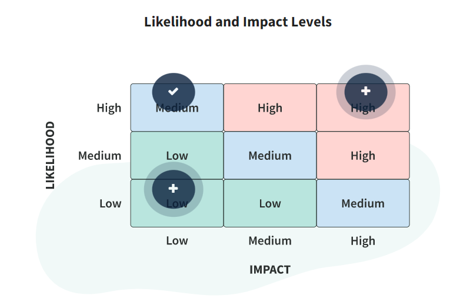

**The Risks of Poorly Secured Software**

- **GDPR  
      
    **The General Data Protection Regulation (GDPR) is a regulation in the EU dealing with data protection and privacy. Companies who violate GDPR may face a fine of up to 20 million euros, or up to 4% of their annual global revenue of the last year, whichever is greater.
- **HIPAA  
      
    **The Health Insurance Portability and Accountability Act (HIPAA) is a federal law in the United States. The purpose of HIPAA is to protect health care information for employees and customers. Based on the level of negligence, the penalties for companies in violation of HIPAA can be up to 50,000 dollars per violation, or up to 1.5 million dollars per year. Violations can also incur criminal charges that may result in jail time.

**Shift-Left Security with Secure SDLC  
  
**Shift-left security means moving security to the earliest possible point in the development process. In a more traditional development approach, development starts without security, and software quality is only checked during the operations and monitoring phases. In shift-left security, teams embed security processes and tools in the CI/CD pipeline, allowing them to catch and correct vulnerabilities and bugs before they launch a product. Testing, feedback, and revisions happen regularly in the shift-left practice, making it easier and less expensive to fix issues. Review the graphic below and compare approaches by the number of security activities performed at each SDLC phase.  
  

  

**Secure SDLC Phases and Activities**

- **Training**
    
    Core security training at the beginning of SSDLC ensures your project team knows the product’s policies and security requirements. It establishes the guidelines for software development and mitigates the risks of neglecting security issues.
    
    Security training typically consists of:
    
    - Code of conduct and basic security concepts training
    - Industry-related training covering standards, industry requirements, and laws
    - Technology-specific training covering best practices for the selected frameworks
- **Requirements**
    
    In this phase, your team gathers security and privacy information and establishes the product’s security requirements.
    
    First, analyze **general security** and **privacy-related information**:
    
    - **Business roles**
    - **Potential attackers and probable attack vectors**
    - **Data sensitivity**
    - Availability
    - Deployment environment
    - **Technological stack**
    - **Points of integration**
    - **Maintenance and support procedures**
    
    Then, collect **specific requirements**:
    
    - Authentication and authorization
    - Auditing
    - Data validation
    - Communication security
    - Session management
    - Cryptography
    
    Next, have a **security champion** perform a **security risk assessment (SRA)** to calculate risks based on the information your team has already gathered. Evaluating application security rank and risk levels per asset allows you to apply relevant security requirements to a specific system, reducing the costs and time spent to implement security controls. Finally, your team should also check **compliance** with standards and policies and create **quality gates** to establish minimum acceptable levels of security and privacy quality.
    
- **Design  
      
    **In the Design phase, your team establishes design requirements to identify potential issues and make the product secure.  
    Security-related activities in this phase include:  
    
    - **Threat modeling**
    
    The goal of this activity is to identify, enumerate, and prioritize potential vulnerabilities. Your team can conduct threat modeling based on SRA results, solution architecture, and an access control matrix. As a result, you get:
    
    - Data Flow Diagrams: extensions of architecture views from a security standpoint
    - Solution Specific Threats: actual threats with severity
    - **Mitigations planning**
    
    This activity helps your team develop a strategy for effectively mitigating the threats you identified in the previous step.
    
    - **Attack surface analysis and reduction**
    
    Finally, check the application itself and try to remove unnecessary API endpoints and machines.
    
    Once you complete these activities, your team can move into development with a clear understanding of how to build a secure application.
    
- **Software Development  
      
    **In the Software Development phase, the writing of the program takes place. Your team should use approved tools and deprecate unsafe functions when you develop software.  
    Activities in this phase include:  
    - Code writing based on the threat models, privacy requirements, best practices, and secure code standards and techniques
    - Security bug fixing
    - **Static Application Security Testing** (SAST)
    - **Software Composition Analysis** (SCA)
    - Regular security code review with the developers and system architects
    - **Fuzz testing**
    - Preparation of security-related documentation
- **Testing  
      
    **After the code is submitted, your team must verify that it is secure in the Testing phase.  
    To assess the results of the Software Development phase and correspondence with plans created during the Design phase, engineers perform activities such as:  
    - Threat models and attack surface review
    - Security testing (fuzz testing, penetration testing)
    - **Dynamic Application Security Testing** (DAST)
    - Bug fixing
    - Secure code review and static analysis
- **Maintenance  
      
    **The release of the application doesn’t mean that your team is finished with security. When you deploy the application on the production infrastructure in the Maintenance phase, your team should be mindful of potential security issues in code. Also, keep an eye on security all the time while the software is operating.  
    Security-related activities to support the Release phase include:  
    
    - Infrastructure verification using correct configuration and its topology
    - A check to ensure engineers installed application components correctly
    - A final security review
    - Creation of the incident response plan
    
    In addition, the team may choose activities from the Testing phase to run in the production environment.
    

**Security in Agile Development**

- **One-Time Security Activities**
    - Identify security/privacy experts
    - Conduct baseline threat modeling
- **Security Activities for Each Sprint**
    - Plan security tasks
    - Perform security/privacy impact analysis
    - Fix identified security/privacy issues
    - Perform security testing
- **Security Activities for a Few Sprints**
    - Update the threat model
    - Conduct code review
    - Conduct penetration testing

**Accelerate SSDLC with DevSecOps**

  

**Maintaining Secure SDLC**

**Prevention**

Preventing a cyberattack is better than responding to one. If your team can prevent attackers from gaining access to the system, they won’t have the opportunity to steal sensitive data, cause damage, and cost the company money. A prevention strategy assumes that the system is built securely from the beginning, using instruments such as:

- **Firewalls**
- **Network Segmentation**
- **Identity and Access Management** (IAM)
- **Secrets Management**
- **Secure Storages**
- **Patch Management**

As a result, your team and company can significantly decrease the probability of a successful attack.

  

**Detection**

In recent years, cyberattacks have become more sophisticated, and a prevention strategy alone isn’t enough to safeguard software. As companies use more software and the number of vulnerabilities grows accordingly, it is increasingly difficult to prevent all security risks.

A detection-based cybersecurity strategy considers security breaches as inevitable and suggests actions to minimize their impact and damage. A detection strategy helps your team quickly find and respond to security issues by employing:

- **Web Application Firewall** (WAF)
- **Anti-DDoS systems**
- **Security Information and Event Management** (SIEM)
- Vulnerability assessment tools
- **Auto-remediation solutions**

By accepting that attacks pass through defenses and adding detection to your project’s security strategy, your team can make an application more resilient against attacks and save money.

  

**Determining Security Risk Severity**

Eliminating every minor risk may not be cost-effective, so you need to prioritize carefully. Risk analysis helps your team estimate the impact of vulnerabilities on the business.

Risk = Likelihood Х Impact

**Likelihood** is a rough measure of how likely it is that a vulnerability will be discovered and exploited by an attacker based on the threat agent factors and the vulnerability factors in place.

**Threat agent factors** (skill level, motive, ability, and size) estimate the likelihood of a successful attack from a group of possible attackers. **Vulnerability factors** (ease of detection, ease of use, awareness, and intrusion detection) estimate the likelihood of a particular vulnerability being detected and exploited.

  

A successful cyberattack has technical and business impacts. The measure of **technical impact** is how a potentially exploited vulnerability will affect an application, its data, and its functionality.

**Business impact** is even more important than technical impact and justifies the investment in solving security problems. Although it stems from technical implications, business impact is assessed based on what is essential to your company. Predicting the business implications of successfully exploiting vulnerabilities may be difficult. In this case, a detailed description of the technical impact will help you assess the business risk.

  

**LOW**

**Risk Example:** A support engineer tampers with the delivery address in online store orders through the support portal.

Although this scenario has a significant business impact on integrity, overall risk severity is low because this situation is “unlikely” to happen. A support engineer has a legal responsibility in front of the employer and can be easily tracked—therefore, the likelihood of tampering with data is low.

**MEDIUM**

**Risk Example:** An unauthenticated anonymous user performs a **DoS**

attack on user profile functionality.

The severity level is medium because the availability level of user profile data—and, consequently, the potential impact—is low, while the likelihood of this attack is “very likely.”

**HIGH**

**Risk Example:** An unauthenticated malicious user gets access to confidential financial data using an SQL injection attack in the username parameter on the login page.

As a result of the attack, the hacker can download confidential data from the database and do significant damage to customers’ trust in the business. The probability and impact of this risk are both high, making the overall risk severity also high.

[https://owasp-risk-rating.com/](https://owasp-risk-rating.com/)

  

**Catching and Handling Security Issues**

If your team is conducting a vulnerability assessment and thorough penetration testing and getting few results, implementing a **bug bounty program** can be an effective next step.

To constantly identify vulnerabilities and minimize the window of opportunity for attackers, your team can establish **Continuous Vulnerability Management**. This process includes tracking issues and handling them according to a Service-Level Agreement (SLA).

- **Issue Tracking  
      
    **Project teams typically use a bug tracking system (e.g., Jira) to check up-to-date security statuses and respond to possible breaches more effectively.
- **Service Level Agreement  
      
    **Your team must mitigate security issues in a reasonable amount of time to minimize the possibility of a breach and be compliant with security standards. To establish a straightforward and fast process for handling security issues, you can utilize a Service-Level Agreement (SLA).
    
    An SLA defines the:
    
    - Level of service expected by a customer
    - Reaction time
    - Metrics used to measure a service
    - Remedies or penalties for inappropriate service
    
    **RACI Matrix**
    
    The whole team’s responsibility for secure software development means that each team member oversees specific security activities. To avoid confusion and make the roles clear for all project members, your team can use a **RACI matrix.**
    
    RACI is an acronym derived from four typical project responsibilities: responsible, accountable, consulted, and informed.
    
    |   |   |   |   |   |   |   |   |   |
    |---|---|---|---|---|---|---|---|---|
    |**Product/Risk Owner**|**Business Analysts**|**Solution Architect**|**Developers**|**Security Champion**|**QAs**|**DevSecOps**|**Security Testers**|**Security Advisor**|
    |**Security Awareness Trainings**|I|R|R|R|R||||
    |**Security Requirements, Risks**|A|R,C|R|I|R|I|||
    |**Threat Modeling**|I,C|I,C|A,R|I,C|R|I||I,C|
    |**Secure Development**|||R|A,R|R||||
    |**Security Tests**|||I,C|I,C|A,R||R|R|
    
      
    

**Cybersecurity Maturity Models**

A set of rules that describe possible actions to improve security, helping a team determine missing activities and activities that require improvements.

The most widely used maturity models are the Building Security in Maturity Model (BSIMM), the Software Assurance Maturity Model (SAMM), and the Security Development Lifecycle (SDL).

- **BSIMM  
      
    **Building Security in Maturity Model (BSIMM) is a study of existing software security initiatives across various industries. By providing a model of security activities that different companies implement, BSIMM lets you identify the common standards as well as unique practices in SSDLC.
- **SAMM  
      
    **The Software Assurance Maturity Model (SAMM) is an open framework that pictures the current security situation in your project/organization and helps formulate and implement a software security strategy tailored to specific risks.
    
    Both BSIMM and SAMM are similar in their approaches to evaluation. They provide an understanding of what can be introduced and improved from a security standpoint. Depending on need, you may use SAMM to measure your organization’s past and present security practices to track improvements and determine a future course of action or use BSIMM to compare your organization’s security practices with those of other companies and industries.
    
- **SDL  
      
    **Security Development Lifecycle (SDL) is the most common maturity model that introduces security and privacy considerations throughout all development phases. It helps developers build highly secure software, address security compliance requirements, and reduce development costs. SDL (or SSDLC) supports:
    - Inspection of the current maturity level (Level One, Level Two, or Level Three)
    - Project transformation (instructions on how to move to the next level)
    - Guidance on how to implement Secure SDLC practices

**Security Baseline Assessment**

- **Security Risk Assessment  
      
    **The Security Risk Assessment (SRA) is the first step in the security baseline assessment. It provides EPAM with an opportunity to evaluate each application’s security rank and risk levels.
- **Threat Modeling  
      
    **Threat modeling helps your team identify, enumerate, and prioritize potential vulnerabilities based on SRA results, solution architecture, and access control matrix.
- **Secure Code Review  
      
    **Secure code review is one of the most effective techniques for identifying security bugs early in application development. This enhancement to the standard code review practice places security considerations, such as company security standards, at the forefront of the decision-making.  
    To enhance secure code review, you may want to use both manual and automated techniques.   
    **Automated tools** are good at assessing large amounts of code and pointing out possible issues. Your team can use them to perform this task, but they always need **human verification**. Only a human reviewer can understand the relevance of a bug or vulnerability in code. As a result of combining these methods, EPAM can make an effective risk estimate that considers both the likelihood and the business impact of an attack.
- **Automated Security Testing  
      
    **Automated security testing has become fundamental for accelerating SSDLC. This process speeds up and eases security and regression testing, allowing more time for the manual testing process. EPAM actively uses the following tools to automate searches for security issues:
    
    - **Static Application Security Testing (SAST) solutions:**
        - Commercial: Checkmarx, Veracode, Fortify, PT Application Inspector
        - Open source: SonarQube
    - **Software Composition Analysis (SCA) solutions:**
        - Commercial: Black Duck, Snyk
    - **Dynamic Application Security Testing (DAST) tools:**
        - Commercial: Acunetix Web Vulnerability Scanner, Burp Suite Professional, Nessus
        - Open source: Arachni, w3af, Skipfish, OWASP ZAP
    
    For automated security testing, EPAM utilizes **the Carrier Platform**. Automation of findings from manual security testing is performed using **the Vividus framework**. You can integrate both tools with CI/CD to boost your security testing process.
    
- **Manual Security Testing  
      
    **While automated security testing tools ease and speed up the secure software development process, they don’t understand application business logic and, as a result, are not a substitute for manual security testing.  
    Because EPAM has many applications,   
    **a dedicated team of Security Testers** evaluates each application depending on its rank and state of development. Manual testing is performed based on the OWASP Testing Methodology.