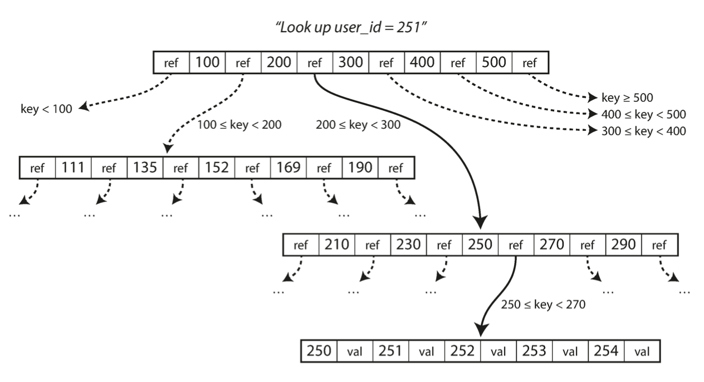
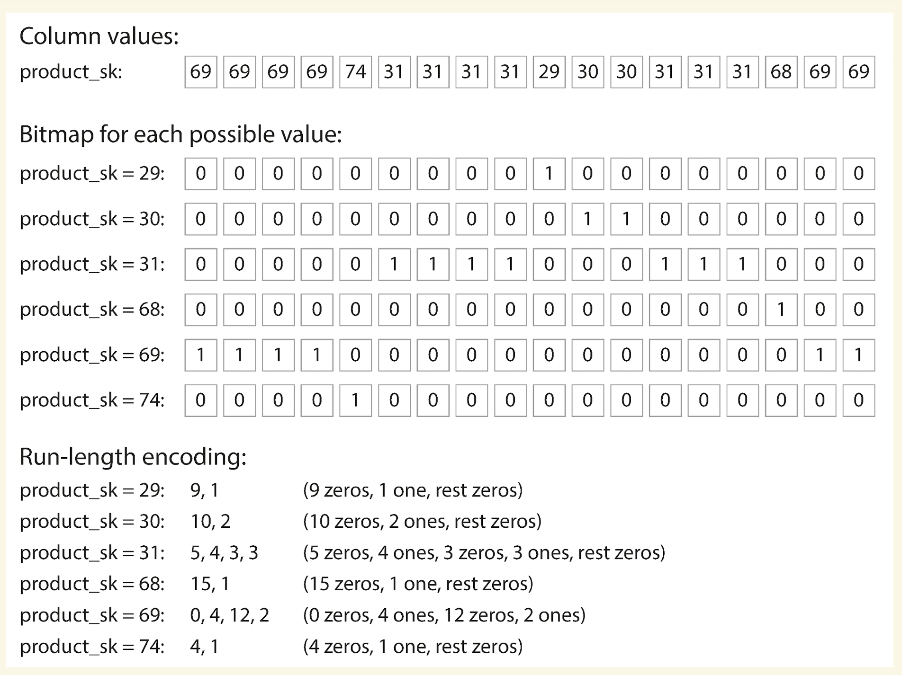
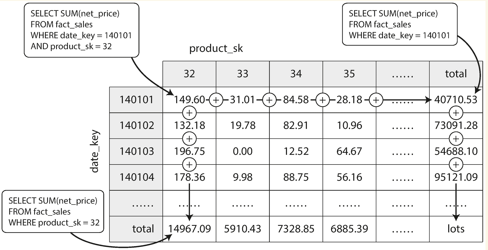

# Data Models and Query Languages
Most applications are built by layering one data model on top of another. For each layer, the key question is: how is it represented in terms of the next-lower layer? 
For example:
1. As an application developer, you look at the real world (in which there are people, organizations, goods, actions, money flows, sensors, etc.) and model it in terms of objects or data structures, and APIs that manipulate those data structures. Those structures are often specific to your application.
2. When you want to store those data structures, you express them in terms of a general-purpose data model, such as JSON or XML documents, tables in a relational database, or a graph model.
3. The engineers who built your database software decided on a way of representing that JSON/XML/relational/graph data in terms of bytes in memory, on disk, or on a network. Each layer hides the complexity of the layers below it by providing a clean data model.
# NoSQL
There are several driving forces behind the adoption of NoSQL databases, including:
- A need for greater scalability than relational databases can easily achieve, including very large datasets or very high write throughpu
* Specialized query operations that are not well supported by the relational model
* Frustration with the restrictiveness of relational schemas, and a desire for a more dynamic and expressive data model
### Many-to-One and Many-to-Many Relationships
Whether you store an ID or a text string is a question of duplication. When you use
an ID, the information that is meaningful to humans is stored in only one place, and everything that refers to it uses an ID (which only has meaning within the database). When you store the text directly, you are duplicating the human-meaningful information in every record that uses it.
- The advantage of using an ID is that because it has no meaning to humans, it never needs to change: the ID can remain the same, even if the information it identifies changes. Anything that is meaningful to humans may need to change sometime in the future—and if that information is duplicated, all the redundant copies need to be updated.
- In document databases, joins are not needed for one-to-many tree structures, and support for joins is often weak. If the database itself does not support joins, you have to emulate a join in application code by making multiple queries to the database.
## Relational Versus Document Databases
- The main arguments in favor of the document data model are schema flexibility, better performance due to locality, and that for some applications it is closer to the data structures used by the applicationIf the data in your application has a document-like structure (i.e., a tree of one-to-many relationships, where typically the entire tree is loaded at once), then it’s probably a good idea to use a document model.
	- The document model has limitations: for example, you cannot refer directly to a nested item within a document, but instead you need to say something like “the second item in the list of positions for user 251” (much like an access path in the hierarchical model). However, as long as documents are not too deeply nested, that is not usually a problem. 
	- The poor support for joins in document databases may or may not be a problem, depending on the application. For example, many-to-many relationships may never be needed if your application does use many-to-many relationships, the document model becomes less appealing. It’s possible to reduce the need for joins by denormalizing, but then the application code needs to do additional work to keep the denormalized data consistent. Joins can be emulated in application code by making multiple requests to the database, but that also moves complexity into the application and is usually slower than a join performed by specialized code inside the database.
	- Most document databases, and the JSON support in relational databases, do not enforce any schema on the data in documents.
- The relational model counters by providing better support for joins, and many-to-one and many-to-many relationships.The relational technique of shredding — splitting a document-like structure into multiple tables can lead to cumbersome schemas and unnecessarily complicated application code.
- For highly interconnected data, the document model is awkward, the relational model is acceptable, and graph models (see “Graph-Like Data Models” on page 49) are the most natural.
- Schema-on-read is similar to dynamic (runtime) type checking in programming languages(document dbs)
- whereas schema-on-write is similar to static (compile-time) type checking.(relational dbs)
* The schema-on-read approach is advantageous if the items in the collection don’t all have the same structure for some reason (i.e., the data is heterogeneous)
- There are many different types of objects, and it is not practical to put each type of object in its own table.
* The structure of the data is determined by external systems over which you have no control and which may change at any time.
* A document is usually stored as a single continuous string, encoded as JSON, XML, or a binary variant thereof (such as MongoDB’s BSON). If your application often needs to access the entire document (for example, to render it on a web page), there is a performance advantage to this storage locality.
- It’s worth pointing out that the idea of grouping related data together for locality is not limited to the document model. For example, Google’s Spanner database offers the same locality properties in a relational data model, by allowing the schema to declare that a table’s rows should be interleaved (nested) within a parent table. Oracle allows the same, using a feature called multi-table index cluster tables. The column-family concept in the Bigtable data model (used in Cassandra and HBase) has a similar purpose of managing locality 
- On the document database side, RethinkDB supports relational-like joins in its query language, and some MongoDB drivers automatically resolve database references (effectively performing a client-side join, although this is likely to be slower than a join performed in the database since it requires additional network round-trips and is less optimized).
# MapReduce Querying
MapReduce is a programming model for processing large amounts of data in bulk
across many machines. A limited form of MapReduce is supported by some NoSQL datastores, including MongoDB and CouchDB, as a mechanism for performing read-only queries across many documents.
- MapReduce is neither a declarative query language nor a fully imperative query API, but somewhere in between: the logic of the query is expressed with snippets of code, which are called repeatedly by the processing framework. 
* It is based on the map (also known as collect) and reduce (also known as fold or inject) functions that exist in many functional programming languages.
* MapReduce is a fairly low-level programming model for distributed execution on a cluster of machines. Higher-level query languages like SQL can be implemented as a pipeline of MapReduce operations (see Chapter 10), but there are also many distributed implementations of SQL that don’t use MapReduce.
## Graph-Like Data Models
The relational model can handle simple cases of many-to-many relationships, but as the connections within your data become more complex, it becomes more natural to start modeling your data as a graph.
A graph consists of two kinds of objects: vertices (also known as nodes or entities) and
edges (also known as relationships or arcs). Many kinds of data can be modeled as a
graph.
Examples:
- Social graphs - Vertices are people, and edges indicate which people know each other.
- The web graph - Vertices are web pages, and edges indicate HTML links to other pages.
- Road or rail networks - Vertices are junctions, and edges represent the roads or railway lines between them.
There are several different, but related, ways of structuring and querying data in 
graphs.
- property graph model
- triple-store model
## Property graph model
In the property graph model, each vertex consists of:
- A unique identifier
- A set of outgoing edges
- A set of incoming edges
- A collection of properties (key-value pairs)
Each edge consists of:
-  A unique identifier
- The vertex at which the edge starts (the tail vertex)
- The vertex at which the edge ends (the head vertex)
- A label to describe the kind of relationship between the two vertices
- A collection of properties (key-value pairs)
Graphs are good for evolvability: as you add features to your application, a graph can easily be extended to accommodate changes in your application’s data structures.
## The Cypher Query Language
Cypher is a declarative query language for property graphs, created for the Neo4j graph database
`(Idaho) -[:WITHIN]-> (USA)` creates an edge labeled WITHIN, with Idaho as the tail node and USA as the head node.
The same arrow notation is used in a MATCH clause to find patterns in the graph: `(person) -[:BORN_IN]-> ()` - matches any two vertices that are related by an edge labeled BORN_IN. The tail vertex of that edge is bound to the variable person, and the head vertex is left unnamed.
##### Graph Queries in SQL
We can also query it using SQL but with some difficulty. In a relational database, you usually know in advance which joins you need in your query. In a graph query, you may need to traverse a variable number of edges before you find the vertex you’re looking for— that is, the number of joins is not fixed in advance.
Since SQL:1999, this idea of variable-length traversal paths in a query can be expressed using something called recursive common table expressions (the WITH RECURSIVE syntax)
## Triple-Stores and SPARQL
The triple-store model is mostly equivalent to the property graph model.
- In a triple-store, all information is stored in the form of very simple three-part statements: (subject, predicate, object).
The subject of a triple is equivalent to a vertex in a graph. The object is one of two things:
-  A value in a primitive datatype, such as a string or a number. In that case, the predicate and object of the triple are equivalent to the key and value of a property on the subject vertex. For example, (lucy, age, 33) is like a vertex lucy with properties {"age":33}.
- Another vertex in the graph. In that case, the predicate is an edge in the graph, the subject is the tail vertex, and the object is the head vertex. For example, in (lucy, marriedTo, alain) the subject and object lucy and alain are both vertices, and the predicate marriedTo is the label of the edge that connects them.
Example
```sql
SELECT ?personName WHERE {
	?person :name ?personName.
	?person :bornIn / :within* / :name "United States".
	?person :livesIn / :within* / :name "Europe".
}
```
## Storage and Retrieval
The word log is often used to refer to application logs, where an application outputs text that describes what’s happening. log is used in the more general sense: an append-only sequence of records. It doesn’t have to be human-readable; it might
be binary and intended only for other programs to read.
A good solution is to break the log into segments of a certain size by closing a segment file when it reaches a certain size, and making subsequent writes to a new segment file. We can then perform compaction on these segments

Moreover, since compaction often makes segments much smaller (assuming that a
key is overwritten several times on average within one segment), we can also merge
several segments together at the same time as performing the compaction,

The hash table must fit in memory, so if you have a very large number of keys, you’re out of luck. In principle, you could maintain a hash map on disk, but unfortunately it is difficult to make an on-disk hash map perform well. It requires a lot of random access I/O, it is expensive to grow when it becomes full, and hash collisions require fiddly logic. Range queries are not efficient.
### SST Tables
 We require that the sequence of key-value pairs of our segment files is sorted by key. This format called Sorted String Table, or SSTable for short. We also require that each key only appears once within each merged segment file (the compaction process already ensures that).
 SSTables have several big advantages over log segments with hash indexes:
 1. Merging segments is simple and efficient, even if the files are bigger than the available memory. 
    The approach is like the one used in the mergesort algorithm
	 1. you start reading the input files side by side, 
	 2. look at the first key in each file, 
	 3. copy the lowest key (according to the sort order) to the output file, and repeat.
 2. In order to find a particular key in the file, you no longer need to keep an index of all the keys in memory. You still need an in-memory index to tell you the offsets for some of the keys, but it can be sparse: one key for every few kilobytes of segment file is sufficient, because a few kilobytes can be scanned very quickly. As you have the keys sorted, you know between which indexes to search
Since read requests need to scan over several key-value pairs in the requested range anyway, it is possible to group those records into a block and compress it before writing it to disk. Each entry of the sparse in-memory index then points at the start of a compressed block.
Sorting
Maintaining a sorted structure on disk is possible, but maintaining it in memory is much easier. There are plenty of well-known tree data structures that you can use, such as red-black trees or AVL trees 

We can now make our storage engine work as follows:
- When a write comes in, add it to an in-memory balanced tree data structure. This in-memory tree is sometimes called a memtable.
* When the memtable gets bigger than some threshold write it out to disk as an SSTable file.
- In order to serve a read request, first try to find the key in the memtable, then in the most recent on-disk segment, then in the next-older segment, etc.
- From time to time, run a merging and compaction process in the background to combine segment files and to discard overwritten or deleted values.
* if the database crashes, the most recent writes (which are in the memtable but not yet written out to disk) are lost. In order to avoid that problem, we can keep a separate log on disk to which every write is immediately appended. Every time the memtable is written out to an SSTable, the corresponding log can be discarded.
  

Making an LSM-tree( Log-Structured Merge-Tree ) out of SSTables

Storage engines that are based on this principle of merging and compacting sorted files are often called LSM storage engines. Lucene, an indexing engine for full-text search used by Elasticsearch and Solr, uses a similar method for storing its term dictionary.

A full-text index is much more

complex than a key-value index but is based on a similar idea: given a word in a

search query, find all the documents (web pages, product descriptions, etc.) that

mention the word. This is implemented with a key-value structure where the key is a

word (a term) and the value is the list of IDs of all the documents that contain the

word (the postings list).

  

A Bloom filter is a memory-efficient

data structure for approximating the contents of a set. It can tell you if a key does not

appear in the database, and thus saves many unnecessary disk reads for nonexistent

keys.

  

There are also different strategies to determine the order and timing of how SSTables

are compacted and merged.In size-tiered com‐

paction, newer and smaller SSTables are successively merged into older and larger

SSTables. In leveled compaction, the key range is split up into smaller SSTables and

older data is moved into separate “levels,” which allows the compaction to proceed

more incrementally and use less disk space.
##### B-Trees
B-trees  remain the standard index implementation in almost all relational databases, and many nonrelational databases use them too.
- Like SSTables, B-trees keep key-value pairs sorted by key, which allows efficient key-value lookups and range queries.
-  B-trees break the database down into fixed-size blocks or pages, traditionally 4 KB in size (sometimes bigger), and read or write one page at a time.
- Each page can be identified using an address or location, which allows one page to refer to another. We can use these page references to construct a tree of pages
- 
- One page is designated as the root of the B-tree; whenever you want to look up a key in the index, you start here.
- Each child is responsible for a continuous range of keys, and the keys between the references indicate where the boundaries between those ranges lie.
- The number of references to child pages in one page of the B-tree is called the branching factor.
- If you want to update the value for an existing key in a B-tree, you search for the leaf page containing that key, change the value in that page, and write the page back to disk (any references to that page remain valid). If you want to add a new key, you need to find the page whose range encompasses the new key and add it to that page.
- If there isn’t enough free space in the page to accommodate the new key, it is split into two half-full pages, and the parent page is updated to account for the new subdivision of key ranges
- This algorithm ensures that the tree remains balanced: a B-tree with n keys always has a depth of O(log n). Most databases can fit into a B-tree that is three or four levels deep, so you don’t need to follow many page references to find the page you are looking for. (A four-level tree of 4 KB pages with a branching factor of 500 can store up to 256 TB
- The basic underlying write operation of a B-tree is to overwrite a page on disk with new data. It is assumed that the overwrite does not change the location of the page;
- if you split a page because an insertion caused it to be overfull, you need to write the two pages that were split, and also overwrite their parent page to update the references to the two child pages. This is a dangerous operation, because if the database crashes after only some of the pages have been written, you end up with a corrupted index (e.g., there may be an orphan page that is not a child of any parent). In order to make the database resilient to crashes, it is common for B-tree implementations to include an additional data structure on disk: a write-ahead log. This is an append-only file to which every B-tree modification must be written before it can be applied to the pages of the tree itself. When the database comes back up after a crash, this log is used to restore the B-tree back to a con sistent state
- An additional complication of updating pages in place is that careful concurrency control is required if multiple threads are going to access the B-tree at the same time—otherwise a thread may see the tree in an inconsistent state. This is typically done by protecting the tree’s data structures with latches (lightweight locks).
### B-tree optimizations
- Instead of overwriting pages and maintaining a WAL for crash recovery, some databases (like LMDB) use a copy-on-write scheme. A modified page is written to a different location, and a new version of the parent pages in the tree is created, pointing at the new location. This approach is also useful for concurrency control,
- We can save space in pages by not storing the entire key, but abbreviating it. Especially in pages on the interior of the tree, keys only need to provide enough information to act as boundaries between key ranges. Packing more keys into a page allows the tree to have a higher branching factor, and thus fewer levels
## Comparing B-Trees and LSM-Trees
LSM-trees are typically faster for writes, whereas B-trees are thought to be faster for reads. Reads are typically slower on LSM-trees
because they have to check several different data structures and SSTables at different stages of compaction.
- A B-tree index must write every piece of data at least twice: once to the write-ahead log, and once to the tree page itself (and perhaps again as pages are split).
- There is also overhead from having to write an entire page at a time, even if only a few bytes in that page changed.
- Log-structured indexes also rewrite data multiple times due to repeated compaction and merging of SSTables. This effect—one write to the database resulting in multiple writes to the disk over the course of the database’s lifetime—is known as write amplification. It is of particular concern on SSDs, which can only overwrite blocks a limited number of times before wearing out.
- In write-heavy applications, the performance bottleneck might be the rate at which the database can write to disk. In this case, write amplification has a direct performance cost: the more that a storage engine writes to disk, the fewer writes per second it can handle within the available disk bandwidth.
- LSM-trees are typically able to sustain higher write throughput than B-trees, partly because they sometimes have lower write amplification, and partly because they sequentially write compact SSTable files rather than having to overwrite several pages in the tree
- LSM-trees can be compressed better, and thus often produce smaller files on disk than B-trees.
- B-tree storage engines leave some disk space unused due to fragmentation
- A downside of log-structured storage is that the compaction process can sometimes interfere with the performance of ongoing reads and writes.
- If write throughput is high and compaction is not configured carefully, it can happen that compaction cannot keep up with the rate of incoming writes. In this case, the number of unmerged segments on disk keeps growing until you run out of disk space, and reads also slow down because they need to check more segment files. Typically, SSTable-based storage engines do not throttle the rate of incoming writes, even if compaction cannot keep up, so you need explicit monitoring to detect this situation
## Storing values within the index
The key in an index is the thing that queries search for, but the value can be one of
two things: it could be the actual row (document, vertex) in question, or it could be a
reference to the row stored elsewhere. In the latter case, the place where rows are
stored is known as a heap file,
The heap file approach is common because it avoids duplicating data
when multiple secondary indexes are present: each index just references a location in
the heap file, and the actual data is kept in one place.
In some situations, the extra hop from the index to the heap file is too much of a per‐
formance penalty for reads, so it can be desirable to store the indexed row directly
within an index. This is known as a clustered index. For example, in MySQL’s
InnoDB storage engine, the primary key of a table is always a clustered index, and
secondary indexes refer to the primary key (rather than a heap file location). In
SQL Server, you can specify one clustered index per table
A compromise between a clustered index (storing all row data within the index) and
a nonclustered index (storing only references to the data within the index) is known
as a covering index or index with included columns, which stores some of a table’s col‐
umns within the index
### Multi-column indexes
The most common type of multi-column index is called a concatenated index, which
simply combines several fields into one key by appending one column to another
Multi-dimensional indexes are a more general way of querying several columns at
once, which is particularly important for geospatial data.
### Full-text search and fuzzy indexes
search for similar keys, such as misspelled words. Such fuzzy querying requires different techniques. full-text search engines commonly allow a search for one word to be expanded to include synonyms of the word, to ignore grammatical variations of
words, and to search for occurrences of words near each other in the same document,
and support various other features that depend on linguistic analysis of the text.
### Keeping everything in memory
Many datasets
are simply not that big, so it’s quite feasible to keep them entirely in memory, potentially distributed across several machines. This has led to the development of in-memory databases.
Some in-memory key-value stores, such as Memcached, are intended for caching use
only, where it’s acceptable for data to be lost if a machine is restarted. But other in-
memory databases aim for durability, which can be achieved with special hardware
(such as battery-powered RAM), by writing a log of changes to disk, by writing peri‐
odic snapshots to disk, or by replicating the in-memory state to other machines.
Counterintuitively, the performance advantage of in-memory databases is not due to
the fact that they don’t need to read from disk. Even a disk-based storage engine may
never need to read from disk if you have enough memory, because the operating sys‐
tem caches recently used disk blocks in memory anyway. Rather, they can be faster
because they can avoid the overheads of encoding in-memory data structures in a
form that can be written to disk
Recent research indicates that an in-memory database architecture could be extended
to support datasets larger than the available memory, without bringing back the over‐
heads of a disk-centric architecture. The so-called anti-caching approach works
by evicting the least recently used data from memory to disk when there is not
enough memory, and loading it back into memory when it is accessed again in the
future.
A transaction needn’t necessarily have ACID (atomicity, consistency, isolation, and durability) properties. Transaction processing just means allowing clients to make low-latency reads and writes — as opposed to batch processing jobs, which only run periodically (for example, once per day)
The data warehouse contains a read-only copy of the data in all the various OLTP systems in the company.Data is extracted from OLTP databases (using either a periodic data dump or a continuous stream of updates), transformed into an analysis-friendly schema, cleaned up, and then loaded into the data warehouse. This process of getting data into the warehouse is known as Extract–Transform–Load (ETL) 

The data model of a data warehouse is most commonly relational, because SQL is
generally a good fit for analytic queries. There are many graphical data analysis tools
that generate SQL queries, visualize the results, and allow analysts to explore the data
(through operations such as drill-down and slicing and dicing).
## Column-Oriented Storage
The idea behind column-oriented storage is simple: don’t store all the values from one
row together, but store all the values from each column together instead. If each col‐
umn is stored in a separate file, a query only needs to read and parse those columns
that are used in that query, which can save a lot of work.
- column-oriented storage layout relies on each column file containing the rows in the same order. Thus, if you need to reassemble an entire row, you can take the 23rd entry from each of the individual column files and put them together to form the 23rd row of the table.
- Depending on the data in the column, different compression techniques can be used. One technique that is particularly effective in data warehouses is bitmap encoding,

Often, the number of distinct values in a column is small compared to the number of
rows (for example, a retailer may have billions of sales transactions, but only 100,000
distinct products). We can now take a column with n distinct values and turn it into
n separate bitmaps: one bitmap for each distinct value, with one bit for each row. The
bit is 1 if the row has that value, and 0 if not.
Concept of column families, which
they inherited from Bigtable. However, it is very misleading to
call them column-oriented: within each column family, they store
all columns from a row together, along with a row key, and they do
not use column compression. Thus, the Bigtable model is still mostly
- Besides reducing the volume of data that needs to be loaded from disk, column- oriented storage layouts are also good for making efficient use of CPU cycles. For example, the query engine can take a chunk of compressed column data that fits comfortably in the CPU’s L1 cache and iterate through it in a tight loop (that is, with no function calls). A CPU can execute such a loop much faster than code that requires a lot of function calls and conditions for each record that is processed. Column compression allows more rows from a column to fit in the same amount of L1 cache. Operators, such as the bitwise AND and OR described previously, can be designed to operate on such chunks of compressed column data directly. This technique is known as vectorized processing

If you have trillions of rows and petabytes of data in your fact tables, storing and
querying them efficiently becomes a challenging problem. Dimension tables are usu‐
ally much smaller (millions of rows), so in this section we will concentrate primarily
on storage of facts.

Another aspect of data warehouses that is worth mentioning briefly is materialized
aggregates. As discussed earlier, data warehouse queries often involve an aggregate
function, such as COUNT, SUM, AVG, MIN, or MAX in SQL. If the same aggregates are used
by many different queries, it can be wasteful to crunch through the raw data every
time. Why not cache some of the counts or sums that queries use most often?
One way of creating such a cache is a materialized view. In a relational data model, it
is often defined like a standard (virtual) view: a table-like object whose contents are
the results of some query. The difference is that a materialized view is an actual copy
of the query results, written to disk, whereas a virtual view is just a shortcut for writ‐
ing queries. When you read from a virtual view, the SQL engine expands it into the
view’s underlying query on the fly and then processes the expanded query.
When the underlying data changes, a materialized view needs to be updated, because
it is a denormalized copy of the data.The database can do that automatically, but such updates make writes more expensive, which is why materialized views are not
often used in OLTP databases. In read-heavy data warehouses they can make more
sense (whether or not they actually improve read performance depends on the indi‐
vidual case).
A common special case of a materialized view is known as a data cube or OLAP cube. It is a grid of aggregates grouped by different dimensions.

Imagine for now that each fact has foreign keys to only two dimension tables—in
Figure 3-12, these are date and product. You can now draw a two-dimensional table,
with dates along one axis and products along the other. Each cell contains the aggre‐
gate (e.g., SUM) of an attribute (e.g., net_price) of all facts with that date-product
combination. Then you can apply the same aggregate along each row or column and
get a summary that has been reduced by one dimension (the sales by product regard‐
less of date, or the sales by date regardless of product).
Disadvantage is that a data cube doesn’t have the same flexibility as querying the
raw data. For example, there is no way of calculating which proportion of sales comes
from items that cost more than $100, because the price isn’t one of the dimensions.
Most data warehouses therefore try to keep as much raw data as possible, and use
aggregates such as data cubes only as a performance

**Summary** 
On a high level, we saw that storage engines fall into two broad categories: those optimized for transaction processing (OLTP), and those optimized for analytics (OLAP).

There are big differences between the access patterns in those use cases:
- OLTP systems are typically user-facing, which means that they may see a huge volume of requests. In order to handle the load, applications usually only touch a small number of records in each query. The application requests records using some kind of key, and the storage engine uses an index to find the data for the requested key. Disk seek time is often the bottleneck here.
- Data warehouses and similar analytic systems are less well known, because they are primarily used by business analysts, not by end users. They handle a much lower volume of queries than OLTP systems, but each query is typically very demanding, requiring many millions of records to be scanned in a short time. Disk bandwidth (not seek time) is often the bottleneck here, and column-oriented storage is an increasingly popular solution for this kind of workload. On the OLTP side, we saw storage engines from two main schools of thought:
	- The log-structured school, which only permits appending to files and deleting obsolete files, but never updates a file that has been written. Bitcask, SSTables, LSM-trees, LevelDB, Cassandra, HBase, Lucene, and others belong to this group.
	- The update-in-place school, which treats the disk as a set of fixed-size pages that can be overwritten. B-trees are the biggest example of this philosophy, being used in all major relational databases and also many nonrelational ones.
Log-structured storage engines are a comparatively recent development. Their key
idea is that they systematically turn random-access writes into sequential writes on
disk, which enables higher write throughput due to the performance characteristics
of hard drives and SSDs.

