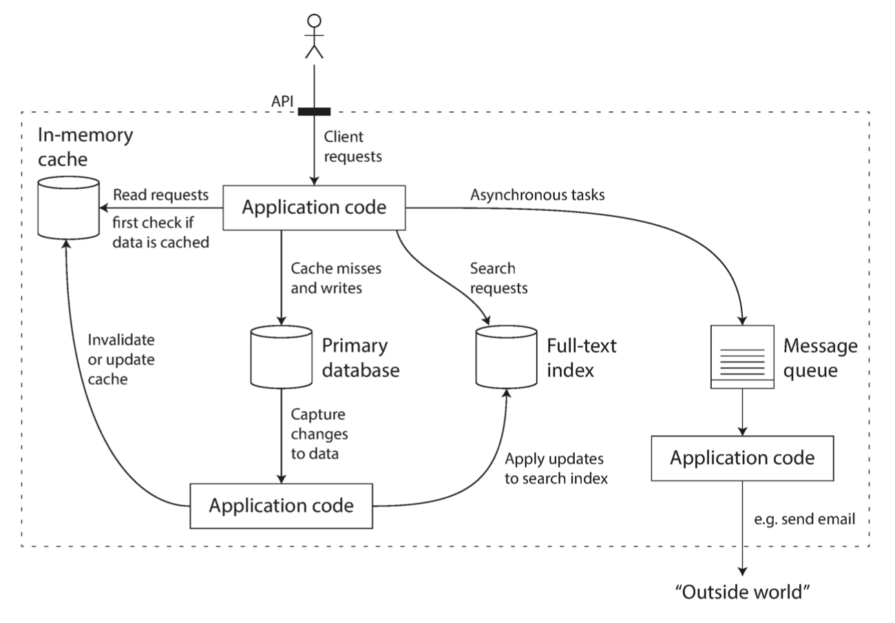

# Reliable, Maintainable and Scalable Applications
An application has to meet various requirements in order to be useful. There are 
- **functional requirements** - what it should do, such as allowing data to be stored, retrieved, searched, and processed in various ways
- **nonfunctional requirements**  - general properties like security, reliability, compliance, scalability, compatibility, and maintainability.

# Reliability
If you have an application-managed caching layer (using Memcached or similar), or a full-text search server (such as Elasticsearch or Solr) separate from your main database, it is normally the application code’s responsibility to keep those caches and indexes in sync with the main database.
  

The system should continue to work correctly (performing the correct function at the desired level of performance) even in the face of adversity (hardware or software faults, and even human error). 
- The application performs the function that the user expected.
- It can tolerate the user making mistakes or using the software in unexpected ways.
- Its performance is good enough for the required use case, under the expected load and data volume.
- The system prevents any unauthorized access and abuse.
## Fault Tolerance
The things that can go wrong are called **faults**, and systems that anticipate faults and can cope with them are called **fault-tolerant** or **resilient**.

> **Fault is not the same as a failure**. 
> A **fault** is usually defined as one component of the system deviating from its spec. Whereas a **failure** is when the system as a whole stops providing the required service to the use 

It is impossible to reduce the probability of a fault to zero; therefore it is usually best to design fault-tolerance mechanisms that prevent faults from causing failures.

Set up detailed and clear monitoring, such as performance metrics and error rates. In other engineering disciplines this is referred to as **telemetry**. Monitoring can show us early warning signals and allow us to check whether any assumptions or constraints are being violated. When a problem occurs, metrics can be invaluable in diagnosing the issue.
# Scalability
As the system grows (in data volume, traffic volume, or complexity), there should be reasonable ways of dealing with that growth.

Scalability is the term we use to describe a system’s ability to cope with increased load.
- we need to succinctly describe the current load on the system;
- Load can be described with a few numbers which we call load parameters. The best choice of parameters depends on the architecture of your system: it may be 
	- requests per second to a web server
	- the ratio of reads to writes in a database
	- the number of simultaneously active users in a chat room
	- the hit rate on a cache

## Example
- Post tweet
	- A user can publish a new message to their followers (4.6k requests/sec on average, over 12k requests/sec at peak).
	- Home timeline
		- A user can view tweets posted by the people they follow (300k requests/sec).

Simply handling 12,000 writes per second (the peak rate for posting tweets) would be fairly easy. However, Twitter’s scaling challenge is not primarily due to tweet volume, but due to fan-out each user follows many people, and each user is followed by many people. 

There are broadly two ways of implementing these two operations:
**Approach 1**
Posting a tweet simply inserts the new tweet into a global collection of tweets. When a user requests their home timeline, look up all the people they follow, find all the tweets for each of those users, and merge them (sorted by time). In a relational database
```SQL
SELECT tweets.*,  users.* FROM tweets
JOIN users ON tweets.sender_id = users.id
JOIN follows ON follows.followee_id = users.id
WHERE follows.follower_id = current_user
```
Approach 2
Maintain a cache for each user’s home timeline. When a user posts a tweet, look up all the people who follow that user, and insert the new tweet into each of their home timeline caches. The request to read the home timeline is then cheap, because its result has been computed ahead of time.

Approach 2 works better because the average rate of published tweets is almost two orders of magnitude lower than the rate of home timeline reads, and so in this case it’s preferable to do more work at write time and less at read time.
The downside of approach 2 is that posting a tweet now requires a lot of extra work. On average, a tweet is delivered to about 75 followers, so 4.6k tweets per second become 345k writes per second to the home timeline caches.
## Load investigation
Once you have described the load on your system, you can investigate what happens when the load increases. You can look at it in two ways:
- When you increase a load parameter and keep the system resources (CPU, memory, network bandwidth, etc.) unchanged, how is the performance of your system affected?
- When you increase a load parameter, how much do you need to increase the resources if you want to keep performance unchanged?

- In a batch processing system such as Hadoop, we usually care about throughput—the number of records we can process per second, or the total time it takes to run a job on a dataset of a certain size.
- In online systems, what’s usually more important is the service’s response time—that is, the time between a client sending a request and receiving a response.
### Latency and Response time
**Latency** and **response time** are often used synonymously, but they are not the same.
- **The response time** is what the client sees: besides the actual time to process the request (the service time), it includes network delays and queueing delays. 
- **Latency** is the duration that request is waiting to be handled—during which it is latent, awaiting service

Usually it is better to use percentiles. If you take your list of response times and sort it from fastest to slowest, then the median is the halfway point. High percentiles of response times, also known as tail latencies, are important because they directly affect users’ experience of the service

Even if only a small percentage of backend calls are slow, the chance of getting a slow call increases if an end-user request requires multiple back-end calls, and so a higher proportion of end-user requests end up being slow - an effect known as tail latency amplification
# Maintainability
Over time, many different people will work on the system, and they should all be able to work on it productively.

>It is well known that the majority of the cost of software is not in its initial development, but in its ongoing maintenance
## Operability
Make it easy for operations teams to keep the system running smoothly.
A good operations team typically is responsible for the following
* Monitoring the health of the system and quickly restoring service if it goes into a bad state
* Tracking down the cause of problems, such as system failures or degraded performance
* Keeping software and platforms up to date, including security patches
* Keeping tabs on how different systems affect each other, so that a problematic change can be avoided before it causes damage
* Establishing good practices and tools for deployment, configuration management
* Defining processes that make operations predictable and help keep the production environment stable
* - Anticipating future problems and solving them before they occur
- Performing complex maintenance tasks, such as moving an application from one platform to another
- Maintaining the security of the system as configuration changes are made
- Preserving the organization’s knowledge about the system, even as individual people come and go

Good operability means making routine tasks easy, allowing the operations team to focus their efforts on high-value activities.
- Providing visibility into the runtime behavior and internals of the system, with good monitoring
* Avoiding dependency on individual machines
* Providing good documentation and an easy-to-understand operational model
* Providing good default behavior, but also giving administrators the freedom to override defaults when needed
* Self-healing where appropriate, but also giving administrators manual control over the system state when needed
* Exhibiting predictable behavior, minimizing surprises
## Simplicity
Make it easy for new engineers to understand the system, by removing as much complexity as possible from the system.

There are various possible symptoms of complexity: 
- explosion of the state space,
- tight coupling of modules
- tangled dependencies
- inconsistent naming and terminology
- hacks aimed at solving performance problems
- special-casing to work around issues elsewhere

When complexity makes maintenance hard, budgets and schedules are often overrun. In complex software, there is also a greater risk of introducing bugs when making a change: when the system is harder for developers to understand and reason about
- hidden assumptions
- unintended consequences
- unexpected interactions are more easily overlooked
- Conversely, reducing complexity greatly improves the maintainability of software, and thus simplicity should be a key goal for the systems we build.

Making a system simpler does not necessarily mean reducing its functionality; 
- it can also mean removing accidental complexity. 
- Moseley and Marks define complexity as accidental if it is not inherent in the problem that the software solves (as seen by the users) but arises only from the implementation.
- One of the best tools we have for removing accidental complexity is abstraction. A good abstraction can hide a great deal of implementation detail behind a clean, simple-to-understand façade.
## Evolvability
Make it easy for engineers to make changes to the system in the future, adapting it for unanticipated use cases as requirements change. Also known as extensibility, modifiability, or plasticity.
- In terms of organizational processes, 
	- Agile working patterns provide a framework for adapting to change. 
	- The Agile community has also developed technical tools and patterns that are helpful when developing software in a frequently changing environment, such as 
		- test-driven development (TDD) 
		- refactoring
- simple and easy-to-understand systems are usually easier to modify than complex ones. But since this is such an important idea, we will use a different word to refer to agility on a data system level: evolvability