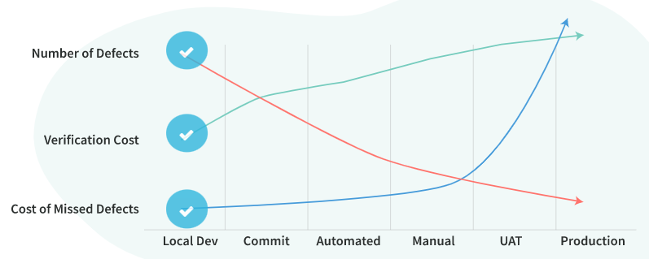
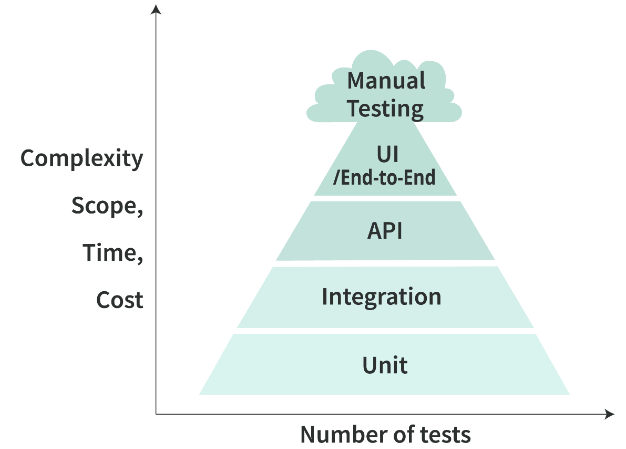

**Benefits and Costs of Automated Testing**

**Benefits**

- Earlier detection of defects due to short execution time and faster feedback.
- Reduced business expenses due to minimizing monotonous and repetitive testing activities.
- Increased test efficiency due to a robust test suite and reduced risk of human error.
- Improved structural code quality as a result of continuous code refactoring, which developers perform more confidently due to safe code changes verified by automated tests.
- Verifiable documentation of an application’s behavior (automated test cases are considered a type of documentation, and executing them regularly ensures that they are up to date).

**Costs**

- Maintenance of test code (fixing, improving, and refactoring test code and test data management).
- Setup and support of test environment infrastructure (for a database, application, test runners).
- Regular reviews of test reports and fixes for app code and data.
- Investment of time, money, and effort in initial training and test framework implementation.

**Critical Attributes of Automated Tests**

- **Feedback Time  
      
    **For automated tests, feedback time equals the duration of an automated test suite execution (i.e., the time between the moment the test run starts, and the moment test results are available).
- **Determinism  
      
    **A **deterministic** test fails or passes every time it runs for the same revision of code. A **flaky** test fails or passes randomly for the same configuration without any code changes. This behaviour is harmful because flaky test failures require teams to investigate the root cause, but they do not necessarily indicate bugs in the code.

**Automated Testing in the Test Pipeline**

- **Local development** is the process of enhancement implementation or bug fixing at a local developer’s workstation.
- **Commit** is a process of pushing changes from a local dev workstation to the shared codebase to make them available for other developers and CI procedures.
- **Automated testing** is a process of automated verification of changes from the previous stage. Passing a test suite is a prerequisite for manual testing.
- **Manual testing** is the process and corresponding environment of manual verification to detect and resolve any bugs or errors before a release. This process is completed without using any tools or automation, so expertise is required.
- **User Acceptance Testing** is the process and corresponding environment of pre-production testing performed by end users.
- **Production** is a process and corresponding environment of application operation in a real-life business context, including real users, data, load, etc.

“Shift Left” is a practice of identifying and preventing defects early in the development process. The goal is to improve quality by moving tasks to the left—as early in the software development life cycle as possible.

  

**Well-Balanced Automated Test Suite**

**Team Involvement in Creating a Balanced Automated Test Suite**

- **Involving Developers and QA Engineers  
      
    **Involving both development and QA teams in test automation increases everyone’s awareness of internal application structure and business problems. Equipped with knowledge of the internal application structure, both Dev and QA teams will be able to place automated tests on proper levels of the Testing Pyramid, while understanding how and when end users engage with an application will help both teams create and automate more relevant test cases in the appropriate business context.  
    Generally, the higher the level of the Testing Pyramid, the more actively engaged QA engineers are in writing automated tests. They typically write advanced test scenarios at the UI level.  
    The lower-level tests, such as unit and integration tests, are harder to write because they require a deep understanding of the source code of an application. Developers write unit and integration tests to cover the code of the applications they author.  
    Both QA engineers and developers write API tests. Developers usually verify basic scenarios, while QA engineers test more complex scenarios and edge cases.  
    
- **Involving a Test Automation Engineer  
      
    **A test automation engineer can significantly simplify test case automation by introducing tools and frameworks that require a lower level of coding skills—or no coding skills at all—and by creating automated test examples and encouraging the team to learn from them. An automation specialist can also provide project-specific guidance and mentorship that help streamline training manual QA engineers to handle basic (and even advanced) automated testing.  
    Engaging a test automation engineer to develop scripts for running automated tests can be expensive because the cost of an automation tester is one and a half times higher than that of a manual tester. It makes more sense to upskill manual testers on a team to enable them to do almost everything at all levels of the Testing Pyramid. If your team decides to hire a test automation engineer, it’s best to encourage the team to learn from that person.  
    

**Test Data Management**

- **Take care of your test data  
      
    **Test data is priceless because an automated test suite depends on it, and teams invest a huge effort in creating it.  
    If a test database gets lost or corrupted, large test suites may become unusable. Without automating or at least documenting test preparation, your team may reach the point where nobody can identify what data is required for tests to pass.  
    There are three ways to deal with this issue:  
    
    - Create all data from scratch during the test. This approach works to some extent, but it leads to repeating steps in tests or making them dependent on each other, increasing feedback time and reducing maintainability.
    - Store test data in a special, backed-up test database.
    - Ingest test data with preparation scripts before each test run.
    
    None of these options can work for all cases. Each of them is applicable in different projects, and sometimes they can even be combined.
    
- **Make sure your test data is reloadable  
      
    **Managing test data requires a capability—or strategy—to reload or clean up test data after test execution. It is crucial to make sure the test is rerunnable without side effects. Neglecting to reload data has negative consequences:
    - **Data volume growth**: Records are not deleted after testing―the generated data is only soft deleted (made invisible to the user but not really removed from the database). As a result, the database grows larger and becomes more difficult to manage.
    - **Increased test execution logic and runtime:** So many records are generated that verification takes too much time or even fails.

**Automated Testing Metrics  
  
**

|   |   |   |
|---|---|---|
|**Metric Name**|**Formula**|**Description**|
|Percentage of bugs that create new tests (PBCNT)|(Number of production defects that caused creation of new automated tests / Total number of production defects) × 100|PBCNT shows how much production use case feedback is considered in automated testing use cases—the higher the percentage, the better. However, the ability to create such tests could be limited by the complexity of scenario, difficulty of data management, and number of integrated parts required, so consider this metric with caution.|
|Percentage of developers who write tests (PDWT)|(Number of developers who write tests / Total number of developers) × 100|PDWT is a specific metric for tests written by developers (unit and integration tests). Automated testing is useful only when there are people who write tests. Ideally, developers should declare a new feature as done only after they accompany it with tests.|
|Code coverage|(Number of code lines executed during testing / Total number of code lines) × 100|Code coverage describes what portion of code is being tested. Your team should consider code coverage as a high-level test presence indicator. Your code may have 85% code coverage, but if you don’t write tests for the most complex code―which is also the most likely to have defects―bugs might be missed. So, code coverage alone is not an adequate measure of code quality and cannot provide a comprehensive picture of the automated testing quality.|
|Test coverage|(Number of automated test cases / Total number of test cases) × 100|Test coverage is a specific metric for UI automated tests because it is based on manual test cases. It depends heavily on the quality and volume of manual testing documentation.|
|Number of flaky tests|Number of flaky automated tests|Even a small number of flaky tests is enough to destroy the credibility of the whole test suite, so this value should be **0.**|

**Reporting the Results of Automated Testing**

- **Consolidated Results  
      
    **Consolidated results mean that:
    - All test results are aggregated by artifact version, so it becomes apparent what tests were executed, what the results are, and what changes were introduced in each version.
    - Management can see all test results by product version in one place and can use these results in deciding whether to release or hold back the version.
- **Transparent Results  
      
    **Transparent results are presented in a simple format so that a non-engineering person can understand them.
- **Results Available to All  
      
    **“Available to all” means that team members do not have to perform extra steps (e.g., obtain special account security permissions) or navigate through a complex UI to access test results.