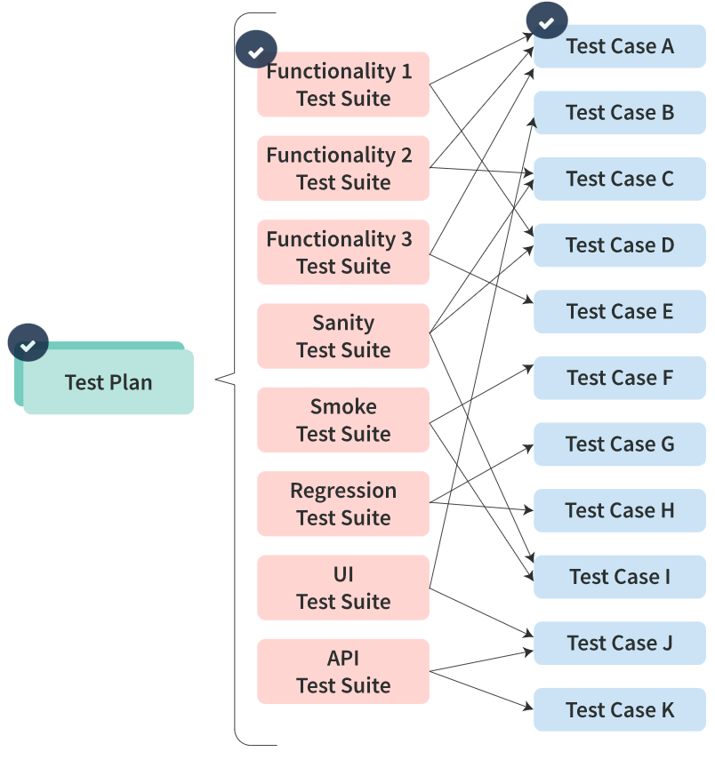
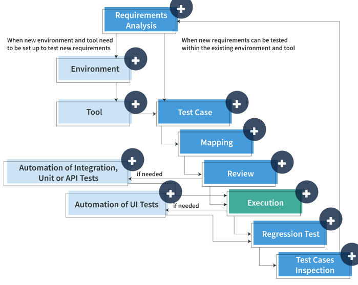

**Test case management** is the process of planning out tests for a project, writing individual test cases, managing the testing schedule, and tracking test progress and results.

**Test Plan**

A test plan is a detailed document outlining the scope of testing, required resources, and a complete timeline of testing activities. A test plan can include multiple test suites and test cases.

**Test Suite**

A test suite is a collection of several test cases used to verify specific functionality. Multiple test suites may share a test case, but the overall purpose of each test suite is different. Test suites may also pertain to specific types of testing, such as:

- sanity testing: determines if modifications to code have fixed issues without introducing new ones
- smoke testing: verifies if basic functionalities work or not
- regression testing: ensures that changes haven’t broken existing functionality
- UI testing: replicates how a user interacts with an application and checks all the system layers
- performance testing: determines how a system performs under a particular workload
- API testing: checks the functionality, reliability, performance, and security of APIs

**Test Case**

A test case comprises the steps used to verify that a specific piece of functionality works correctly and meets the project requirements. A single test case can be organized into one or more test suites.

**Writing Test Cases**

A good test case has a clear structure and typically includes the following parameters:

- **Test Case ID  
      
    **Enter a unique ID for each test case. For consistency, your team should identify a naming convention that indicates the type of test.  
      
    **Example:** “TC_UI_1” indicating “user interface test case \#1”.
- **Test Title  
      
    **Use a descriptive title so reviewers and testers know right away what the test case is checking for.
- **Test Case Description  
      
    **Briefly describe the test objective and the overall goal of the test.
- **Test Priority  
      
    **Set the test priority. For example, test priority for business rules and functional test cases can be medium or higher, whereas minor user interface cases can be low priority.
- **Prerequisites  
      
    **List all preconditions and prerequisites needed to execute the test successfully in the order they should be followed.
- **Test Steps  
      
    **List all the test steps in the order that a tester should execute them, including all the necessary details.  
      
    **Note:** To manage a test case efficiently with fewer fields, use this area to describe the test conditions, test data, and user roles for running the test.
- **Test Data  
      
    **If there is any data that a tester needs to input during execution, enter it here. If possible, provide several data sets with exact values for testers to use.
- **Expected Result  
      
    **Describe the expected result from test execution in detail, including the message/error displayed on the screen.
- **Environment Information  
      
    **If multiple environments are being tested, specify which one to use (e.g., enter “Chrome Version 91.0 or above” to ensure the test for a web application is run in the correct browser).
- **Comments  
      
    **Use this field to note any special conditions supporting the above fields or any questions related to expected or actual result
- **Requirement ID  
      
    **Use this field to provide a requirement ID which is covered by this test case.
- **Defect ID  
      
    **Use this field to provide a defect ID based on which this test case was created. This test case helps ensure that defect was fixed and will not appear in the future.
- **Automation  
      
    **Use this field for marking a testing status—automated or manual, or for providing a link to an automation test case.

**Best Practices for Writing a Test Case**

- **Use Meaningful Titles and Descriptions  
      
    **A strong title helps testers immediately understand what module or functionality is being tested. For example, the title of a test case for a login page might be “Verify a user can log in with a valid password.” Your team may also choose to include a unique identifier in the test case for easier reference, especially if titles tend to be long. Some tools will add the unique identifier automatically.  
    The description should tell the test engineer precisely what will be tested and give them a high-level view of what determines if the test case is a “pass” or a “fail.”  
    
- **Write Clear and Concise Test Steps  
      
    **Test steps should include all necessary data and information on how to execute the test—written in simple, clear, and concise language so that anyone can run it. To help keep this section brief, use a separate section to list any assumptions about the test environment, conditions that need to be met, or prerequisite tests that must pass before the test case is executed.
- **Keep Reusability in Mind  
      
    **Write your test cases so that they can be run on any version of the product, in any environment (e.g., development, environment for User Acceptance Testing (UAT)/staging, or production), with no adjustment to the test steps. Reusing test cases instead of rewriting them saves time and provides maximum value to your team.

  

**Design Techniques for a Good Test Case**

- **Boundary Value Analysis (BVA)  
      
    **In a test designed to use **boundary value analysis**, representative values at the edge of identified data sets are employed to test the system or application. The values used include inner and outer boundaries.  
    For example, imagine you are testing the input box on a product ordering page. The box allows users to enter their desired item quantity up to a maximum of 10. Any input in the box that is not a value of 1 through 10 will result in an error message. Using boundary value analysis, you would run a test that includes values on the inner boundaries, 1 and 10, then the outer boundaries, including 0 and 11. The test should pass when you enter numbers between 1 and 10 and allow the purchase to continue. But, if you enter 0 or 11, you should get an error message.  
    
    
    
- **Equivalence Partitioning (EP)  
      
    **Equivalence partitioning—or equivalence class partitioning—helps reduce the total number of test cases by dividing the input data of a software unit into sections (partitions), then designing test cases to cover each partition at least once.  
    Suppose you are testing a system that requires a certain age to be entered into an input box. The valid ages are 18 to 56 years old. In this test, the partitions would be 17 years and younger, 18 to 56 years old, and 57 years old and above. You pick a number from each partition to test (e.g., 15, 28, and 65). During the test, 15 and 65 should return an error message, while 28 should not.  
    
    
    
- **Decision Table Testing  
      
    **The decision table testing technique is used to test system behavior for different input combinations.  
    Consider, for example, a simple login screen that requires the correct UserID and Password combination for the system to open the User Account page. If either the UserID or Password is incorrect, the user should get an error message.Using a Decision Tree Table, you would add the conditions and action to the first column and then the rules across the top row. For the UserID and Password conditions, there is a True or False possibility. The Actions would have either a successful login or an error message. The rule for each possibility is entered into the table. Tests will be completed to cover each rule and will then be marked pass or fail.  
    
    
    
- **State Transition Diagram  
      
    **If you are testing to see how an application responds to different input conditions, a state transition diagram can be helpful. The diagram should include:
    
    - all the states that the test subject can have
    - the events that cause the test subject to change state
    - what transition conditions must be fulfilled in order for the state change to occur
    - expected actions resulting from each transition
    
    For instance, if you want to verify that a button activates after a user acknowledges a license agreement, the state transition diagram would show the deactivated button state and the transition condition of checking the checkbox. The second state, where the button is active, would show after the transition condition.
    

- **Use Case Testing  
      
    **A use case describes a particular use of the system by the end user (usually a person). Basing test cases on use cases is a valuable technique for uncovering defects that a real-world user may encounter. Use case testing helps build test suites that span an entire system, transaction by transaction, based on end-to-end processes.  
    Imagine your team is testing a bank application where users will transfer money from one account to another. This process requires multiple steps, including selecting the accounts to transfer to and from, entering the amount in an input box, and pressing a “continue” button to verify the correct information was provided. These steps—and the preferred outcome—should be written out for any tester to follow.  
    
    
    
- **KISS Design Principle  
      
    **The KISS principle states that most systems work best if they are kept simple rather than made complex. Adhering to this principle helps you avoid unnecessary complexity in test case design.

  

**Following the Test Case Life Cycle**

The **test case life cycle** is a testing process that refers to specific steps, including analyzing, writing, reviewing, executing, and reporting that are executed in a set sequence. This process supports your team in meeting your quality goals.

- **Requirements Analysis  
      
    **In this step, you analyze the requirements for the specific functionality you are testing and identify what qualifies as passing. These requirements will help you determine if you can use a current environment or tool for the test case or need new ones. You will use these requirements when you write the test case to make sure all requirements are covered.
- **Environment**  
    If you determine that a new environment is needed for the test case, you will set it up in this step.  
    
- **Tools**  
    Acquire and set up any new tools necessary to perform the test case.  
    
- **Test Case**  
    Using the gathered requirements, write the test case and perform a self-review.  
    
- **Mapping**  
    Map each requirement to the test case to verify that you have covered them all.  
    
- **Review**  
    After you have reviewed your test case and mapped the requirements, have a peer conduct a review.  
    
- **Automation of API**  
    If you need to automate Integration, Unit, or API tests, for most projects, you can complete these tasks before executing the test case.  
      
    **Note:** Automation can vary from project to project. For some projects, _all_ tests — unit, API, and UI — might be automated before or after execution.
- **Execution**  
    Determine who will perform the test. Then have them execute the test case.  
    
- **Automation of UI**  
    After test case execution, perform any needed automated UI tests.  
    
- **Regression Test**  
    If necessary, perform regression testing to identify if any changes or updates to the code have affected the software's functionality, using previously created test cases that correlate with the functions you are testing.  
    
- **Test Cases Inspection  
      
    **Review manual and automated test cases to ensure they are unique and applicable for future projects.  
    If you find any duplicated test cases, combine them. If you determine that a test case is no longer useful, retire it.  
    

**Reviewing Test Cases to Ensure Quality**

- **Self Review  
      
    **The test engineer who wrote the test case should perform a **self-review**. If you perform a self-review, verify that all requirements are covered by comparing the test case to the:
    - Software Requirement Specification (SRS), which describes the software’s purpose, how it is supposed to function, and how it will fulfill the needs of the business and its users.
    - Functional Requirements Document (FRD), which is similar to a contract stating the functional requirements needed for software to meet agreed-upon capabilities.
- **Peer Review  
      
    **A different test engineer than the one who wrote the test case should perform a **peer review**. The peer should have theoretical knowledge and practical skills in test case writing and be familiar with the system being tested. This type of review is also known as a Maker and Checker review.
- **Supervisor Review  
      
    **The team lead, manager, or business analyst (in a supervisory role compared to the test case author) can perform a **supervisor review**. The person completing this review should have extensive knowledge of the requirements and system being tested.

|   |   |
|---|---|
|**Functionality Coverage**|If test cases do not cover all functionality associated with what is being tested, then there is the possibility that testers will miss significant defects. This possibility increases exponentially over an entire test suite or test plan if reviewers do not check functionality coverage for each test case.|
|**Spelling**|Spelling mistakes in test cases can create confusion or make them hard to understand.|
|**Grammar**|Poor grammar can cause a tester to misinterpret the test case, leading to erroneous results.|
|**Template/Writing Standards**|Not using a proper template or following set writing standards and guidelines decreases efficiency while writing test cases. In addition, reviewers and testers will continuously have to adapt their approach to unique test cases, so the results of reviewing and testing will be less consistent.|
|**Language/Word Choice**|If you use specialized terms, complex language, or language unfamiliar to your testers, they can have a hard time understanding how to execute the test case.|
|**Duplication**|There might be situations where two or more test cases test the same thing. You can merge similar test cases to save time and space in your test case library.|
|**Obsolescence**|Due to changes in requirements or previously written tests, cases may become obsolete and must be removed.|

**Identifying Test Coverage**

Test coverage reporting saves a lot of time — you can quickly identify which requirements are covered with tests and avoid checking each requirement separately. This is particularly beneficial at a release because it can demonstrate that you and your team checked all functionality before the application goes to production.

- The **Requirement Test Coverage Report** allows your team to:
    - identify the status of the testing process, including passed and failed test cases
    - track which requirements are covered by specific versions of a test case template
    - track the requirements that still need to be covered by tests
    - understand the extent to which the code written for an application has been tested
- A **Requirement Traceability Matrix** is a single document that:
    - is delivered at the conclusion of the software development life cycle
    - captures all requirements and maps them to test cases
    - aims to validate that no functionality is unchecked during software testing
    - is also used as a resource when creating a Requirement Test Coverage Report

**Creating Regression Test Suites**

Regression testing is a technique in which some test cases previously developed to test specific functions are conducted to determine whether code changes impact the software’s existing functionality. This testing process ensures that any changes made to the system will not move to production if any previously developed functionality is broken.

- **Categorize Test Cases  
      
    **To create a regression test suite, first categorize the test cases by whether they can be used in further regression cycles (reusable) or not (obsolete).
- **Prioritize Test Cases  
      
    **Next, prioritize the test cases depending on business impact, focusing on critical and frequently used functionalities. Selecting test cases based on priority will reduce the regression test suite’s size and execution time.
- **Select Test Cases  
      
    **For effective regression testing, be sure to include test cases that cover:
    
    - Critical and/or highly visible functionalities
    - Areas with frequent defects
    - Core features of the product
    - Frequently or recently changed functionalities
    
    In addition, the regression test suite should include all integration test cases, complex test cases, and boundary value analysis test cases, along with samples of successful and failed test cases.
    

**Creating Test Reports**

A test report is a document that summarizes all test activities and final test results and serves as an assessment of how well the tests are performed. Based on the test report, stakeholders can evaluate the product’s quality and decide on the software release. The responsible test engineer or the test leader writes the test report at the end of testing for a given iteration.

When writing a test report, your team should pay special attention to the Test Results Summary. This section includes the summary of all testing activities, including:

- The number of test cases executed
- The number of test cases that passed
- The number of test cases that failed
- Pass percentage
- Fail percentage
- Comments from testers about the test

**Test Case Management Tools**

A **test case management tool** stores vital information about testing, including the test plan, testing activities, and report status for quality assurance activities.

- **Expedites Test Case Creation  
      
    **A test case management tool should allow you to expedite test case creation with the use of templates.
- **Executes the Test Case and Records the Results  
      
    **A test case management tool must enable you to execute a test case and obtain and record the results easily.
- **Automates Defect Tracking  
      
    **Failed tests should automatically be linked to the bug tracker, which can be assigned to developers on your team and tracked by email notifications.
- **Traces Coverage  
      
    **Requirements, test cases, and test case execution are all interlinked through the test case management tool. Your team should be able to trace coverage across all three areas.
- **Preserves Test Cases  
      
    **A test case management tool should help your team keep a library of test cases you can reference or reuse for additional testing and prevent test cases from being lost or corrupted. Test case management tools with version control also provide a history for each test case.

**Test Library**

A test library is a module in a test management tool used to store test cases, usually within a catalog structure. In the test library, you can create and modify test cases, assign test cases to test suites, and label them for quick and simple searching.

**Test Run**

A test run in a test management tool enables your team to organize test cases and suites into a test plan for each project phase, sprint, or release. For example, you can use a test run to select test cases from the library for execution during a sprint or release, register test executions, and control tests.