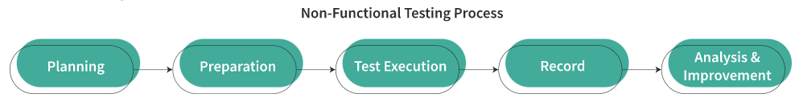

A **non-functional requirement** describes operational qualities rather than behavioral qualities—not _what_ the system will do but _how_ the system will do it. **Non-functional testing** verifies how well the system meets these requirements by examining its performance, usability, reliability, etc. For example, a non-functional test of an e-shop would check how many people could simultaneously place an order. While functional testing checks whether requirements are met, non-functional testing tends to check measurable specifications of an application.

**The Value of Non-Functional Testing**

- **Benefits of Non-Functional Testing  
      
    **Non-functional tests can bring a lot of benefits to a project, such as:
    - Increasing the security of the product
    - Improving the performance of the system
    - Improving the user experience and ease of operating the software
    - Helping to establish whether a new version is ready for production
    - Allowing stakeholders to understand a solution’s actual performance compared to their expectations
- **Impacts of Neglecting Non-Functional Testing  
      
    **Without non-functional testing, a system might suffer from issues, such as:
    
    - Running slowly or becoming unresponsive while several users use it simultaneously
    - Becoming unavailable when it is required most, resulting in a direct impact on business
    - Having inconsistencies across different operating systems
    - Providing poor usability that frustrates users
    
    Issues with the system can result in serious consequences that include:
    
    - Losing valuable data
    - Breaking the security of confidential data
    - Generating incorrect reporting that breaks the law and results in a financial penalty for your company or client

**Functional vs. Non-Functional Testing**

|   |   |   |
|---|---|---|
|**Parameter**|**Functional Testing**|**Non-Functional Testing**|
|**Functionality**|Verifies what the product does|Verifies how the product works|
|**Execution**|Is performed before non-functional testing|Is performed after functional testing|
|**Focus area**|Is based on customers’ requirements|Focuses on customers’ expectations|
|**Manual testing**|Can be executed either manually or using automation tools|Is preferably performed using automation tools|
|**Example Requirements to Test**|1. A login page must show text boxes to enter a username and password.   2.   The search function in the application should not be case sensitive.   3.   A verification email is sent to a user whenever he/she registers for the first time.|1. The dashboard should load in 2 seconds.   2.   Software should be installable on all versions of Windows and Mac.   3.   The GUI should provide help and tooltips to make it easy to use.|

- **Planning  
      
    **During this initial step, the entire team contributes to prioritizing the requirements and planning the testing specifications. They also determine the test techniques and methodologies and choose the tools required.
- **Preparation  
      
    **In this second step, the team works together to design the test cases, create test data, and prepare a correct environment. The team ensures the test environment setup is simple to configure and repeat.
- **Test Execution  
      
    **During step three, the team uses tools to execute tests, monitor testing progress, and capture the results.
- **Record  
      
    **In step four, the team documents test outputs and response times and then compares them to the expected results.
- **Analysis and Improvement  
      
    **For the final step, QA engineers need to:
    - monitor the system’s compatibility with the non-functional requirements
    - discover hidden bottlenecks in the system
    - validate its configuration settings

**Types of Non-Functional Testing**

- **Compatibility  
      
    **What are the minimum hardware requirements? What operating systems (including versions) must be supported?
- **Performance  
      
    **How quick is the response to a user’s actions? How much time does a user wait for a specific operation to happen?
- **Capacity  
      
    **What is the maximum number of users allowed to use the application simultaneously—for example, on Black Friday? Is the user experience compromised at this time?
- **Security  
      
    **Is every endpoint adequately secured? Does every endpoint require an authentication? Is confidential data, such as the last names of end users, shared in response?
- **Reliability and Availability  
      
    **How often do critical failures happen to the system? Do users need round-the-clock access to the system?
- **Scalability  
      
    **Is your system able to handle the growing amount of users by adding extra resources (e.g., servers, storage, memory) to it?
- **Maintainability and Manageability  
      
    **How long does it take to fix components? How easily can an administrator service the system? How easy is it to improve performance and adapt to a new operating system?
- **Usability  
      
    **What determines the user’s satisfaction with the product? How easy is it to use the application? Is your site easy to navigate? Does the user understand the primary purpose of the application?
- **Accessibility  
      
    **Could people with visual impairments or color blindness use the application? Can users with impaired mobility navigate the system with a keyboard? Will people with cognitive disabilities, or those who are deaf or hard-of-hearing, have full access to the content? Does the application meet all legal requirements for accessibility?

**Performance Testing**

Performance testing is a software testing practice implemented to determine how a system performs in terms of speed, response time, stability, reliability, scalability, and resource usage of a software application under the expected workload.

- **Load testing** verifies an application’s ability to perform under anticipated user loads.
- **Endurance testing** checks whether software can handle the expected load over a long period of time.
- **Volume testing** checks a software application’s performance under varying database volumes.
- **Scalability testing** determines how effectively an application scales up to support an increase in user load. Scalability testing helps your team plan capacity additions to a software system.
- **Spike testing** checks the software’s reaction to sudden large spikes in the load generated by users.
- **Stress testing** checks an application under extreme workloads to see how it handles high traffic or data processing. It helps identify the breaking point of an application.